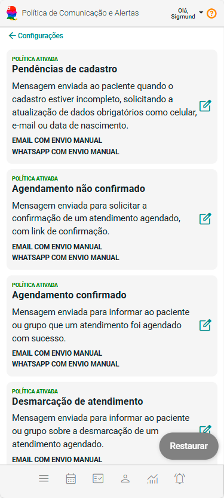

# Política de Comunicação e Alertas

A Política de Comunicação e Alertas define quando, como e por qual canal o sistema envia mensagens automáticas ou manuais para pacientes ou grupos terapêuticos.

Essas comunicações ajudam a:

- Reduzir faltas em atendimentos

- Lembrar pagamentos e vencimentos

- Manter cadastros atualizados

- Melhorar o relacionamento com o paciente

- Automatizar tarefas administrativas repetitivas

A tela pode ser acessada a partir do painel de configurações.

## Estrutura da tela

A tela apresenta uma lista de eventos, cada um representando uma situação específica do sistema que pode gerar comunicação.

Cada item contém:

- Nome do evento

- Descrição do momento em que a mensagem é enviada

- Status da política (ativa/inativa)

- Ações de configuração

## Eventos disponíveis e seus significados

#### 🔹 Pendências de cadastro

Envia mensagem ao paciente quando o cadastro está incompleto, solicitando atualização de dados obrigatórios, como:

- E-mail

- Celular

- Data de nascimento

📌 Útil para garantir comunicações futuras e conformidade de dados.

#### 🔹 Agendamento não confirmado

Mensagem enviada para solicitar a confirmação de um atendimento agendado, com link para confirmação.

📌 Ajuda a reduzir faltas e agendas “ociosas”.

#### 🔹 Agendamento confirmado

Mensagem informando que o agendamento foi confirmado com sucesso.

📌 Reforça segurança e profissionalismo no atendimento.

#### 🔹 Desmarcação de atendimento

Notifica o paciente ou grupo quando um atendimento é cancelado.

📌 Evita desencontros e ruídos de comunicação.

#### 🔹 Remarcação de atendimento

Informa alterações de data ou horário de um atendimento já agendado.

#### 🔹 Pagamento feito nos últimos 7 dias ou antecipado

Mensagem informativa sobre:

- Pagamentos realizados nos últimos 7 dias

- Pagamentos feitos de forma antecipada (antes do vencimento)

📌 Reforça transparência financeira com o paciente.

#### 🔹 Vencimento nos próximos 7 dias

Mensagem preventiva para lembrar sobre:

- Valor em aberto

- Vencimento próximo

📌 Ajuda a reduzir inadimplência sem abordagem invasiva.

#### 🔹 Pagamento pendente

Mensagem de cobrança direta, enviada ao paciente ou responsável financeiro.

⚠️ Use com atenção ao tom da mensagem.

#### 🔹 Aniversário

Mensagem de parabenização enviada sobre aniversário do paciente. Ele é mostrada de 15 dias antes a 15 dias após o aniversário.

📌 Humaniza o relacionamento.

#### 🔹 Atendimento provável

Mensagem a pacientes que tiveram atendimento no mês anterior e que ainda não possuem atendimento agendado no mês atual.

📌 Incentiva retorno terapêutico.

#### 🔹 Recebimento pendente

Notificação quando existe intenção de pagamento registrada, mas ainda não concluída.

---

Nos cards de paciente, grupo e atendimento, existe a opção 🔔 (alertas).

Essa opção funciona como um histórico de eventos e comunicações relacionados àquele paciente, grupo ou atendimento.

Sempre que ocorrer um dos eventos configurados na Política de Comunicação e Alertas — como confirmação de agendamento, lembretes, cobranças, pendências de cadastro ou outras notificações — o sistema:

- Registra automaticamente o evento

- Exibe um indicativo visual no card correspondente

- Armazena a ocorrência no histórico de alertas

Ao clicar no ícone 🔔, o usuário poderá:

- Visualizar todas as ocorrências registradas

- Identificar o tipo de evento

- Conferir quando a comunicação foi gerada

- Entender o contexto do alerta relacionado ao paciente, grupo ou atendimento

Essa funcionalidade permite acompanhar facilmente tudo o que já foi comunicado, trazendo mais controle, transparência e rastreabilidade para o atendimento e para a gestão.