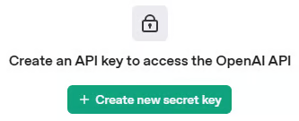
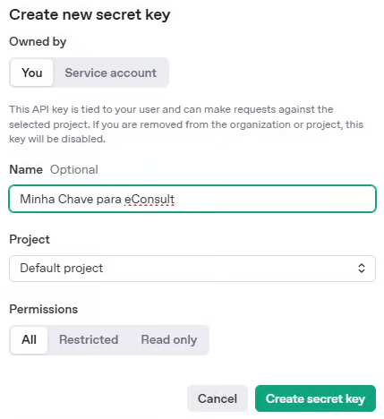
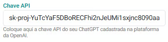

# OpenAI

**O eConsult já conta com inteligência artificial nativa para agilizar tarefas do dia a dia, como geração de textos e análises automáticas. Mas, se preferir, você também pode configurar sua própria conta na OpenAI e personalizar ainda mais a experiência.**

A integração é simples e acessível (não requer conhecimentos avançados de informática), permitindo que você aproveite todos os recursos da OpenAI diretamente na plataforma eConsult. Com isso, é possível gerar anotações clínicas, resumos, análises e automatizar partes do seu trabalho com o suporte da IA de forma prática, inteligente e adaptada ao seu perfil.

Mesmo com a IA já ativa por padrão no eConsult, essa configuração com a sua própria chave de API da OpenAI permite:

- Maior controle sobre os dados utilizados
- Personalização da capacidade de uso  
- Escalabilidade conforme suas necessidades
- Uso da IA no eConsult independentemente do plano de assinatura eConsult

## Funcionalidades com Inteligência Artificial no eConsult

A Inteligência Artificial (IA) integrada ao eConsult foi desenvolvida para apoiar o profissional da saúde nas áreas clínica e gerencial, oferecendo recursos que se adaptam à sua especialidade (psicologia, terapia integrativa, coaching, fisioterapia, nutrição, entre outras).

### 1. Anotações Clínicas

A IA auxilia na elaboração e revisão de anotações clínicas, permitindo:

- Geração de textos completos com base nas informações do atendimento;
- Reformulação, resumo ou expansão de anotações;
- Adaptação ao vocabulário e à lógica da especialidade do profissional;
- Resultado num contexto relacionado a um Propósito especificado por você.

### 2. Respostas no Contexto Profissional

A IA responde perguntas e oferece sugestões sempre dentro do propósito especificado e do contexto da área de atuação do especialista. Por exemplo:

- **Psicólogos** recebem respostas baseadas no propósito e em conceitos da psicologia;
- **Nutricionistas** recebem sugestões alinhadas ao propósito e às práticas da área de nutrição.

### 3. Hipóteses Diagnósticas, Prognósticas, Planos e Evoluções de Tratamento

Com base nos dados do prontuário, na bordagem terapêutica do profissional, nos testes psicológicos aplicados, anotações clínicas feitas durante os atendimentos e no engajamento nos atendimentos do paciente, a IA pode sugerir:

- Hipótese diagnóstica;
- Hipótese prognóstica;
- Sugestão de Plano de Tratamento;
- Sugestão de Evolução de Tratamento;

> **Observação:** essas sugestões são auxiliares e não substituem a análise clínica do especialista.

### 4. Análises Mensais com Insights

A IA gera relatórios mensais com insights sobre:

- Desempenho clínico (número de atendimentos, taxa de comparecimento, entre outros);
- Resultados financeiros (faturamento, média por sessão, etc.).

Essas informações ajudam o profissional a acompanhar e melhorar sua performance mensalmente.

### 5. Análises Anuais com Visão Estratégica

Além dos relatórios mensais, a IA também oferece uma análise anual com:

- Dados consolidados de desempenho e finanças;
- Comparações ao longo do tempo;
- Insights para decisões estratégicas de médio e longo prazo.

**Importante:** A IA é uma ferramenta de apoio. Todas as decisões clínicas e administrativas continuam sob responsabilidade do profissional.

## Não utilizar a integração com a OpenAI

O eConsult fornece IA com limitações definidas dentro do plano de assintura escolhida. Sendo:

| **Recurso**                         | **Free**      | **Pro** | **Plus**      | **Premium**   |
|-------------------------------------|---------------|---------|--------------|--------------|
| Anotações assistidas por IA        | 0       | 0       | 176/mês      | Ilimitado    |
| Análises mensais e anuais          | 0     | 0       | 3 de cada    | Ilimitado    |
| Geração de hipóteses diagnósticas  | 0    | 0       | Até 20/mês   | Ilimitado    |
| Geração de hipóteses prognósticas  | 0   | 0       | Até 20/mês   | Ilimitado    |
| Geração de propostas de planos terapêuticos | 0   | 0       | Até 20/mês   | Ilimitado    |
| Geração de propostas de evoluções de tratamento | 0    | 0       | Até 20/mês   | Ilimitado    |

## Utilizando a integração eConsult com a sua conta na OpenAI

Se preferir utilizar a sua API da OpenAI, você será responsável por adicionar créditos e gerenciar o uso. A inteligência artificial estará disponível em todos os planos de assinatura do eConsult sem limitações.

---

## Configurar a integração da sua conta OpenAI no eConsult

**1. Crie ou acesse sua conta na OpenAI**
    
    - Acesse: https://platform.openai.com/​

    - Clique em "Sign Up" para criar uma conta ou "Log In" se já tiver uma no canto superior direito da tela.

        

**2. Vá até a seção de API Keys**
    
    - Após fazer login, vá para: https://platform.openai.com/account/api-keys​

**3. Gere uma nova chave**
    
    - Clique no botão “+ Create new secret key”.
    
        
    
    - Dê um nome para identificar sua chave (ex: “Minha Chave para eConsult”).
    
        
    
    - Clique em "Create secret key" .

**4. Copie a chave**

    - Copie a chave exibida logo após criá-la .
    
        :::warning Você não poderá vê-la novamente depois de sair da página.
            - Guarde em local seguro, como um gerenciador de senhas ou arquivo de configuração local.
        :::

**5. Configure a Integração no eConsult**

    - No eConsult, no painel Configurações, acesse a opção "Integrações / ChatGPT".
    
    - Preencha o campo Chave API com a chave copiada anteriormente.
    
        
    
    - Acione o botão Salvar .
    
**Pronto! Sua integração está feita.**

---

## Inserir créditos na plataforma OpenAI

**1. Acesse a Plataforma da OpenAI**

- Acesse: [https://platform.openai.com](https://platform.openai.com)
- Faça login com sua conta OpenAI (a mesma do ChatGPT, se já tiver).

**2. Vá até a Seção de Faturamento**

- No canto superior direito, clique no seu **nome ou ícone de usuário**.
- No menu, selecione **Billing** (Faturamento).

**3. Adicione um Método de Pagamento**

- Acesse a aba **Payment methods**.
- Clique em **“+ Add payment method”**.
- Insira os dados do seu **cartão de crédito** (Visa, MasterCard, etc.).

**4. Configure Limites de Gasto**

- Vá para a aba **Usage limits**.
- Defina um **limite de uso mensal** (recomendado: $5 a $10 para uso constante).
- Essa configuração ajuda a **evitar cobranças inesperadas**.

:::tip

Você pode acompanhar seu uso e gastos na aba **“Usage”** da plataforma, e ajustar limites sempre que necessário.

:::
