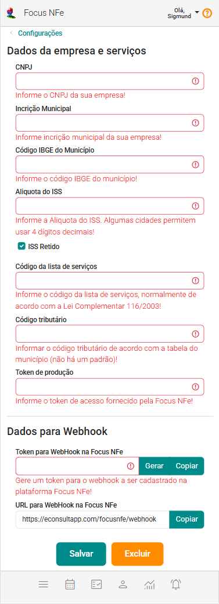

# Focus NFe

A integração do **eConsult** com a **Focus NFe** permite a automatização da emissão de notas fiscais de serviços diretamente pelo sistema, sem precisar alternar entre diferentes plataformas. Essa funcionalidade é ideal para profissio
nais que desejam otimizar o processo administrativo, garantindo mais eficiência e segurança no controle fiscal de seus atendimentos.

:::warning
A integração com a Focus NFe está disponível exclusivamente nos planos PREMIUM do eConsult!
:::

## Como funciona

1. **Conexão entre plataformas:**

O psicólogo cadastra a sua conta Focus NFe dentro do eConsult, estabelecendo uma comunicação segura entre os dois sistemas.

2. **Emissão automática de notas:**

Ao registrar uma sessão ou processar o pagamento de uma assinatura, você poderá emitir a nota fiscal correspondente diretamente pelo eConsult utilizando sua conta na Focus NFe.

3. **Gestão centralizada:**

Todas as notas emitidas ficam registradas no eConsult, permitindo que o profissional acompanhe e exporte relatórios fiscais de maneira simples, sem precisar acessar a Focus NFe diretamente.

4. **Conformidade e segurança:**

A integração mantém o sistema em conformidade com a legislação vigente, incluindo o correto cálculo de impostos, retenções (quando aplicável) e armazenamento seguro dos dados fiscais.

## Benefícios

- **Economia de tempo:** elimina a necessidade de digitar manualmente informações fiscais em outra plataforma.

- **Redução de erros:** a transferência automática de dados evita inconsistências comuns na emissão manual de notas.

- **Organização:** histórico de notas e relatórios disponíveis diretamente no eConsult, facilitando a contabilidade e declarações fiscais.

## Como configurar a integração Focus NFe

A tela de configuração da integração com a Focus NFe permite o cadastro dos dados da empresa, a definição dos serviços prestados e a configuração do webhook, garantindo a integração automática com o eConsult.

#### Dados da empresa e serviços

Nesta seção, você deve preencher as informações fiscais da sua empresa:

1. **CNPJ:** Informe o número do CNPJ da sua empresa.

1. **Inscrição Municipal:** Número de inscrição da empresa no município.

1. **Código IBGE do Município:** Código do município conforme o IBGE, necessário para emissão de notas fiscais.

1. **Alíquota do ISS:** Percentual do ISS (Imposto Sobre Serviços) que será aplicado às notas fiscais.

1. **ISS Retido:** Marque esta opção se o ISS for retido na fonte pelo contratante.

1. **Código da lista de serviços:** Informe o código do serviço prestado conforme a lista de serviços municipal.

1. **Código tributário:** Código utilizado para classificação fiscal do serviço (opcional).

1. **Token de produção:** Token fornecido pela Focus NFe para autenticação da sua conta e emissão de notas fiscais.

:::warning
- É importante que todos os dados estejam corretos para garantir que as notas fiscais sejam emitidas corretamente e estejam em conformidade com a legislação.

- A maioria das informações acima você pode obter diretamente com seu contador.
:::

#### Dados para Webhook

O webhook permite que o eConsult receba automaticamente informações da Focus NFe quando uma nota fiscal é emitida:

1. **Token para WebHook na Focus NFe:** Código gerado para autenticação do webhook. Você pode Regenerar ou Copiar o token conforme necessário.

1. **URL para WebHook na Focus NFe:** Endereço fornecido pelo eConsult para receber as notificações da Focus NFe. Você pode Copiar o URL para uso ou conferência.

    :::warning
    Sempre que atualizar o token ou URL, clique em Salvar para que as alterações entrem em vigor.
    :::

#### Ações disponíveis:

    - **Salvar:** Salva todas as alterações feitas nos dados da empresa e nas configurações do webhook.

    - **Excluir:** Remove as configurações atuais do webhook e limpa os dados relacionados à integração.

Essa tela é essencial para garantir que a emissão de notas fiscais pelo eConsult funcione de forma automática e correta, permitindo que você concentre sua atenção na gestão clínica sem se preocupar com processos manuais de faturamento.