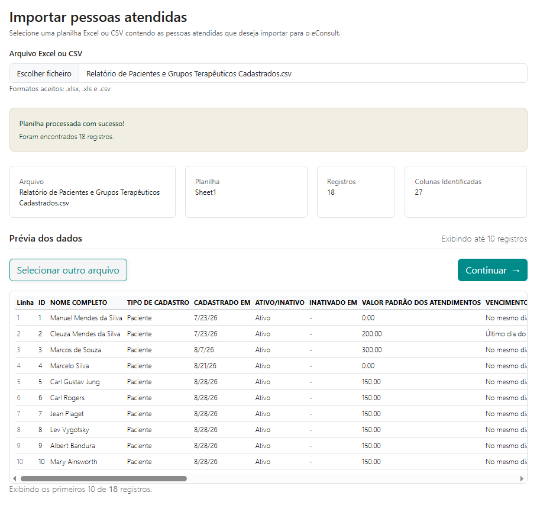
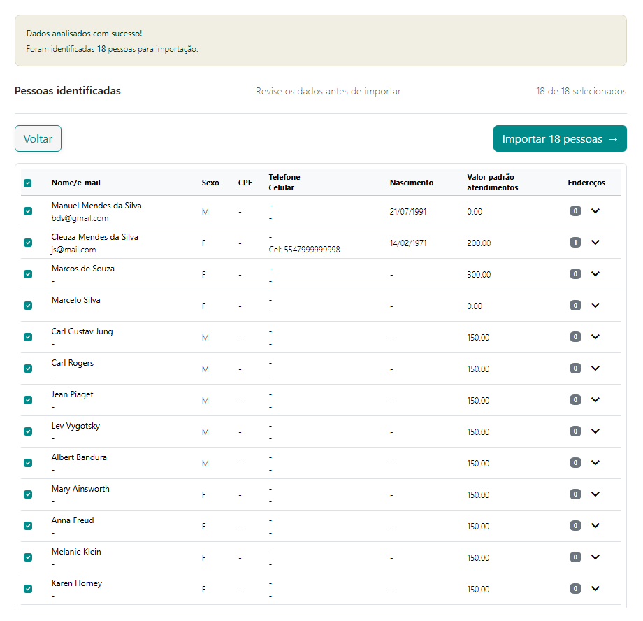
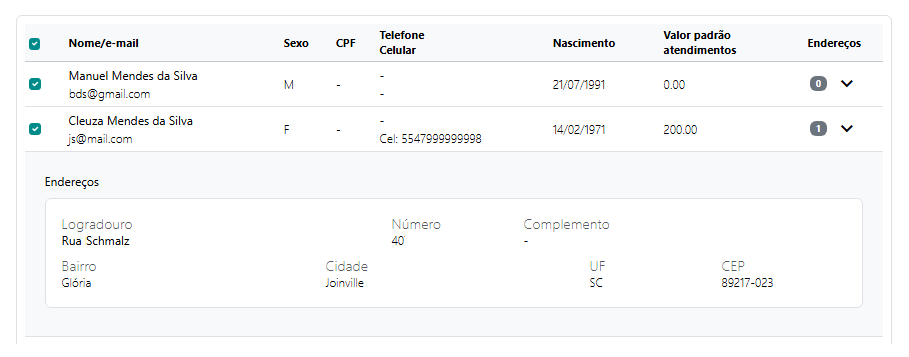
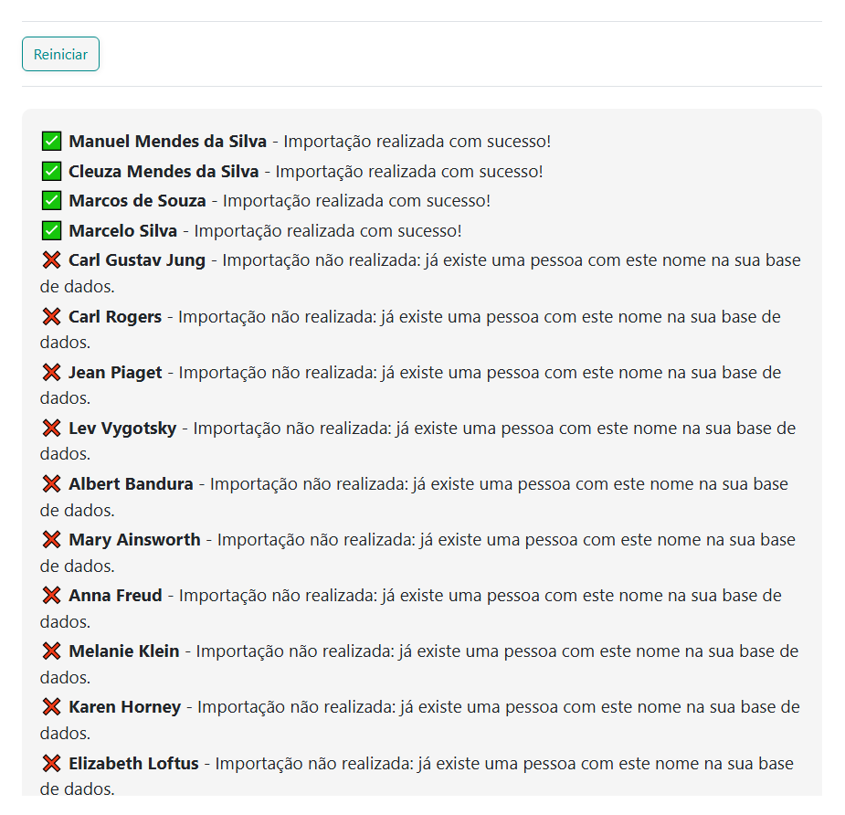

# Importação de Pessoas Atendidas

A **Importação de Pessoas Atendidas** permite cadastrar no eConsult várias pessoas de uma só vez utilizando informações existentes em uma planilha **Excel ou CSV**.

O recurso é especialmente útil para quem está começando a utilizar o eConsult e já possui seus cadastros organizados em planilhas ou exportados de outro sistema.

Não é necessário que a planilha utilize exatamente os mesmos nomes de campos do eConsult. Durante o processamento, o sistema analisa a estrutura encontrada e procura identificar as informações correspondentes aos campos utilizados no cadastro de pessoas atendidas.

## 1. Selecione o arquivo

Na tela de importação, clique no campo **Arquivo Excel ou CSV** e selecione o arquivo que contém os cadastros que deseja importar.

São aceitos os formatos:

* `.xlsx`
* `.xls`
* `.csv`

Após selecionar o arquivo, o eConsult fará uma primeira leitura da planilha e apresentará informações como o nome do arquivo, planilha utilizada, quantidade de registros encontrados e quantidade de colunas identificadas.

### Qual planilha será utilizada?

Caso o arquivo Excel possua várias abas, a importação utiliza a **primeira planilha do arquivo**.

Por isso, antes de iniciar, verifique se os dados que deseja importar estão na primeira aba.

## 2. Confira a prévia dos dados

Depois da leitura do arquivo, o eConsult apresenta uma **prévia dos primeiros registros encontrados**.

Essa etapa permite verificar se a planilha foi lida corretamente antes de continuar.

Os nomes das colunas são apresentados conforme encontrados no arquivo original. Por exemplo, sua planilha pode utilizar nomes como:

`Cliente`, `Nome do Paciente`, `WhatsApp`, `Nascimento`, `CPF`, `Endereço`, entre outros.

Não é necessário renomear essas colunas para os nomes utilizados internamente pelo eConsult.

Se o arquivo selecionado não for o correto, clique em **Selecionar outro arquivo**.

## 3. Análise e organização dos dados

Após conferir a prévia, clique em **Continuar**.

O eConsult analisará os registros da planilha e procurará identificar e organizar informações como:

* nome;
* CPF;
* e-mail;
* telefone;
* celular;
* data de nascimento;
* logradouro;
* número;
* complemento;
* bairro;
* cidade;
* UF;
* CEP.

Campos que não existirem ou que não puderem ser identificados permanecerão sem preenchimento.

### Endereços

O endereço pode estar distribuído em várias colunas da planilha ou concentrado em uma única informação.

Quando possível, o eConsult organiza os dados encontrados em campos separados, como **logradouro, número, complemento, bairro, cidade, UF e CEP**.

Uma mesma pessoa também pode possuir **mais de um endereço**.

Se a planilha possuir várias linhas referentes à mesma pessoa por causa de endereços diferentes, o eConsult poderá consolidar essas informações em um único cadastro e relacionar os endereços identificados à mesma pessoa.

## 4. Revise as pessoas identificadas

Depois da análise, será apresentada a relação das **Pessoas Identificadas**.

Essa é uma etapa de conferência. Os dados ainda não foram cadastrados no eConsult.

A tabela apresenta as principais informações encontradas para cada pessoa, como nome, CPF, e-mail, celular, data de nascimento e quantidade de endereços.

Quando houver endereços, você poderá expandir o registro para conferir as informações identificadas.

Recomendamos revisar os dados, principalmente quando a planilha de origem possuir informações incompletas, colunas com significados pouco claros ou dados preenchidos de formas diferentes.

## 5. Selecione o que deseja importar

Inicialmente, todas as pessoas identificadas ficam **selecionadas para importação**.

Você pode desmarcar qualquer registro que não queira cadastrar.

Também é possível utilizar a caixa de seleção do cabeçalho para selecionar ou desmarcar todos os registros de uma só vez.

Somente as pessoas que estiverem **selecionadas** serão importadas.

## 6. Conclua a importação

Depois de revisar os dados e definir quais pessoas deseja cadastrar, clique em:

**Importar**

O número apresentado no botão corresponde à quantidade de registros atualmente selecionados.

O eConsult enviará somente esses registros para o processo de importação.

No término da importação o sistema apresenta informação de quais pessoas atendidas foram importadas e quais foram recusadas.

## Importante

A importação foi desenvolvida para reduzir o trabalho necessário para migrar cadastros existentes para o eConsult, mas a qualidade do resultado depende também das informações disponíveis no arquivo de origem.

O eConsult procura interpretar e organizar os dados encontrados, mas **não cria informações que não estejam presentes na planilha**.

Por isso, revise os registros apresentados antes de confirmar a importação.

Caso alguma informação não seja identificada, você poderá posteriormente complementar o cadastro diretamente no eConsult.

## Dica para uma melhor importação

Embora não seja necessário utilizar um modelo específico de planilha, arquivos bem organizados facilitam a identificação das informações.

Sempre que possível:

* utilize uma linha para cada registro;
* mantenha títulos claros na primeira linha da planilha;
* evite células mescladas;
* mantenha CPF, telefone, e-mail e data de nascimento em colunas próprias;
* não misture informações de pessoas diferentes na mesma linha;
* mantenha os dados de endereço organizados em colunas próprias quando disponíveis.

Você **não precisa adaptar sua planilha ao formato do eConsult** antes de tentar a importação. Primeiro envie o arquivo e confira o resultado apresentado pelo sistema.
