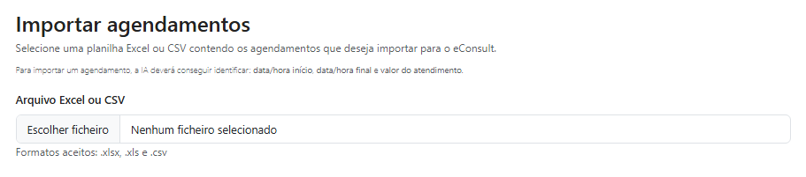
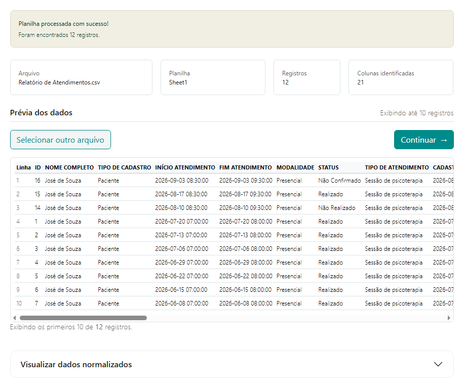
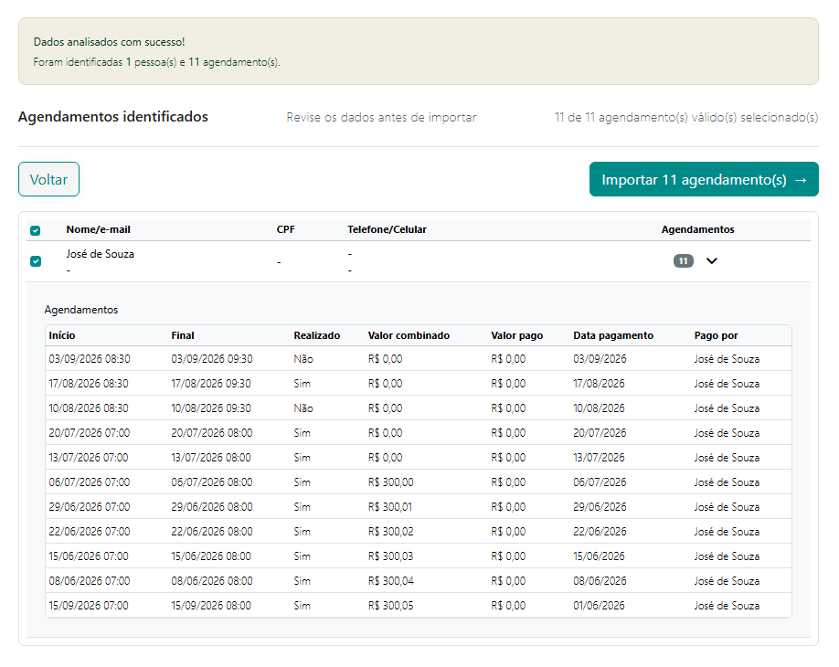
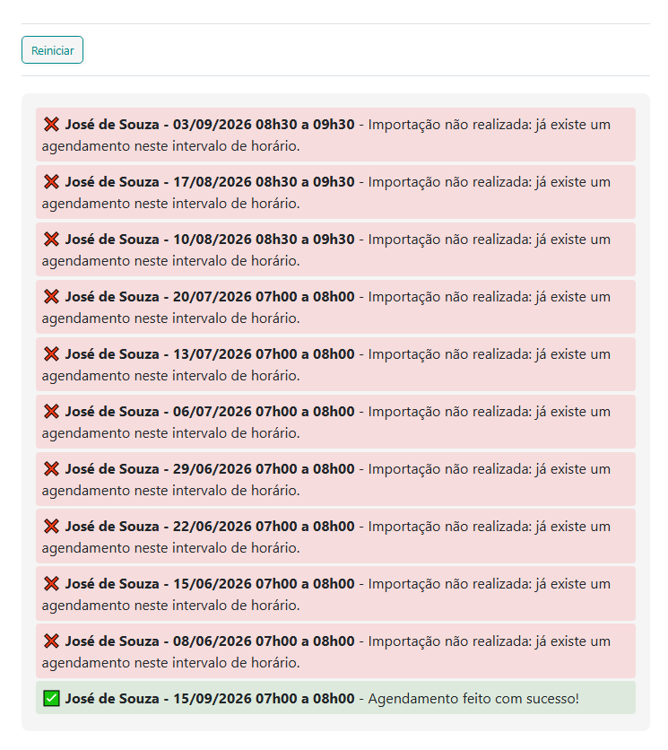

# Importação de Agendamentos

A **Importação de Agendamentos** permite cadastrar no eConsult vários agendamentos de uma só vez utilizando informações existentes em uma planilha **Excel ou CSV**.

O recurso é especialmente útil para quem está começando a utilizar o eConsult e já possui sua agenda organizada em planilhas ou deseja migrar agendamentos exportados de outro sistema.

Não é necessário que a planilha utilize exatamente os mesmos nomes de campos do eConsult. Durante o processamento, o sistema analisa a estrutura encontrada e procura identificar as informações correspondentes aos campos utilizados nos agendamentos.

## 1. Selecione o arquivo

Na tela de importação, clique no campo **Arquivo Excel ou CSV** e selecione o arquivo que contém os agendamentos que deseja importar.

São aceitos os formatos:

* `.xlsx`
* `.xls`
* `.csv`

Após selecionar o arquivo, o eConsult fará uma primeira leitura da planilha e apresentará informações como o nome do arquivo, planilha utilizada, quantidade de registros encontrados e quantidade de colunas identificadas.

### Qual planilha será utilizada?

Caso o arquivo Excel possua várias abas, a importação utiliza a **primeira planilha do arquivo**.

Por isso, antes de iniciar, verifique se os dados que deseja importar estão na primeira aba.

## 2. Confira a prévia dos dados

Depois da leitura do arquivo, o eConsult apresenta uma **prévia dos primeiros registros encontrados**.

Essa etapa permite verificar se a planilha foi lida corretamente antes de continuar.

Os nomes das colunas são apresentados conforme encontrados no arquivo original. Por exemplo, sua planilha pode utilizar nomes como:

`Paciente`, `Cliente`, `Data`, `Horário`, `Início`, `Fim`, `Valor`, `Pago`, entre outros.

Não é necessário renomear essas colunas para os nomes utilizados internamente pelo eConsult.

Se o arquivo selecionado não for o correto, clique em **Selecionar outro arquivo**.

## 3. Análise e organização dos agendamentos

Após conferir a prévia, clique em **Continuar**.

O eConsult analisará os registros da planilha e procurará identificar e organizar informações como:

* pessoa atendida;
* data do atendimento;
* horário de início;
* horário de término;
* situação do atendimento;
* valor combinado;
* valor pago;
* data do pagamento;
* responsável pelo pagamento.

Os nomes e a organização dessas informações podem variar de uma planilha para outra.

Por exemplo, a data e o horário podem estar em uma única coluna ou separados em campos diferentes. Quando possível, o eConsult interpreta essas informações e as organiza no formato necessário para o agendamento.

Campos que não existirem ou que não puderem ser identificados permanecerão sem preenchimento.

### Pessoa atendida

Cada agendamento precisa estar relacionado a uma **pessoa atendida**.

O eConsult procura identificar a pessoa correspondente utilizando as informações disponíveis na planilha.

Quando a pessoa já estiver cadastrada no eConsult, o agendamento será relacionado ao cadastro existente.

Quando necessário, o processo de importação também poderá identificar os dados disponíveis da pessoa para possibilitar seu cadastro e o relacionamento com os respectivos agendamentos.

Uma mesma pessoa pode possuir **vários agendamentos** no arquivo. Nesse caso, o eConsult organiza os registros encontrados e relaciona os diferentes atendimentos à mesma pessoa.

## 4. Revise os agendamentos identificados

Depois da análise, será apresentada a relação dos **Agendamentos Identificados**.

Essa é uma etapa de conferência. Os agendamentos ainda não foram cadastrados no eConsult.

Confira principalmente:

* pessoa atendida;
* data;
* horário de início;
* horário de término;
* situação do atendimento;
* valores identificados.

Recomendamos atenção especial às **datas e horários**, principalmente quando a planilha de origem possuir informações incompletas ou utilizar formatos diferentes para representar data e hora.

## 5. Selecione o que deseja importar

Inicialmente, todos os agendamentos identificados e aptos para importação ficam **selecionados**.

Você pode desmarcar qualquer registro que não queira cadastrar.

Também é possível utilizar a caixa de seleção do cabeçalho para selecionar ou desmarcar todos os registros de uma só vez.

Somente os agendamentos que estiverem **selecionados** serão enviados para importação.

## 6. Conclua a importação

Depois de revisar os dados e definir quais agendamentos deseja cadastrar, clique em:

**Importar**

O número apresentado no botão corresponde à quantidade de registros atualmente selecionados.

O eConsult enviará somente esses registros para o processo de importação.

Durante a importação, o eConsult verifica novamente as informações de cada agendamento antes de cadastrá-lo.

### Conflitos de horário

Um agendamento não será importado quando já existir outro agendamento ocupando o mesmo intervalo de horário na agenda.

Por exemplo, se já existir um agendamento das **07h00 às 08h00**, outro agendamento que utilize parte desse mesmo intervalo será recusado.

Agendamentos consecutivos são permitidos. Portanto, um atendimento das **07h00 às 08h00** não impede o cadastro de outro das **08h00 às 09h00**.

Ao término, o sistema apresenta quais agendamentos foram importados e quais não puderam ser importados, juntamente com o motivo.

Exemplos:

- **José de Souza - 15/09/2026 07h00 a 08h00** - Agendamento feito com sucesso!

    

- **José de Souza - 03/09/2026 08h30 a 09h30** - Não importado: já existe um agendamento neste intervalo.

    

## Importante

A importação foi desenvolvida para reduzir o trabalho necessário para migrar agendas existentes para o eConsult, mas a qualidade do resultado depende também das informações disponíveis no arquivo de origem.

O eConsult procura interpretar e organizar os dados encontrados, mas **não cria informações que não estejam presentes na planilha**.

Por isso, revise principalmente a pessoa atendida, a data e os horários apresentados antes de confirmar a importação.

Caso alguma informação não seja identificada corretamente, você poderá ajustar o arquivo de origem ou posteriormente complementar as informações diretamente no eConsult.

## Dica para uma melhor importação

Embora não seja necessário utilizar um modelo específico de planilha, arquivos bem organizados facilitam a identificação dos agendamentos.

Sempre que possível:

* utilize uma linha para cada agendamento;
* mantenha títulos claros na primeira linha da planilha;
* evite células mescladas;
* mantenha a identificação da pessoa atendida em uma coluna própria;
* mantenha datas e horários em colunas próprias ou em formatos consistentes;
* não misture informações de atendimentos diferentes na mesma linha;
* mantenha valores e informações de pagamento em colunas próprias quando disponíveis.

Você **não precisa adaptar sua planilha ao formato do eConsult** antes de tentar a importação. Primeiro envie o arquivo e confira o resultado apresentado pelo sistema.
