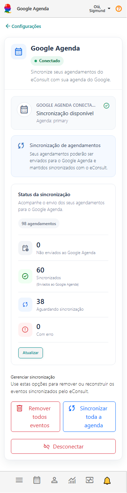

# Google Agenda

**Configure a integração do eConsult com o Google Agenda para enviar automaticamente seus agendamentos para a sua agenda do Google e manter seus compromissos organizados em um único lugar.**

Com a integração ativa, os agendamentos cadastrados no eConsult podem ser enviados para o Google Agenda, permitindo que você visualize seus atendimentos junto com os demais compromissos do seu dia a dia.

A página **Google Agenda** pode ser acessada através do **Painel Configurações**, na opção de integração com o Google Agenda.

:::note Por que integrar o Google Agenda ao eConsult?

A integração permite visualizar os agendamentos do eConsult diretamente no Google Agenda, facilitando a organização da rotina e o acompanhamento dos atendimentos em outros dispositivos, como computador, tablet ou celular.

O **eConsult continua sendo a referência para os dados do atendimento**. Alterações realizadas diretamente no Google Agenda não alteram o agendamento correspondente no eConsult.

:::

## Conectar o Google Agenda

1. Acesse **Configurações > Google Agenda**.

2. Clique em **Conectar Google Agenda**.

3. Selecione a conta Google que deseja utilizar.

4. Autorize o eConsult a acessar o seu Google Agenda.

5. Após a autorização, você será direcionado novamente ao eConsult.

Quando a conexão estiver concluída, será exibido o status **Conectado** e a agenda utilizada na sincronização.

## Sincronização dos agendamentos

Depois de conectado, o eConsult passa a disponibilizar a sincronização dos seus agendamentos com o Google Agenda.

Na seção **Status da sincronização**, você pode acompanhar quantos agendamentos estão em cada situação:

- **Não enviados ao Google:** agendamentos que ainda não foram enviados para o Google Agenda.
- **Sincronizados:** agendamentos enviados corretamente para o Google Agenda.
- **Aguardando sincronização:** agendamentos que estão na fila para serem enviados ou atualizados.
- **Com erro:** agendamentos que apresentaram algum problema durante a sincronização.

O botão **Atualizar** permite consultar novamente o status da sincronização.

:::info A sincronização pode não ser imediata

Quando um agendamento é criado ou alterado no eConsult, ele pode permanecer por algum tempo como **Aguardando sincronização** até que o processo automático de sincronização seja executado.

:::

## O que acontece quando um agendamento é alterado?

Quando você altera informações de um agendamento no eConsult, o evento correspondente pode ser atualizado no Google Agenda durante a próxima sincronização.

Isso permite que alterações realizadas no eConsult sejam refletidas no evento que já foi enviado para o Google Agenda.

:::warning Alterações realizadas diretamente no Google Agenda

Nesta versão da integração, as alterações feitas diretamente no evento pelo **Google Agenda não são enviadas de volta para o eConsult**.

Para manter as informações consistentes, faça alterações como data, horário, modalidade, status ou cancelamento diretamente pelo eConsult.

:::

## Sincronizar toda a agenda

Caso seja necessário reconstruir ou reenviar os eventos, clique em **Sincronizar toda a agenda**.

Essa opção coloca os agendamentos novamente no processo de sincronização, permitindo reconstruir os eventos do eConsult no Google Agenda.

Use essa opção, por exemplo, quando precisar refazer a sincronização após uma alteração na integração.

:::note

A ressincronização é uma operação de manutenção da agenda. Ela não deve ser necessária no uso normal da integração.

:::

## Remover todos os eventos

Para remover do Google Agenda os eventos criados pelo eConsult, clique em **Remover todos eventos**.

Essa opção é útil quando você deseja limpar os eventos sincronizados antes de realizar uma nova sincronização.

Antes da remoção, confirme a operação apresentada pelo sistema.

:::warning

Essa operação remove do Google Agenda os eventos sincronizados pelo eConsult. Os agendamentos cadastrados no eConsult não são excluídos.

:::

## Desconectar o Google Agenda

Para interromper a integração, clique em **Desconectar**.

Após a desconexão, novos agendamentos e alterações realizadas no eConsult deixarão de ser sincronizados com o Google Agenda.

Os seus agendamentos continuam normalmente cadastrados e disponíveis no eConsult.

## Recomendações

Sempre que precisar alterar informações de um atendimento, faça a alteração diretamente pelo **eConsult**. Dessa forma, o sistema permanece como fonte principal das informações e pode atualizar o evento correspondente no Google Agenda.

Você pode acompanhar o funcionamento da integração através do painel **Status da sincronização**. Em condições normais, após o processamento da fila, os agendamentos devem aparecer como **Sincronizados**.
