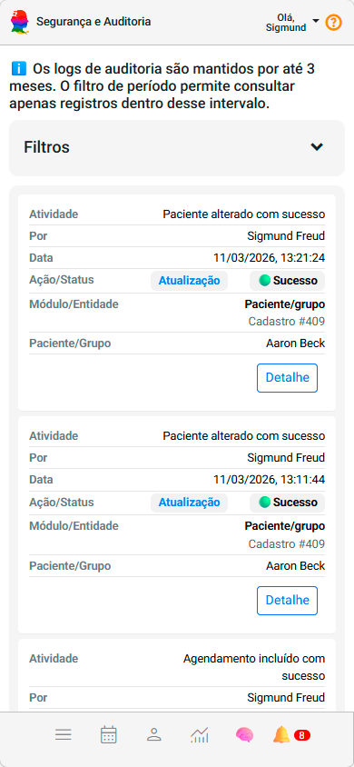
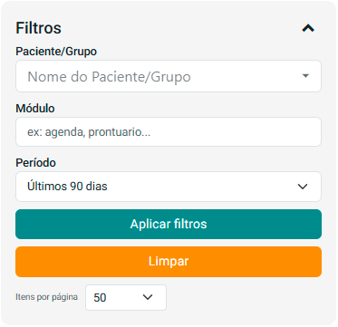
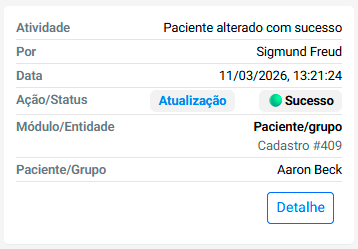
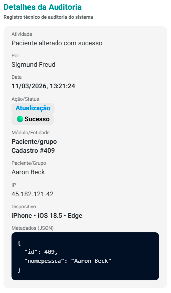

# Sobre Segurança e Auditoria

O painel **Segurança e Auditoria** permite acompanhar as principais atividades realizadas dentro do sistema. Ele registra eventos importantes relacionados ao uso da plataforma, oferecendo transparência, rastreabilidade e maior controle sobre as ações executadas.

Esse painel ajuda a compreender **quem realizou determinada ação, quando ela ocorreu e qual registro foi afetado**, facilitando a investigação de comportamentos, alterações ou ocorrências relevantes no sistema.

Os registros exibidos nesta tela correspondem aos **logs de auditoria do sistema**, que são mantidos por um período de até **3 meses**.

Durante esse período, você pode utilizar os filtros disponíveis para localizar rapidamente atividades específicas.

:::info
Os logs de auditoria são mantidos por até **3 meses**. O filtro de período permite consultar apenas registros dentro desse intervalo.
:::

---

# Filtros de consulta

A seção **Filtros** permite refinar a busca pelos registros de auditoria exibidos na tela.

Ao expandir essa seção, você pode definir critérios de pesquisa para localizar atividades específicas realizadas no sistema.

Os filtros podem incluir, por exemplo:

- Período em que a ação ocorreu
- Tipo de ação executada
- Módulo ou área do sistema envolvida
- Usuário responsável pela ação

Esses filtros ajudam a encontrar rapidamente eventos relevantes dentro do histórico de auditoria.

---

# Estrutura dos registros de auditoria

Cada atividade registrada no painel é apresentada em formato de **card**, contendo as principais informações relacionadas ao evento ocorrido.

Cada registro apresenta os seguintes elementos:

### **Atividade**
Descreve de forma resumida a ação realizada no sistema.

Exemplos:
- Paciente alterado com sucesso
- Agendamento incluído
- Registro financeiro atualizado

---

### **Por**
Indica **qual usuário realizou a ação** registrada.

Essa informação permite identificar rapidamente o responsável por determinada operação dentro da plataforma.

---

### **Data**
Mostra **a data e o horário exatos** em que a atividade ocorreu.

Esse registro temporal ajuda a reconstruir o histórico das operações realizadas no sistema.

---

### **Ação / Status**

Indica:

- **Ação:** o tipo de operação executada (ex.: atualização, criação ou exclusão).
- **Status:** se a operação foi concluída com sucesso ou se ocorreu algum erro.

Exemplos de status:

- **Sucesso:** a ação foi realizada corretamente.
- **Erro:** ocorreu algum problema durante a execução.
- **Negado:** a operação não foi permitida pelo sistema.

---

### **Módulo / Entidade**

Informa **em qual área do sistema a ação ocorreu**.

Exemplos:

- Pacientes / Grupo
- Agendamentos
- Financeiro
- Registros clínicos

Também pode indicar o **identificador do registro afetado**, como um cadastro específico.

---

### **Paciente / Grupo**

Quando a atividade envolve um paciente ou grupo terapêutico, o sistema exibe o nome correspondente para facilitar a identificação.

---

# Visualização de detalhes

Cada registro possui o botão **Detalhe**, que permite visualizar informações adicionais sobre a atividade registrada.

Ao acessar os detalhes, é possível obter mais contexto sobre a operação realizada, o que pode ajudar na análise de ocorrências ou na verificação de alterações realizadas no sistema.

---

# Importância do painel de auditoria

O painel **Segurança e Auditoria** é um recurso essencial para:

- acompanhar alterações realizadas no sistema
- identificar responsáveis por determinadas ações
- investigar ocorrências ou comportamentos inesperados
- aumentar a transparência e o controle sobre o uso da plataforma

Esse mecanismo contribui para uma gestão mais segura e confiável das informações registradas no sistema.

:::tip
Utilize os filtros para localizar rapidamente atividades específicas, especialmente ao investigar alterações realizadas em cadastros, agendamentos ou registros clínicos.
:::