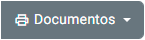
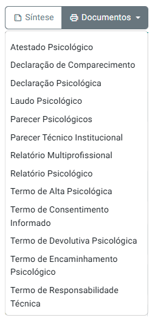
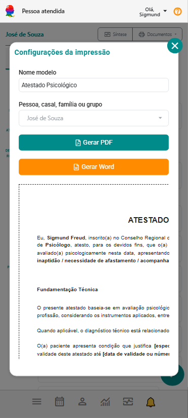

# Documentos de Pessoas Atendidas

O botão **Documentos** presente na tela **Pessoa Atendida** do eConsult permite que o psicólogo imprima documentos diretamente vinculados ao paciente/cliente selecionado.

Essa funcionalidade integra o módulo de Documentos ao contexto clínico, tornando o acesso mais rápido e organizado durante o atendimento.

---

## O que faz este botão

Ao clicar em **Documentos**, o sistema exibe todos os **modelos disponíveis com vínculo “Pessoa Atendida”** — ou seja, documentos configurados para serem utilizados dentro do cadastro de pessoa atendida (seja indivíduo, casal, família ou grupo terapêutico).

Entre os exemplos de documentos disponíveis estão:

- Atestado Psicológico  
- Declaração Psicológica  
- Declaração de Comparecimento  
- Termo de Consentimento Informado  
- Termo de Alta Psicológica  
- Relatório Psicológico  
- Parecer Técnico Institucional  
- Termo de Devolutiva Psicológica  
- Termo de Responsabilidade Técnica  

Esses modelos podem ser utilizados conforme a necessidade do caso clínico, garantindo padronização e agilidade na emissão.

---

## Como utilizar

1. Acesse o menu **Pessoas Atendidas**.  
2. Selecione a pessoa atendida desejada.  
3. Clique no botão **Documentos** no canto superior da ficha.  
4. Escolha o modelo desejado na lista exibida.  
5. O sistema abrirá a tela de **Edição e Pré-visualização**, onde você poderá:  
   - Visualizar o resultado em tempo real;  
   - Gerar PDF ou Word para impressão ou assinatura.  
6. Clique em **Gerar PDF** ou **Gerar Word** para emitir o documento final.

   

---

## Requisitos

Para que o modelo apareça nesta tela, ele deve ter a opção **“Vínculo do modelo”** marcada como **"Pessoa Atendida"** no cadastro do modelo de documento, no módulo principal de **Documentos**.

:::warning 
Modelos sem essa opção ativada não serão exibidos dentro do cadastro de Pessoas Atendidas. 
:::

---

:::tip
É possível criar novos modelos específicos para pessoas atendidas (ex.: *Declaração de Atendimento*, *Encaminhamento*, *Relatório de Sessão*), duplicando modelos existentes e marcando a opção **“Vínculo do modelo / Pessoa Atendida”** no painel **Documentos**.  
Assim, eles estarão disponíveis automaticamente no botão **Documentos** de cada paciente/cliente.
:::

---

## ✅ Benefícios

- Acesso rápido aos documentos mais usados na rotina clínica  
- Integração direta com dados do paciente  
- Redução de tempo de emissão  
- Padronização técnica e estética dos documentos  
- Garantia de conformidade com normas do CFP e LGPD
