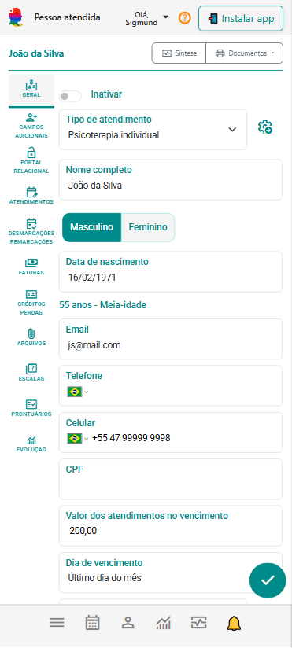
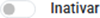
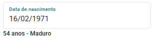

# Aba Geral 

No cadastro de Pessoa Atendida, na aba "Geral", os campos são organizados para a inserção das informações essenciais. Nesta seção, apenas "Tipo de Atendimento" e "Nome Completo" são de preenchimento obrigatório. Esses dados são fundamentais para atender às exigências mínimas necessárias para o registro.

Os demais campos (informações de contato ou o responsável pelo grupo) são opcionais e podem ser preenchidos conforme necessidade. Essa abordagem proporciona maior flexibilidade, permitindo que sejam inseridos apenas os dados considerados relevantes no momento. Assim, o sistema facilita a personalização e otimização do cadastro, adaptando-se aos objetivos específicos de cada caso, sem exigir informações desnecessárias.

## Componentes da Aba Geral

- **Seletor Inativar/Inativado /:** Esta opção permite inativar ou reativar o cadastro do paciente ou grupo.
- **Seletor Tipo de Atendimento:** Indica o tipo de atendimento que será dado a pessoa atendida.
- **Campo Nome Completo:** Permite incluir o nome completo da pessoa atendida (indivíduo, casal, família ou grupo).
- **Seletor Sexo:** Permite indicar Masculino ou Feminino.
- **Campo Data de Nascimento:** Permite informar a data de nascimento da pessoa atendida. Com base na data informada, o sistema identifica automaticamente o grupo etário correspondente, conforme as faixas de Grupos Etários cadastradas.

    A data deve ser preenchida no formato dd/mm/aaaa (ex.: 16/02/1971), utilizando barras. Caso o formato não seja respeitado, o sistema não aceitará o valor informado.

    

    :::note
        O campo "Data de Nascimento" não estará disponível para Casais, Famílias ou Grupos.
    :::
- **Campo E-mail:** Permite indicar o e-mail de contato.
- **Campo Telefone:** Permite indicar o telefone fixo.
- **Campo Celular:** Permite indicar o celular. 
    :::note
        Nos campos Telefone e Celular, ao digitar o código DDI (por exemplo, +55), o sistema identifica automaticamente o país e exibe a respectiva bandeira como ícone. Caso você não saiba o DDI, basta clicar no ícone da bandeira e selecionar o país desejado. Depois disso, é só digitar o número — o sistema fará a formatação conforme o padrão do país escolhido.
    :::
- **Campo CPF:** Permite indicar o CPF (opcional).
    :::note
        O campo "CPF" não estará disponível para Casais, Famílias ou Grupos.
    :::
- **Valor dos atendimentos no vencimento:** Permite indicar o valor padrão dos atendimentos no vencimento para o paciente ou grupo terapêutico. 
    :::note
        O sistema sugere o valor indicado na configuração **[Padrões para Atendimentos](/docs/funcionalidades/configuracoes/financas/padroes-atendimentos)**.
    :::
- **Dia de vencimento para atendimentos:** Permite indicar um padrão de dia de vencimento para pagamentos dos atendimentos deste paciente ou grupo.
    :::note 
    O sistema permite indicar:

        - No mesmo dia dos atendimentos
        - Definir número de dias após vencimento
        - Último dia do mês
        - Dia 1 do mês subsequente
        - Dia 10 do mês subsequente
        - Dia 15 do mês subsequente
        - Dia 20 do mês subsequente
        - Dia 25 do mês subsequente        

    Ao selecionar 'Definir número de dias após o atendimento', será possível informar quantos dias após a data do atendimento o vencimento deverá ocorrer.
    :::
- **Regras de Cobrança:** Permite indicar uma regra de cobrança para o paciente ou grupo. Esta regra pode conceder descontos para pagamento antecipado ou cobrar juros e mora após um período de atraso.
    :::note
        As regras de cobrança podem ser cadastradas na tela Regras de Cobrança do painel de configuração do sistema.
    :::

---

## Endereços

O eConsult oferece uma funcionalidade robusta para o cadastro de endereços na aba Geral, permitindo que cada paciente ou grupo terapêutico tenha um endereço principal e múltiplos endereços secundários. Esse recurso é especialmente útil para profissionais que prestam serviços em diferentes locais, possibilitando o registro detalhado dos locais de atendimento ou residência dos pacientes.

O cadastro de endereços é essencial para garantir que o eConsult possa emitir documentos de forma precisa e personalizada, como recibos, prontuários, e outras documentações importantes. O endereço principal é utilizado como referência para os documentos oficiais, enquanto os endereços secundários podem ser aplicados em situações específicas, como para entrega de correspondências ou para a prestação de serviços em locais alternativos.

### Incluir um novo endereço

1. Acione o botão "Incluir Endereço".

1. O sistema abrirá tela com formulário de cadastro de novo endereço. 

1. Preencha os campos "Tipo", "CEP", "Rua", "Número", "Complemento", "Bairro", "Cidade", "Estado", "País" e informe se este endereço será o seu principal ou não. Por último acione o botão "Incluir" .

    :::note
        Se, no campo "Tipo", você selecionar "Estrangeiro" (endereço fora do Brasil), o sistema ajustará o formulário para exigir a informação do "País" e permitirá que você insira um endereço estrangeiro no campo correspondente.
    :::

### Alterar um endereço

1. Acione o botão  correspondente ao endereço que se deseja alterar.

2. O sistema abrirá tela com formulário de cadastro de alteração do endereço.

3. Altere os campos "Tipo", "CEP", "Rua", "Número", "Complemento", "Bairro", "Cidade", "Estado", "País"  e informe se este endereço será o seu principal ou não. Por último acione o botão "Salvar" .

**OU, NO CASO DE ESTRANGEIRO**

3. Altere os campos "Endereço", "País" e informe se este endereço será o seu principal ou não. Por último acione o botão "Salvar" .

### Excluir um endereço

1. Acione o botão  correspondente ao endereço que se deseja excluir.

1. Confirme a operação acionando a opção "Sim".

