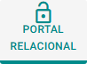

# Aba Portal Relacional

***Autonomia, transparência e vínculo terapêutico em um só ambiente.***

O **Portal Relacional** é uma funcionalidade exclusiva do **eConsult**, desenvolvida para oferecer a pessoa atendida **autonomia, praticidade e acesso seguro** às suas informações clínicas e financeiras.  
Ela foi pensada para **fortalecer a relação de confiança** entre paciente/cliente e psicólogo, permitindo uma comunicação ética, organizada e transparente.

---

## Visão Geral

Cada pessoa atendida (indivíduo, casal, família ou grupo) possui uma **área individual e criptografada**, acessível por um **link seguro e intransferível**, enviado pelo profissional.  
Nesse ambiente, a pessoa atendida pode:

- Visualizar **dados cadastrais** e **endereços** atualizados;  
- Consultar **agendamentos futuros e passados**;  
- Acompanhar **remarcações e cancelamentos**;  
- Baixar **recibos**, **documentos** e **notas fiscais**;  
- Acompanhar **faturas, créditos e perdas contábeis**;  
- E — se autorizado — **acessar seu prontuário clínico**, com anotações e evoluções liberadas pelo profissional.

> 🔒 Todos os dados são protegidos por criptografia e acesso autenticado, em conformidade com a LGPD e o Código de Ética Profissional do Psicólogo.

---

## Como Configurar os Acessos

1. No painel **Pessoas Atendidas**, clique em  no *card* da pessoa atendida desejada.  
2. Na tela de cadastro, abra a aba **Portal Relacional**.  
3. Marque as seções que a pessoa atendida poderá acessar:  
   - Prontuário  
   - Atendimentos  
   - Faturas  
   - Créditos e perdas  
   - Documentos  
   - Recibos  
   - Notas fiscais  
4. Clique em **Salvar** para registrar as permissões.

> 💡 Você pode alterar as permissões a qualquer momento, garantindo controle total sobre o que a pessoa atendida visualiza.

---

## Envio do Link de Acesso ao Portal Relacional

1. No aba **Portal Relacional**, clique em "Enviar link do Portal".  
    :::warning
    Escolha o meio de envio:
      -  **WhatsApp:**   
      -  **E-mail:**  
    :::
1. A pessoa atendida receberá o link seguro (token único) e poderá acessar sua área diretamente pelo navegador, sem login ou senha.

---

## Estrutura do Portal Relacional

A interface do Portal Relacional foi desenhada para ser **intuitiva, responsiva e humanizada**, mantendo clareza visual e foco na usabilidade.

O **Portal Relacional** é um ambiente exclusivo do eConsult criado para aproximar o profissional da pessoa atendida por meio de uma comunicação organizada, segura e transparente.

Nesse espaço, a pessoa atendida pode acompanhar informações relacionadas ao seu cuidado, consultar atendimentos e compromissos, acessar documentos compartilhados, visualizar informações financeiras e manter seus dados cadastrais atualizados.

## Para que serve o Portal Relacional?

O portal centraliza informações que normalmente seriam enviadas por diferentes canais, facilitando o acesso da pessoa atendida e reduzindo solicitações administrativas ao consultório.

Com essa funcionalidade, o profissional pode oferecer mais autonomia à pessoa atendida sem perder o controle sobre o que será disponibilizado.

## O que a pessoa atendida encontra no portal?

Ao acessar o Portal Relacional, a pessoa atendida visualiza uma tela inicial personalizada com seu nome e as informações disponibilizadas pelo profissional ou consultório.

### Avisos e ações pendentes

A área de destaque informa se existe alguma ação que precisa da atenção da pessoa atendida. Quando não houver pendências, o portal exibirá a mensagem **“Nenhuma ação pendente no momento”**.

### Atendimentos

Permite consultar os atendimentos registrados e as informações que tenham sido compartilhadas pelo profissional.

Essa área facilita o acompanhamento do histórico de cuidado, preservando o acesso somente ao conteúdo disponibilizado para a pessoa atendida.

### Financeiro

Apresenta as informações financeiras compartilhadas pelo consultório, como:

- faturas e pagamentos;
- créditos disponíveis;
- perdas ou valores compensados;
- recibos e outros registros relacionados.

### Documentos

Reúne documentos, recibos, notas fiscais e outros arquivos disponibilizados pelo profissional.

O conteúdo somente ficará visível no portal quando estiver devidamente compartilhado com a pessoa atendida.

### Meus dados

Permite que a pessoa atendida consulte e mantenha suas informações cadastrais atualizadas, contribuindo para a qualidade dos registros do consultório.

### Agenda

Disponibiliza o acesso aos compromissos e às informações de agendamento vinculadas à pessoa atendida.

## Tela inicial e acesso rápido

A tela inicial apresenta atalhos para as áreas mais utilizadas do portal:

- **Atendimentos:** acesso ao histórico e às informações compartilhadas;
- **Financeiro:** consulta de faturas, pagamentos e créditos;
- **Documentos:** acesso aos arquivos disponibilizados;
- **Meus dados:** consulta e atualização das informações cadastrais.

Além dos atalhos, são exibidos resumos das áreas de **Atendimentos**, **Financeiro** e **Documentos**, permitindo que a pessoa atendida localize rapidamente o que procura.

## Compartilhamento de informações

Antes de disponibilizar qualquer conteúdo no Portal Relacional, confira se a informação pertence à pessoa correta e se é adequada para compartilhamento.

Utilize o portal para disponibilizar conteúdos como:

- informações administrativas sobre os atendimentos;
- documentos destinados à pessoa atendida;
- recibos, notas fiscais e informações financeiras;
- materiais complementares relacionados ao acompanhamento;
- orientações que possam ser consultadas posteriormente.

> O registro de uma informação no eConsult não significa necessariamente que ela ficará visível no portal. A pessoa atendida acessa somente os conteúdos efetivamente disponibilizados ou compartilhados com ela.

## Boas práticas para o profissional

- Confira o destinatário antes de compartilhar documentos ou informações.
- Compartilhe apenas o conteúdo necessário e apropriado à finalidade do atendimento.
- Evite disponibilizar anotações de uso exclusivamente profissional ou informações de terceiros.
- Mantenha os dados cadastrais e de contato da pessoa atendida atualizados.
- Oriente a pessoa atendida a não compartilhar sua senha ou seus dados de acesso.
- Revise periodicamente os documentos e as informações disponíveis no portal.

## Privacidade e responsabilidade profissional

O Portal Relacional apoia uma comunicação mais segura e organizada, mas não substitui a avaliação técnica e ética do profissional sobre quais informações podem ser compartilhadas.

Antes de disponibilizar registros clínicos ou documentos sensíveis, considere a finalidade do compartilhamento, o contexto do atendimento, o sigilo profissional e as normas aplicáveis à sua atuação.

## Suporte à pessoa atendida

Na tela inicial, a pessoa atendida encontra os dados de contato do profissional ou consultório responsável. Oriente-a a utilizar esse contato sempre que tiver dúvidas sobre atendimentos, documentos, cobranças ou informações apresentadas no portal.

## Segurança e Conformidade

O Portal Relacional segue o mesmo padrão de segurança aplicado aos módulos clínicos do eConsult:

- **Criptografia ponta a ponta (HTTPS + AES-256)**  
- **Links únicos e intransferíveis (token individual)**  
- **Controle de acesso granular** configurado pelo profissional  
- **Anonimização de dados** para IA e relatórios estatísticos  
- **Auditoria e rastreabilidade completa de acessos**

> 🧠 Nenhuma informação é compartilhada sem consentimento, e todos os acessos são registrados com data e hora.

---

## Boas Práticas

:::tip  
- Envie o link somente após verificar as permissões de acesso.  
- Utilize o Portal Relacional para fortalecer a transparência do processo terapêutico.  
- Oriente seu paciente/cliente sobre o sigilo e a finalidade das informações visíveis.  
- Evite liberar prontuários ainda em elaboração.  
:::

---

## Comparativo com Outros Sistemas

#### Outros sistemas
- Portal do cliente inexistente ou restrito a agendamentos.  
- Nenhum controle sobre o que o cliente pode acessar.  
- Falta de integração com faturas, notas fiscais e prontuário.  
- Comunicação dispersa (WhatsApp, e-mail, planilhas externas).

#### eConsult
- **Área unificada** com dados clínicos e financeiros.  
- **Controle total de acesso** pelo profissional.  
- **Links seguros** e integrados ao cadastro.  
- **Comunicação ética e centralizada.**

> 🔹 O eConsult é um dos poucos sistemas que oferece ao psicólogo **uma Área do Paciente/Cliente realmente funcional e customizável**, conectando prontuário, financeiro e documentação em um só ambiente.

---

## Análise Crítica da Funcionalidade

#### 💼 Design funcional
O fluxo do Portal Relacional é simples e elegante: configuração → envio → acesso.  
O profissional controla tudo a partir do painel principal, sem precisar de portais externos.

#### 🔒 Segurança e ética
A arquitetura com **links criptografados e tokens únicos** é tecnicamente superior a sistemas baseados em login.  
Ela reduz o risco de acesso indevido e simplifica a experiência do paciente/cliente, sem comprometer a LGPD.

#### 💡 Experiência do usuário
A interface é responsiva e leve, otimizada tanto para desktop quanto para dispositivos móveis.  
A divisão por blocos (dados, atendimentos, finanças, documentos) é intuitiva e reduz curva de aprendizado.

#### 🧩 Diferencial clínico
A integração direta com **prontuário e finanças** é um diferencial marcante — poucos sistemas permitem que o paciente acompanhe sua jornada clínica e administrativa com tanta transparência e controle ético.

#### 📈 Potencial de expansão
O módulo está preparado para evoluir: chat seguro, upload de documentos pelo paciente/cliente e integração com teleatendimento são evoluções naturais dentro da arquitetura existente.

---

## Conclusão

O **Portal Relacional do eConsult** representa o ponto de encontro entre **transparência, ética e tecnologia**.  
Ele não apenas digitaliza a comunicação entre psicólogo e paciente/cliente, mas redefine a relação, transformando-a em um processo **colaborativo, seguro e centrado na confiança**.  

Com o Portal Relacional, o eConsult reafirma seu compromisso em unir **profundidade clínica**, **inteligência tecnológica** e **respeito absoluto à ética profissional.**