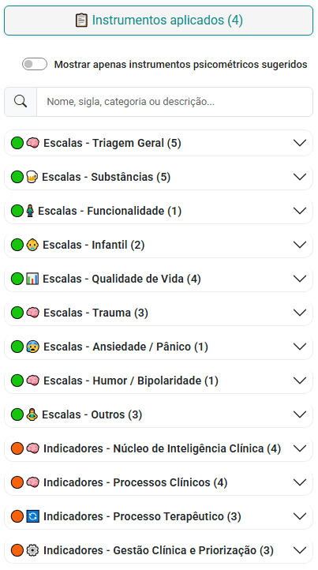
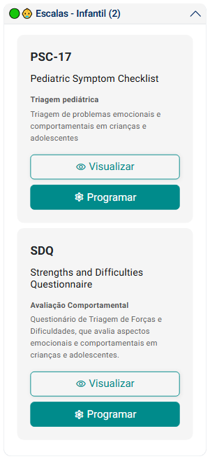
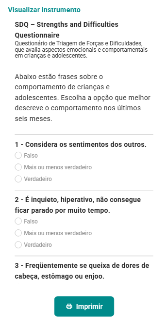
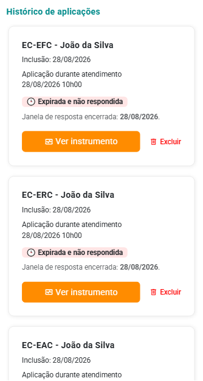
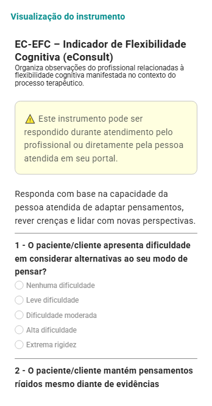
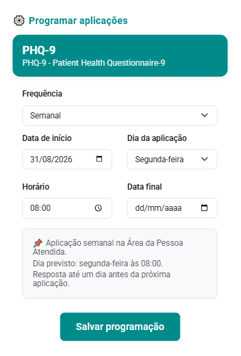

# Aba Instrumentos

A aba **Instrumentos** reúne os instrumentos psicométricos disponíveis para a pessoa atendida e permite acompanhar, em um único local, tanto os instrumentos já aplicados ou em aplicação quanto aqueles que poderão ser utilizados ao longo do acompanhamento clínico.

Seu objetivo é facilitar a organização das aplicações, a consulta aos instrumentos e o planejamento de aplicações recorrentes, contribuindo para o acompanhamento longitudinal da pessoa atendida.

## Localizar instrumentos

Os instrumentos são organizados por **categorias**, permitindo identificar com facilidade o contexto ou a finalidade de cada recurso disponível.

Cada categoria informa também a quantidade de instrumentos disponíveis.

Para localizar um instrumento específico, utilize o campo de pesquisa e informe parte do **nome, sigla, categoria ou descrição**.

A opção **Mostrar apenas instrumentos psicométricos sugeridos** permite restringir a visualização aos instrumentos sugeridos pelo sistema para o contexto da pessoa atendida.

:::tip

Os instrumentos apresentados nesta área podem possuir finalidades distintas. Antes da aplicação, consulte a descrição e o conteúdo do instrumento para verificar sua adequação ao contexto clínico e à finalidade pretendida.

:::

## Visualizar um instrumento

Ao expandir uma categoria, o sistema apresenta os instrumentos disponíveis em *cards*.

Cada instrumento apresenta informações resumidas, como:

- **Nome ou sigla** do instrumento;
- **Nome completo**, quando disponível;
- **Categoria ou finalidade**;
- **Descrição resumida** de sua utilização.

Para consultar o conteúdo antes de utilizá-lo, acione **Visualizar**.

A tela de visualização permite consultar a apresentação do instrumento, suas perguntas e alternativas de resposta.

Quando necessário, utilize a opção **Imprimir** para gerar uma versão destinada à consulta ou aplicação em formato impresso.

## Instrumentos aplicados

Na parte superior da sub-aba, a opção **Instrumentos aplicados** apresenta a quantidade de instrumentos vinculados à pessoa atendida que possuem aplicação registrada ou em andamento.

Ao acessar essa opção, o sistema exibe o **Histórico de aplicações**.

Para cada aplicação, podem ser apresentadas informações como:

- Instrumento e pessoa atendida;
- Data de inclusão;
- Contexto ou atendimento relacionado à aplicação;
- Situação atual da aplicação;
- Janela ou prazo de resposta, quando aplicável.

A opção **Ver instrumento** permite acessar os detalhes da aplicação selecionada.

Quando disponível, a opção **Excluir** permite remover a aplicação do histórico.

:::info

O histórico facilita a identificação de instrumentos já utilizados ou que ainda aguardam resposta, evitando aplicações desnecessariamente duplicadas e apoiando o acompanhamento ao longo do processo clínico.

:::

## Programar aplicações

Além de aplicações pontuais, o eConsult permite **programar aplicações recorrentes** de um instrumento psicométrico.

Essa funcionalidade é especialmente útil quando o profissional deseja acompanhar determinado aspecto ao longo do tempo por meio de aplicações periódicas.

Para criar uma programação:

1. Localize o instrumento desejado.
1. Acione **Programar**.
1. Defina a **frequência** de aplicação.
1. Informe a **data de início**.
1. Selecione o **dia da aplicação**, quando aplicável.
1. Informe o **horário** previsto.
1. Se desejar limitar o período de acompanhamento, informe uma **data final**.
1. Revise o resumo apresentado pelo sistema.
1. Acione **Salvar programação**.

Após salvar, o sistema utilizará a programação definida para disponibilizar as aplicações à pessoa atendida conforme a frequência configurada.

:::tip

A programação periódica pode ser utilizada como apoio ao **monitoramento longitudinal**, permitindo comparar respostas obtidas em diferentes momentos do acompanhamento.

A frequência de aplicação deve ser definida pelo profissional de acordo com a finalidade do instrumento, o contexto clínico e a necessidade de acompanhamento da pessoa atendida.

:::

## Acompanhamento longitudinal

A aba **Instrumentos** não se limita ao registro de uma aplicação isolada. Ao reunir histórico, situação das aplicações e programação periódica, ela permite organizar o uso dos instrumentos ao longo do processo terapêutico.

Dessa forma, o profissional pode utilizar os instrumentos como fonte complementar de informação para acompanhar mudanças, identificar tendências e apoiar seu raciocínio clínico ao longo do tempo.

:::caution

Os resultados dos instrumentos devem ser interpretados considerando sua finalidade, características e contexto de aplicação. O uso de instrumentos de triagem ou monitoramento não substitui o julgamento clínico profissional nem, quando exigível, uma avaliação psicológica realizada com instrumentos e procedimentos adequados à finalidade proposta.

:::
