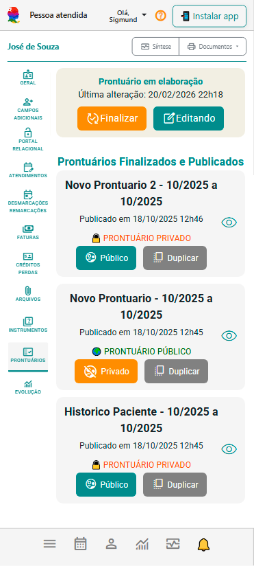
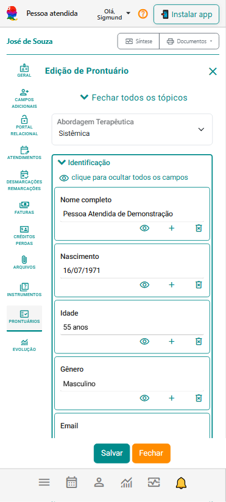

# Aba Prontuário

O **Prontuário Eletrônico** do **eConsult** foi projetado para unir **rigor técnico**, **flexibilidade de uso** e **segurança avançada**, atendendo às necessidades específicas de psicólogos que trabalham com atendimentos individuais, casais, famílias ou grupos terapêuticos.  

Por meio da **aba Prontuário**, o profissional centraliza todo o acompanhamento clínico da pessoa atendida, mantendo histórico completo, registros evolutivos, avaliações psicológicas, hipóteses clínicas e documentos anexados — tudo dentro de um ambiente seguro, criptografado e em conformidade com a LGPD.

---

## ⚙️ Estrutura do Prontuário

Cada pessoa atendida pode possuir **múltiplos prontuários**, permitindo que o profissional registre diferentes fases ou enfoques do processo terapêutico.  
Os prontuários assumem dois estágios principais:

- **🟡 Em elaboração:** visível apenas ao profissional até que seja concluído.  
- **🟢 Publicado:** finalizado e salvo no histórico, podendo ser:
  - **Privado:** acesso exclusivo do profissional;  
  - **Público:** visível também a pessoa atendida, se o profissional optar.

> 🔒 Apenas **um prontuário em elaboração** pode existir por pessoa atendida.

---

## 🧭 Importância Clínica e Ética

O prontuário no eConsult cumpre funções **assistenciais, jurídicas, administrativas e científicas**, sendo elemento essencial de registro clínico e rastreabilidade.

Ele pode conter:
- Dados pessoais e anamnese  
- Avaliações psicológicas aplicadas  
- Histórico de atendimentos e anotações clínicas  
- Arquivos anexados e relatórios  
- Hipóteses, diagnósticos e planos terapêuticos  
- Evoluções e encaminhamentos  

> Cada registro deve seguir as normas éticas do CFP e os princípios da LGPD, assegurando clareza, precisão e confidencialidade.

---

## 🧩 Componentes e Recursos

O prontuário é criado a partir de um **modelo de anamnese** e da **abordagem terapêutica** escolhida, que determinam sua estrutura e linguagem.  

Durante a edição, o profissional pode acessar recursos integrados:

- **🧠 Anamnese:** registro inicial estruturado conforme o modelo clínico configurado.  
- **📈 Avaliações Psicológicas:** aplicação de testes validados (ex.: PHQ-9, GAD-7 e WHO-5) com resultados automáticos integrados.  
- **🗂️ Histórico de Atendimentos:** linha do tempo com sessões, anotações clínicas e evolução do caso.  
- **📎 Arquivos:** upload e gerenciamento de documentos e relatórios vinculados.  
- **🤖 Inteligência Artificial Clínica:** sugestões de hipóteses diagnósticas, prognósticos e planos terapêuticos baseados no conteúdo do prontuário, nas escalas aplicadas e na abordagem escolhida.  
- **🔐 Controle de acesso:** criptografia de dados e permissões avançadas garantem total segurança e confidencialidade.

---

## 🧾 Como Criar e Gerenciar um Prontuário

1. Acesse a aba **Prontuário** dentro de **Pessoas Atendidas**.  
2. Clique em **Novo Prontuário** .  
3. Escolha um **modelo de anamnese** previamente cadastrado.  
4. Configure a **abordagem terapêutica**, tópicos e campos.  
5. Adicione avaliações, anotações e utilize os recursos de IA conforme desejar.  
6. **Salve** para manter em elaboração ou **finalize** para publicar.

Após finalizado, o prontuário aparece na lista com as seguintes opções:
- **Visualizar** 👁️ (modo leitura)  
- **Tornar Público/Privado** 🔒  
- **Duplicar para nova edição** 🔁  

> ⚠️ Prontuários publicados não podem mais ser editados — apenas duplicados ou alterados quanto à visibilidade.

:::tip Boas Práticas
- Mantenha os registros atualizados e objetivos.  
- Valide todas as sugestões da IA antes de incluir no texto clínico.  
- Use a versão pública apenas quando for clinicamente adequado.  
- Configure modelos de anamnese personalizados por abordagem terapêutica.  
:::

---

## 🔐 Segurança e LGPD

O eConsult adota padrões de segurança equivalentes a sistemas médicos e hospitalares:

- **Criptografia de ponta a ponta (AES-256)**  
- **Controle de acesso individualizado** por profissional  
- **Auditoria e rastreabilidade de ações**  
- **Anonimização de dados** para uso em relatórios ou IA  
- **Monitoramento contínuo contra acessos indevidos**

> 💡 Mesmo com anonimização, recomenda-se informar a pessoa atendida sobre o uso ético de IA e o tratamento anônimo dos dados, reforçando transparência e confiança.

---

## 🤖 Inteligência Artificial no Prontuário

A IA atua como **suporte ao raciocínio clínico**, gerando insights personalizados a partir dos registros existentes.  
Ela considera:

- Abordagem terapêutica (TCC, Psicanálise, Sistêmica, etc.)  
- Grau de engajamento da pessoa atendida  
- Avaliações psicológicas aplicadas  
- Histórico clínico e anotações anteriores 
- Último prontuário publicado (se houver)

:::note 
No caso de grupos terapêuticos, a IA considera os últimos prontuários publicados de cada membro do grupo.
:::

Os módulos que recebem apoio por IA são:
- **Diagnóstico**  
- **Prognóstico**  
- **Plano de Tratamento**  
- **Evolução do Tratamento**

:::warning
A IA **não substitui o julgamento profissional**.  
As sugestões são opcionais e devem ser validadas pelo psicólogo.
:::

---

## 📊 Comparativo com Outros Sistemas

### Outros sistemas
- Estrutura fixa e limitada a modelos genéricos.  
- Histórico sobrescrito (sem preservação de versões).  
- Falta de integração com grupos terapêuticos.  
- Nenhum suporte de IA ou anonimização LGPD.  
- Pouca ou nenhuma automação de registros.

### eConsult
- Prontuários **flexíveis, modulares e personalizáveis**.  
- **Histórico completo e versionado** por pessoa atendida.  
- **Integração total** com avaliações, arquivos e sessões.  
- **IA clínica contextualizada**, com privacidade assegurada.  
- **Controle granular** de visibilidade e publicação.  

:::tip  
**Diferencial real:** O eConsult eleva o conceito de prontuário eletrônico, tornando-o uma ferramenta ativa de raciocínio clínico e decisão terapêutica, não apenas um repositório de dados.
:::

---

## 🧭 Análise Crítica da Funcionalidade

### 💼 Design funcional
O fluxo do prontuário é intuitivo: criação → edição → publicação → histórico.  
A interface por *cards* facilita o gerenciamento de múltiplos registros e está visualmente bem resolvida tanto em desktop quanto mobile.

### 🧩 Robustez técnica
A arquitetura baseada em **modelos configuráveis (anamnese + abordagem)** permite adaptação a qualquer linha terapêutica.  
O armazenamento versionado de prontuários e a IA integrada representam um salto em automação clínica.

### 🔒 Ética e segurança
O modelo de **visibilidade dupla (Privado/Público)** é excelente: preserva sigilo e, ao mesmo tempo, permite comunicação transparente com a pessoa atendida quando o profissional desejar.  
A anonimização e conformidade com a LGPD são implementações exemplares no contexto psicológico.

### 💡 Experiência e usabilidade
O fluxo de edição e retomada do prontuário é fluido — especialmente o botão “Editando” exibido nos cards de prontuários em elaboração.  
O uso da IA embutida nos blocos de diagnóstico e plano terapêutico torna o processo de escrita mais produtivo, sem burocracia.

### 📈 Escalabilidade
O módulo foi claramente pensado para clínicas com múltiplos profissionais e grupos terapêuticos.  
O histórico completo e a duplicação de prontuários facilitam auditorias, revisões e continuidade longitudinal do cuidado.

---

## ✅ Conclusão

O **Prontuário Eletrônico do eConsult** transcende o papel tradicional de registro clínico.  
Ele se comporta como um **núcleo inteligente de gestão terapêutica**, combinando **segurança jurídica, rigor ético e suporte tecnológico avançado**.  

Com histórico evolutivo, IA integrada e controle granular de acesso, o módulo representa uma das soluções mais completas do mercado em termos de **documentação psicológica digital** — moderna, ética e centrada na prática profissional.