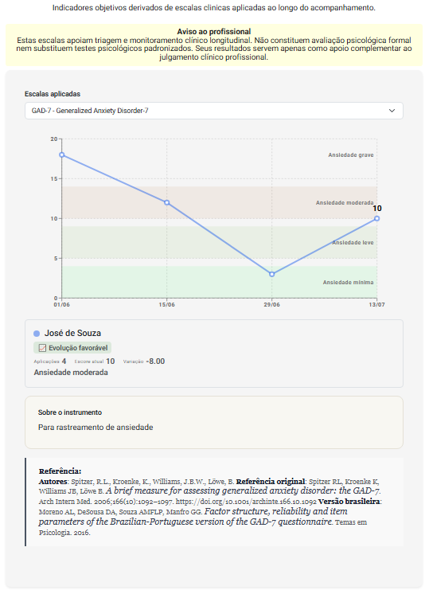

# Aba Evolução

A aba **Evolução** reúne indicadores administrativos, financeiros e clínicos da pessoa atendida ao longo do tempo.  
O objetivo é oferecer ao profissional uma visão integrada do acompanhamento, apoiando decisões mais informadas sobre o manejo, a organização da agenda e a sustentabilidade do cuidado.

O painel está organizado em quatro sub-abas:

- **Evolução**
- **Escalas**
- **Panorama**
- **Resumos**

Cada uma oferece um nível diferente de leitura do acompanhamento.

---

## Sub-aba Evolução

A sub-aba **Evolução** apresenta a leitura longitudinal clínica baseada nos **marcadores clínicos** registrados ao longo das sessões.

Seu objetivo é apoiar o raciocínio clínico, tornando visível a progressão do caso ao longo do tempo.

### Indicadores sintéticos do momento clínico

- **Direção:** tendência recente do caso (ex.: evolução favorável inicial)  
- **Risco atual:** nível estimado de risco clínico  
- **Manejo sugerido:** orientação assistiva baseada nos marcadores  

Esses elementos oferecem uma leitura rápida do estado atual do processo terapêutico.

### 💡 Insight Clínico

A seção apresenta um **insight clínico assistido**, elaborado a partir da trajetória dos marcadores registrados ao longo dos atendimentos.

O insight busca:

* destacar o movimento predominante do processo terapêutico;
* sinalizar avanços, estabilizações ou possíveis oscilações;
* indicar aspectos que ainda precisam de acompanhamento;
* apoiar a definição de focos para os próximos atendimentos.

A mensagem é apresentada de forma breve e objetiva, podendo incluir recomendações como o monitoramento de riscos residuais, a sustentação do engajamento e a continuidade das estratégias que vêm favorecendo a evolução clínica.

> ⚠️ O insight possui caráter **assistivo** e deve ser analisado pelo profissional em conjunto com os registros clínicos, o contexto da pessoa atendida e sua própria avaliação técnica.

### 🧠 Interpretação Clínica

A seção apresenta uma **síntese clínica assistida**, construída a partir dos marcadores registrados.

A análise busca:

- integrar sinais clínicos relevantes  
- identificar movimentos do processo terapêutico  
- apontar focos potenciais de manejo  
- apoiar a leitura longitudinal  

> ⚠️ Essa hipótese interpretativa é **assistiva** e não substitui a formulação clínica do profissional.

O texto narrativo pode incluir, conforme o caso:

- sinais de estabilização  
- indicadores de aliança terapêutica  
- movimentos de enfrentamento  
- elementos transferenciais/relacionais  
- ganhos de autonomia  
- padrões de engajamento  

A leitura considera a progressão temporal dos marcadores.

### Linha temporal dos atendimentos

Na parte inferior, o sistema apresenta a **progressão clínica por sessão**, incluindo:

- data do atendimento  
- marcadores identificados  
- estágio do processo  
- nível de engajamento  
- nível de risco  
- status do acompanhamento  

Essa visualização permite observar:

- mudanças de fase  
- padrões de estabilidade ou oscilação  
- momentos de maior risco  
- consolidação de ganhos terapêuticos  

---

## Sub-aba Escalas

A sub-aba **Escalas** apresenta a evolução dos resultados das escalas clínicas aplicadas ao longo do acompanhamento.

Seu objetivo é apoiar a **triagem**, o **monitoramento clínico** e a identificação de mudanças nos indicadores avaliados ao longo do tempo.

> ⚠️ **Aviso ao profissional:** as escalas apresentadas oferecem indicadores complementares e não constituem, isoladamente, uma avaliação psicológica formal. Seus resultados não substituem testes psicológicos padronizados, o raciocínio clínico nem o julgamento técnico do profissional.

### Escala aplicada

No campo **Escalas aplicadas**, selecione o instrumento que deseja analisar. A lista apresenta as escalas respondidas pela pessoa atendida durante o acompanhamento.

Ao selecionar uma escala, o sistema exibe um gráfico com:

* as datas das aplicações;
* a pontuação obtida em cada aplicação;
* as faixas de classificação do instrumento;
* a trajetória dos resultados ao longo do tempo.

Essa visualização facilita a identificação de:

* melhora ou agravamento dos indicadores;
* estabilidade dos resultados;
* oscilações entre as aplicações;
* possíveis respostas às intervenções realizadas;
* aspectos que demandam acompanhamento clínico.

### Síntese dos resultados

Abaixo do gráfico, o sistema apresenta uma síntese da aplicação mais recente e da trajetória observada, incluindo:

* nome da pessoa atendida;
* quantidade de aplicações realizadas;
* pontuação atual;
* variação em relação à primeira aplicação;
* classificação correspondente ao resultado;
* indicação da direção da evolução.

A variação permite verificar a diferença entre o resultado inicial e o mais recente. Sua interpretação deve considerar as características do instrumento: em algumas escalas, a redução da pontuação representa melhora; em outras, o significado pode ser diferente.

> 💡 A indicação de evolução favorável ou desfavorável é calculada de acordo com os critérios da escala selecionada e deve ser interpretada em conjunto com o contexto clínico.

### Sobre o instrumento

A seção **Sobre o instrumento** apresenta uma descrição resumida da finalidade da escala, indicando o construto ou a condição clínica que ela auxilia a rastrear ou monitorar.

Essas informações ajudam o profissional a compreender o objetivo do instrumento e a contextualizar seus resultados no acompanhamento.

### Referência técnica

Ao final da sub-aba, são apresentadas as informações bibliográficas relacionadas à escala, como:

* autores do instrumento;
* referência da publicação original;
* estudos de tradução, adaptação ou validação;
* fontes utilizadas para os critérios de interpretação.

As referências permitem consultar a fundamentação científica do instrumento e aprofundar a análise de suas propriedades e formas de utilização.

> ⚠️ Os resultados das escalas devem ser analisados em conjunto com entrevistas, observações, registros clínicos e demais informações disponíveis sobre a pessoa atendida.

---

## Sub-aba Panorama

A sub-aba **Panorama** apresenta uma visão gráfica longitudinal dos principais indicadores administrativos da pessoa atendida.

Ela permite identificar rapidamente:

- tendências de frequência  
- comportamento financeiro  
- padrão de comparecimento  
- utilização da agenda  

Os gráficos consideram uma janela temporal móvel (ex.: meses anteriores, mês atual e projeção), facilitando o monitoramento contínuo.

### Indicadores disponíveis

#### **LTV e CLC**

Apresenta a relação entre:

- **LTV (Lifetime Value):** valor gerado pela pessoa atendida  
- **CLC (Customer Lifetime Cost):** custo associado à manutenção da pessoa atendida  

Essa leitura ajuda a compreender a sustentabilidade financeira do acompanhamento.

#### **Detalhe da frequência**

Mostra o comportamento de comparecimento da pessoa atendida, incluindo:

- não confirmados  
- confirmados  
- realizados  
- não realizados  

Permite identificar padrões de adesão ao tratamento.

#### **Inadimplência**

Exibe os valores em atraso:

- total no mês  
- acumulado no ano  
- acumulado geral  

Funciona como um sinalizador de risco financeiro do vínculo.

#### **Perdas (baixas contábeis)**

Representa valores reconhecidos como perda definitiva no período.

#### **Perdas recuperadas**

Indica valores previamente inadimplentes que foram posteriormente recuperados.

#### **Ocupação**

Mostra como a pessoa atendida utiliza a agenda, discriminando:

- remotos pagos  
- remotos gratuitos  
- presenciais pagos  
- presenciais gratuitos  
- capacidade total  

Ajuda a avaliar eficiência de uso da agenda.

#### **Valor dos atendimentos**

Apresenta os valores praticados nos atendimentos da pessoa atendida, incluindo métricas como valor médio e máximo no período.

#### **Desmarcações e remarcações**

Aponta movimentações de agenda, como:

- desmarcações  
- desmarcações recuperadas  
- remarcações no mês  
- remarcações herdadas de mês anterior  
- remarcações para o próximo mês  

Esse indicador ajuda a avaliar estabilidade do comparecimento.

:::note Seletor de período
O período analisado pode ser ajustado pelos controles no topo da tela, permitindo ampliar ou reduzir a janela temporal de análise.

Essa flexibilidade facilita a identificação de tendências, oscilações e mudanças de comportamento ao longo do tempo.

:::

---

## Sub-aba Resumos

A sub-aba **Resumos** apresenta um consolidado administrativo do mês selecionado, organizado em *cards* sintéticos.

Ela responde rapidamente:

- como está o vínculo com a pessoa atendida  
- qual o volume financeiro do período  
- qual o nível de ocupação  
- se há sinais de risco administrativo  

### Cards disponíveis

#### **Dados da relação com a pessoa atendida**

Apresenta:

- tempo de relacionamento  
- ticket médio  
- frequência (mês, ano e global)  
- LTV e CLC (mês, ano e global)  

Esse bloco ajuda a entender o histórico e o valor do vínculo.

#### **Atendimentos do mês**

Mostra:

- quantidade total de atendimentos  
- valor total do mês  
- valores quitados e não quitados  

#### **Inadimplência**

Exibe o montante inadimplente:

- no mês  
- no ano  
- no total  

#### **Perdas (baixas contábeis)**

Apresenta valores reconhecidos como perda.

#### **Perdas recuperadas**

Mostra valores recuperados de inadimplência.

#### **Ocupação**

Detalha o uso da agenda pela pessoa atendida, incluindo:

- atendimentos remotos e presenciais  
- pagos e gratuitos  
- total de atendimentos  
- capacidade da agenda  

#### **Custos pagos**

Apresenta a faixa de valores pagos pela pessoa atendida no mês:

- mínimo  
- médio  
- máximo  

#### **Detalhe da frequência**

Mostra o status dos atendimentos:

- não confirmados  
- confirmados  
- não realizados  
- realizados  

#### **Remarcações e desmarcações**

Apresenta a movimentação de agenda da pessoa atendida no período.

### Leitura estratégica

A visualização consolidada permite ao profissional:

- identificar padrões de adesão  
- monitorar risco financeiro  
- avaliar estabilidade do comparecimento  
- compreender o valor longitudinal da pessoa atendida  
- ajustar estratégias de manejo administrativo  

---

## Finalidade clínica

A aba **Evolução** foi desenvolvida para:

- apoiar a leitura longitudinal da pessoa atendida 
- integrar dimensões clínicas e administrativas  
- tornar visível a evolução do acompanhamento  
- qualificar o planejamento do manejo  
- fortalecer a tomada de decisão baseada em dados  

---

> ⚠️ **Importante:** As análises apresentadas são ferramentas de apoio. A interpretação clínica e as decisões terapêicas são sempre de responsabilidade do profissional.