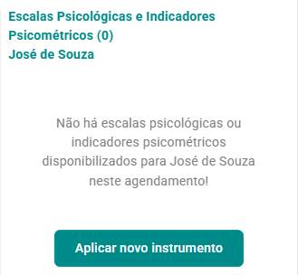
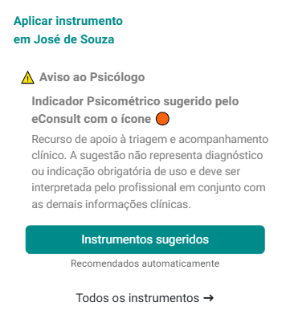
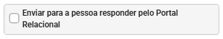

# Escalas e Indicadores Psicométricos

**Instrumentos e indicadores de apoio à triagem, investigação e acompanhamento clínico.**

O módulo de **Escalas e Indicadores Psicométricos** do eConsult reúne
instrumentos estruturados e recursos de acompanhamento que auxiliam o
profissional na organização e interpretação de informações relevantes ao
processo terapêutico.

Por meio do módulo, o profissional pode aplicar **Escalas
Psicológicas**, consultar seus resultados e acompanhar registros ao
longo do tempo. O eConsult também pode sugerir **Indicadores
Psicométricos** relacionados ao contexto clínico, oferecendo medidas
complementares para apoiar a observação e o acompanhamento longitudinal.

Esses recursos podem contribuir para identificar aspectos que merecem
investigação, acompanhar mudanças e organizar informações relevantes
para o raciocínio clínico. Seus resultados devem sempre ser analisados
pelo profissional em conjunto com entrevistas, observações, histórico
clínico e demais informações da pessoa atendida.

:::warning Atenção

Escalas e Indicadores Psicométricos são **recursos de apoio ao
profissional**. Seus resultados isolados não constituem uma avaliação
psicológica completa, não estabelecem diagnóstico e não substituem o
julgamento clínico.

:::

---

## Escalas Psicológicas e Indicadores Psicométricos

Embora possam ser utilizados de forma complementar, esses recursos
possuem finalidades e características diferentes.

### Escalas Psicológicas

São instrumentos estruturados utilizados para mensurar, rastrear ou
acompanhar determinados sintomas, comportamentos, percepções ou aspectos
do funcionamento psicológico.

Cada escala possui características próprias, que podem incluir:

- conjunto definido de itens;
- alternativas de resposta;
- regras de pontuação;
- dimensões ou fatores;
- critérios de classificação;
- orientações de aplicação;
- referências científicas.

O eConsult automatiza o cálculo dos resultados quando previsto pelo
instrumento, mas sua interpretação permanece sob responsabilidade do
profissional.

### Indicadores Psicométricos

Os **Indicadores Psicométricos** são medidas sugeridas pelo eConsult
para apoiar a observação estruturada de aspectos relevantes ao
acompanhamento clínico.

Diferentemente de uma escala tradicional, um indicador pode ser
utilizado como uma **medida complementar de acompanhamento**, ajudando o
profissional a observar determinados aspectos do processo terapêutico e
sua evolução ao longo do tempo.

Eles podem contribuir para:

- direcionar a atenção para aspectos clinicamente relevantes;
- estruturar observações ao longo das sessões;
- complementar informações provenientes de escalas;
- identificar mudanças que mereçam investigação;
- apoiar a leitura longitudinal do acompanhamento;
- auxiliar na organização e priorização das informações clínicas.

:::info Importante

A sugestão de um Indicador Psicométrico pelo eConsult **não representa
diagnóstico, conclusão clínica ou indicação obrigatória de uso**.

Cabe ao profissional avaliar sua pertinência para cada caso e
interpretar seus resultados dentro do contexto clínico.

:::

---

## Visão geral da funcionalidade

O módulo permite ao profissional:

- selecionar escalas de acordo com o domínio e o objetivo clínico;
- consultar **Indicadores Psicométricos sugeridos pelo eConsult**;
- aplicar uma escala ou indicador durante o atendimento;
- quando permitido, disponibilizar o instrumento à pessoa atendida por
  meio de um link;
- obter o cálculo automático da pontuação total e, quando previsto, da
  pontuação por fatores;
- consultar classificações e informações interpretativas disponíveis;
- acessar referências bibliográficas e informações técnicas;
- registrar os resultados no prontuário da pessoa atendida;
- revisar aplicações anteriores;
- acompanhar mudanças ao longo do tempo.

::: info
As classificações apresentadas pelo sistema reproduzem os critérios
cadastrados para cada instrumento ou indicador. Elas funcionam como
**informações de apoio ao raciocínio clínico** e não como conclusões
diagnósticas automáticas.
:::

---

## Acessando as Escalas e Indicadores

1.  Localize o atendimento desejado.

2.  No _card_ do atendimento, clique no botão **Instrumentos Psicomátricos** ().

   

3.  Clique em **Aplicar novo instrumento**.

   

4.  Escolha:
    - **Instrumentos sugeridos:** apresenta instrumentos e indicadores sugeridos (relacionados ao contexto clínico da pessoa atendida); ou
    - **Todos os instrumentos:** exibe a biblioteca completa de instrumentos disponível no eConsult.

5.  Selecione uma escala ou indicador conferindo sua descrição.

6. Aplique o instrumento respondendo as peguntas junto a pessoa atendida ou envie para a pessoa responder pelo Portal Relacional.

:::tip Instrumentos sugeridos

As sugestões apresentadas pelo eConsult funcionam como um recurso de
apoio à decisão. Elas ajudam a localizar escalas ou indicadores
potencialmente relacionados ao contexto observado, mas **não significam
que sua aplicação seja necessária ou adequada ao caso**.

A decisão de utilizar o recurso permanece sob responsabilidade do
profissional.

:::

### Atendimentos individuais

Em atendimentos individuais, a aplicação é vinculada diretamente à
pessoa atendida.

### Atendimentos de casal, família ou grupo

Para atendimentos de casal, família ou grupo, selecione o membro
ao qual a aplicação será vinculada. O resultado será armazenado no
prontuário individual desse membro, preservando a identificação correta
das informações.

---

## Formas de aplicação

### Aplicação durante o atendimento

O profissional pode realizar a aplicação junto à pessoa atendida durante
uma sessão presencial ou remota.

Antes de registrar cada resposta, confirme se a pessoa compreendeu o
enunciado e as alternativas apresentadas, sem interferir indevidamente
no conteúdo da resposta.

### Aplicação remota

Ao selecionar um instrumento, o sistema mostra a opção "Enviar para a pessoa responder pelo Portal Relacional".

Esta opção permite a pessoa atendida responder de forma remota pelo Portal Relacional.

A resposta remota não transfere ao sistema a responsabilidade pela condução clínica. Cabe ao profissional:

- verificar se a aplicação remota é apropriada;
- fornecer as orientações necessárias;
- considerar as condições em que o instrumento foi respondido;
- analisar o resultado dentro do contexto clínico;
- realizar o acolhimento ou manejo necessário diante de respostas
  sensíveis ou indicadores de risco.

:::warning
Nem todo instrumento admite aplicação informatizada ou remota. Quando se
tratar de teste psicológico, devem ser observadas as condições de
aplicação, correção e interpretação previstas em seu manual e no
**Sistema de Avaliação de Testes Psicológicos --- SATEPSI**.
:::

---

## Resultado da aplicação

Após o preenchimento, o eConsult poderá apresentar, conforme as
características do recurso utilizado:

- pontuação total;
- pontuação por dimensões ou fatores;
- faixa de classificação;
- informações interpretativas de apoio;
- observações técnicas;
- referências bibliográficas.

O resultado fica vinculado à pessoa atendida e pode ser consultado
posteriormente no prontuário.

### Acompanhamento longitudinal

Uma das principais vantagens da integração das escalas e indicadores ao
eConsult é a possibilidade de observar seus resultados **ao longo do
processo terapêutico**.

Aplicações realizadas em momentos diferentes podem ajudar o profissional
a identificar:

- estabilidade ou mudança de determinados indicadores;
- aumento ou redução de sintomas relatados;
- aspectos que permanecem relevantes ao longo das sessões;
- possíveis respostas às intervenções;
- situações que merecem investigação adicional.

:::tip Leitura clínica do resultado

Considere cada resultado em conjunto com o motivo do atendimento,
contexto de aplicação, histórico clínico, observações das sessões,
Marcadores Clínicos e outras fontes de informação.

Uma mudança numérica pode sinalizar algo relevante, mas **seu
significado depende da interpretação clínica e do contexto em que
ocorreu**.

:::

---

## Registro no prontuário

Os resultados passam a integrar o histórico clínico da pessoa atendida.

O profissional também pode utilizar a funcionalidade de **Anotações
Clínicas** para registrar:

- o motivo da aplicação;
- as condições em que o instrumento foi respondido;
- observações relevantes durante o preenchimento;
- a análise clínica do resultado;
- relações percebidas com outros indicadores ou registros;
- condutas, encaminhamentos ou pontos a serem acompanhados.

Esse registro ajuda a contextualizar o resultado e evita que uma
pontuação seja interpretada isoladamente em consultas futuras.

---

## Domínios disponíveis

A biblioteca do eConsult organiza escalas e indicadores em diferentes
domínios:

- Triagem Geral;
- Infantil;
- Ansiedade e Pânico;
- Humor e Bipolaridade;
- Trauma;
- Sono;
- Substâncias;
- Funcionalidade;
- Qualidade de Vida;
- Processos Clínicos;
- Processo Terapêutico;
- Núcleo de Inteligência Clínica;
- Gestão Clínica e Priorização;
- Outros.

Essa organização facilita a localização de recursos relacionados à
necessidade clínica observada.

A presença de uma escala ou indicador em determinado domínio --- ou sua
sugestão pelo eConsult --- **não significa, por si só, que sua aplicação
seja indicada para todos os casos**.

---

## Escalas, indicadores, testes e avaliação psicológica

Embora esses termos estejam relacionados, eles não são equivalentes:

- **Escala psicológica:** instrumento utilizado para mensurar,
  rastrear ou acompanhar determinados sintomas, comportamentos,
  percepções ou aspectos do funcionamento psicológico.
- **Indicador Psicométrico:** medida utilizada no eConsult como
  recurso complementar para estruturar e acompanhar determinados
  aspectos relevantes ao processo clínico. Sua finalidade, método de
  cálculo e fundamentação devem ser considerados antes de sua
  utilização e interpretação.
- **Teste psicológico:** instrumento de uso profissional da Psicologia
  que deve atender às exigências técnicas e às condições de uso
  estabelecidas pelo Conselho Federal de Psicologia.
- **Avaliação psicológica:** processo estruturado de investigação que
  integra diferentes métodos, técnicas, instrumentos e fontes de
  informação para subsidiar uma decisão profissional.

Escalas e indicadores podem contribuir para o processo de investigação e
acompanhamento, mas **não representam, isoladamente, todo o processo
avaliativo**.

Para consultar a situação e as condições de uso de testes psicológicos,
acesse o [SATEPSI](https://satepsi.cfp.org.br/).

---

## Cuidados técnicos e éticos

### Uso adequado do recurso

Antes da aplicação, verifique:

- sua finalidade;
- o público-alvo e a faixa etária;
- a fundamentação e as evidências científicas disponíveis;
- as condições recomendadas de aplicação;
- o método de cálculo;
- as limitações de interpretação;
- a situação do instrumento no SATEPSI, quando aplicável;
- eventuais restrições de direitos autorais ou de reprodução.

Estar cientificamente fundamentado ou constar no SATEPSI **não significa
necessariamente que um instrumento seja de domínio público ou possa ser
digitalizado, reproduzido ou aplicado remotamente sem autorização**.

### Responsabilidade profissional

O eConsult automatiza cálculos, organiza informações e pode sugerir
escalas e indicadores relacionados ao contexto clínico, mas a decisão de
aplicação e a análise final permanecem sob responsabilidade do
profissional.

Nenhum resultado deve ser utilizado isoladamente para:

- estabelecer diagnóstico;
- confirmar ou excluir uma condição clínica;
- tomar decisões de alto impacto;
- substituir entrevista, observação ou outras fontes de informação;
- produzir documentos psicológicos sem fundamentação técnica
  suficiente.

### Sigilo e proteção de dados

As respostas e os resultados contêm dados pessoais sensíveis. O acesso
às informações é controlado conforme as permissões definidas no sistema,
e o profissional deve observar o sigilo, a finalidade do tratamento e os
demais deveres previstos na legislação e nas normas profissionais.

Ao enviar um instrumento por link ou compartilhar seus resultados,
confirme a identidade do destinatário e utilize um canal adequado para
informações clínicas.

---

## Benefícios para o acompanhamento clínico

Quando utilizados de forma adequada, Escalas Psicológicas e Indicadores
Psicométricos podem contribuir para:

- estruturar a coleta de informações;
- apoiar a triagem clínica;
- identificar aspectos que merecem investigação adicional;
- acompanhar sintomas e indicadores ao longo do tempo;
- observar respostas às intervenções;
- complementar os Marcadores Clínicos;
- enriquecer os registros clínicos;
- apoiar o diálogo entre profissional e pessoa atendida;
- construir uma visão longitudinal do acompanhamento.

O principal benefício não está apenas na obtenção de uma pontuação, mas
na possibilidade de **conectar diferentes medidas ao histórico clínico e
compreender como determinados aspectos evoluem ao longo do processo
terapêutico**.

---

## Limites de uso

:::warning
As **Escalas Psicológicas e os Indicadores Psicométricos** disponíveis
no eConsult são recursos de apoio à triagem, investigação e
acompanhamento clínico.

Seus resultados:

- não constituem diagnóstico automático;
- não substituem uma avaliação profissional completa;
- não devem ser interpretados fora do contexto clínico;
- não dispensam o cumprimento das orientações técnicas de cada
  instrumento;
- não autorizam o uso de instrumentos restritos ou protegidos sem a
  devida permissão;
- não tornam obrigatória a aplicação de uma escala ou indicador
  sugerido pelo eConsult.

A indicação apresentada pelo sistema deve ser compreendida como
**sugestão de apoio ao profissional**, cabendo a ele decidir sobre sua
pertinência e interpretar os resultados dentro do contexto de cada
pessoa atendida.
:::
