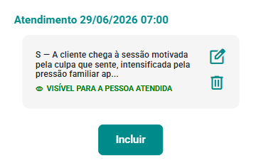
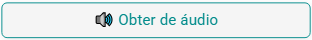
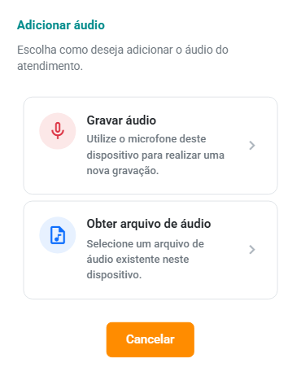
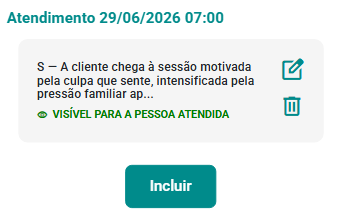

# Anotações Clínicas

As **Anotações Clínicas** permitem registrar informações relevantes
sobre cada atendimento realizado no eConsult, apoiando a documentação do
processo terapêutico e a continuidade do acompanhamento da pessoa
atendida.

Elas podem reunir relatos apresentados durante a sessão, observações do
profissional, intervenções realizadas, hipóteses de trabalho,
orientações, encaminhamentos e outros elementos considerados relevantes
para o acompanhamento clínico.

No eConsult, a anotação pode ser elaborada de diferentes formas:

-   **manualmente**, utilizando texto livre ou um formato estruturado;
-   a partir de **Marcadores Clínicos** registrados no atendimento;
-   a partir da **gravação ou envio de um arquivo de áudio**, com
    transcrição;
-   com apoio da **Inteligência Artificial**, para gerar, organizar,
    melhorar ou detalhar o texto.

:::info
A Inteligência Artificial atua como **recurso de apoio à elaboração da
anotação clínica**. O conteúdo gerado deve sempre ser revisado, ajustado
e validado pelo profissional antes de ser salvo.
:::

## Acessar as Anotações Clínicas de um atendimento

1.  Localize o atendimento desejado.

2.  No ***card*** do atendimento, acione a opção .

3.  O sistema abrirá a tela **Anotações Clínicas**, apresentando as anotações já registradas para aquele atendimento.

    

4.  Para alterar uma anotação, acione o botão **Edit**
    .

5.  Para registrar uma nova anotação, acione o botão **Incluir**
    .

6.  O sistema abrirá o formulário **Anotações Clínicas**.

    

A partir desse formulário, escolha a forma mais adequada para elaborar a
anotação.

------------------------------------------------------------------------

## Elaborar uma anotação a partir de áudio

O eConsult permite utilizar um áudio como ponto de partida para a
elaboração da anotação clínica.

Essa opção pode ser útil quando o profissional prefere registrar
verbalmente suas principais observações após o atendimento e utilizar a
transcrição como base para a documentação.

1.  No formulário **Anotações Clínicas**, acione a opção **Obter de
    Áudio**.

    

2.  Escolha uma das opções disponíveis:

    -   **Gravar Áudio** --- permite realizar uma nova gravação
        utilizando o dispositivo;
    -   **Obter arquivo de áudio** --- permite selecionar um arquivo de
        áudio já existente.

    

3.  Após a gravação ou seleção do arquivo, o sistema realizará a
    **transcrição do áudio**.

4.  Utilize o texto transcrito como base para elaborar a anotação
    clínica.

:::tip
Antes de salvar, revise a transcrição e ajuste eventuais nomes, termos
técnicos, expressões ou informações que não tenham sido reconhecidos
corretamente.
:::

------------------------------------------------------------------------

## Elaborar uma anotação a partir dos Marcadores Clínicos

Quando o atendimento possui **Marcadores Clínicos** previamente
registrados, eles podem ser utilizados como contexto para auxiliar na
elaboração da anotação.

Essa funcionalidade reduz a necessidade de reconstruir manualmente os
principais acontecimentos da sessão e permite transformar os marcadores
selecionados em uma sugestão estruturada de registro clínico.

1.  No formulário **Anotações Clínicas**, no campo **Formato**, selecione:

    **🧠 Obter de Marcadores Clínicos**

    

2.  Acione a opção **Aprimorar com IA**.

    

3.  O sistema abrirá a tela de geração assistida por IA, utilizando os Marcadores Clínicos como contexto e apresentando uma sugestão de anotação já no formato SOAP.

    

4.  **Revise e edite** o conteúdo sugerido.

5.  Quando o texto estiver adequado, clique em **Aplicar**.

    

6.  Caso queira disponibilizar a anotação para a pessoa atendida no
    **Portal Relacional**, marque a opção **Compartilhar com a pessoa
    atendida**.

    

7.  Acione o botão **Salvar anotação clínica**.

8.  A nova anotação será apresentada na tela **Anotações Clínicas**.

    

9.  Ao fechar a tela, o **card** do atendimento será atualizado,
    indicando que existem anotações registradas para aquele atendimento.

    

    

:::info
Os Marcadores Clínicos funcionam como **contexto para a geração
assistida**. A anotação resultante não deve ser considerada um registro
automático definitivo: cabe ao profissional revisar e validar o conteúdo
antes de salvá-lo.
:::

------------------------------------------------------------------------

## Elaborar uma anotação manualmente

Também é possível registrar uma anotação sem utilizar Marcadores
Clínicos ou Inteligência Artificial.

1.  No formulário **Anotações Clínicas**, altere o campo **Formato da
    anotação** para:

    **📝 Texto livre**

    

2.  Digite a anotação clínica no campo correspondente.

3.  Caso queira disponibilizar o conteúdo para a pessoa atendida no
    **Portal Relacional**, marque a opção **Compartilhar com a pessoa
    atendida**.

    

4.  Acione o botão **Salvar anotação clínica**.

5.  O sistema atualizará a tela **Anotações Clínicas** com o novo
    registro.

    

6.  Ao fechar a tela, o **card** do atendimento indicará que existe uma
    anotação registrada.

    

    

------------------------------------------------------------------------

## Elaborar uma anotação estruturada com apoio da IA

Além do texto livre, o eConsult permite organizar a anotação utilizando
diferentes modelos de documentação clínica.

No campo **Formato da anotação**, selecione uma das opções disponíveis:

-   📝 **Texto livre**
-   📋 **SOAP** --- Subjetivo, Objetivo, Avaliação e Plano
-   📋 **PPR** --- Prontuário Psicológico Resumido
-   📋 **DAR** --- Data, Action, Response
-   📋 **DAP** --- Data, Avaliação e Plano
-   📋 **PIE** --- Problema, Intervenção e Avaliação
-   📋 **EEM** --- Exame do Estado Mental
-   📋 **BIRP** --- Comportamento, Intervenção, Resposta e Plano
-   📋 **GIRP** --- Objetivo, Intervenção, Resposta e Plano

### Utilizar a IA

1.  Selecione o formato desejado.

2.  Informe no campo de anotação os relatos, observações ou informações
    que deseja utilizar como contexto.

    

3.  Acione a opção **Aprimorar com IA**.

    

4.  Na tela de IA, escolha a ação desejada, como **Gerar**, **Melhorar**
    ou **Detalhar**.

    

5.  O sistema apresentará uma sugestão de texto considerando as
    informações fornecidas e o formato selecionado.

    

6.  **Revise e edite** o conteúdo gerado.

7.  Clique em **Aplicar** para transferir o conteúdo para a anotação
    clínica.

    

8.  Se desejar disponibilizar a anotação no **Portal Relacional**,
    marque **Compartilhar com a pessoa atendida**.

9.  Acione **Salvar anotação clínica**.

    

10. O sistema atualizará a tela com a nova anotação.

    

11. Ao fechar a tela, o **card** do atendimento será atualizado com o
    indicador de anotação.

    

    

------------------------------------------------------------------------

## Recursos disponíveis na geração com IA

Na tela de geração assistida, estão disponíveis ações para trabalhar o
conteúdo da anotação, como:

-   **Gerar novo** --- cria uma nova sugestão a partir das informações
    fornecidas;
-   **Melhorar texto** --- reorganiza e aprimora a redação do conteúdo;
-   **Detalhar mais** --- amplia o texto considerando o contexto
    informado;
-   **Continuar com IA** --- permite continuar trabalhando o conteúdo de
    forma assistida.

Para consultar a explicação de cada recurso, acione a opção de
informações
.

O sistema apresentará uma tela explicativa.

:::warning Importante

A IA auxilia na **organização e elaboração do texto**, mas não substitui
o raciocínio, a avaliação ou a responsabilidade profissional.

Antes de aplicar e salvar qualquer conteúdo gerado, verifique se o texto
representa adequadamente o atendimento realizado.

:::

------------------------------------------------------------------------

## Compartilhar a anotação com a pessoa atendida

Ao registrar uma anotação, o profissional pode definir se ela ficará
apenas no contexto interno do atendimento ou se também será
disponibilizada para a pessoa atendida.

Para permitir a visualização no **Portal Relacional**, marque:

**Compartilhar com a pessoa atendida**

Utilize essa opção somente quando o conteúdo da anotação for apropriado
para compartilhamento.

:::warning
Antes de compartilhar uma anotação, revise cuidadosamente seu conteúdo e
verifique se as informações registradas são adequadas para
disponibilização à pessoa atendida.
:::

------------------------------------------------------------------------

## Alterar ou excluir uma anotação

Você pode incluir **quantas anotações forem necessárias em um mesmo
atendimento**.

Na tela **Anotações Clínicas**, utilize:

-   **Alterar**
     ---
    para editar uma anotação existente;
-   **Excluir**
    
    --- para remover uma anotação.

------------------------------------------------------------------------

## Limitações de uso da Inteligência Artificial no eConsult

O eConsult possui recursos de Inteligência Artificial para apoiar
tarefas como elaboração, revisão, organização e estruturação de
anotações clínicas.

A disponibilidade e os limites de utilização desses recursos variam
conforme o plano contratado.

  |**Recurso**|**Free**|**Pro**|**Plus**|**Premium**|
  |---|---|---|---|---|
  |Anotações clínicas por IA|0|0|176/mês|Ilimitado|

:::warning Importante

Se o limite mensal de utilização for atingido, os recursos
correspondentes de IA ficarão temporariamente indisponíveis até a
renovação do saldo prevista para o próximo ciclo mensal.

:::

------------------------------------------------------------------------

## Boas práticas para Anotações Clínicas

Ao elaborar uma anotação:

-   registre informações relevantes para a compreensão e continuidade do
    acompanhamento;
-   utilize linguagem clara, objetiva e profissional;
-   diferencie, sempre que necessário, **relatos da pessoa atendida** de
    **observações do profissional**;
-   revise conteúdos provenientes de áudio ou gerados com Inteligência
    Artificial;
-   evite incluir informações desnecessárias ao propósito do registro;
-   antes de compartilhar pelo Portal Relacional, verifique se o
    conteúdo é apropriado para visualização pela pessoa atendida.

As Anotações Clínicas devem apoiar a documentação do atendimento sem
substituir o julgamento e a responsabilidade profissional sobre aquilo
que será efetivamente registrado.
