# Anotações Clínicas

Você pode elaborar anotações detalhadas para os atendimentos realizados no eConsult, com o objetivo de registrar informações essenciais, desde o motivo inicial do atendimento até observações feitas durante a interação. Essas anotações são fundamentais para documentar decisões, raciocínios e orientações fornecidas a pessoa atendida, garantindo que o atendimento seja compreendido e que haja continuidade adequada nos cuidados ou serviços prestados.

As anotações podem incluir detalhes como o histórico da pessoa atendida, relatos, respostas a perguntas específicas, além de orientações ou recomendações feitas durante o atendimento. A precisão e a clareza são cruciais para assegurar que todas as informações sejam facilmente compreendidas e possam ser referenciadas posteriormente.

Essas anotações podem ser de uso interno, servindo exclusivamente como referência para o profissional, ou podem ser integradas ao prontuário da pessoa atendida. Quando publicadas no prontuário, tornam-se parte permanente do registro, acessíveis para futuros atendimentos e podendo ser visualizadas pela pessoa atendida.

A decisão de publicar ou não as anotações no prontuário deve levar em conta a relevância das informações para o histórico da pessoa atendida e a necessidade de compartilhá-las, a fim de garantir um cuidado contínuo e eficaz. Independentemente de serem publicadas no prontuário, todas as anotações são realizadas com rigor e em conformidade com as normas de confidencialidade e privacidade, garantindo a proteção dos dados da pessoa atendida e a integridade do processo de atendimento.

## Incluir anotação para o atendimento utilizando marcadores clínicos previamente cadastrados

1. Acione a opção  no *card* do atendimento para o qual deseja incluir uma anotação.

1. O sistema abre a tela "Anotações Clínicas".

    

1. Acione o botão "Incluir" .

1. O sistema abre o formulário "Anotações Clínicas".

    

1. Mantenha o campo "Formato da anotação" com a opção "🧠 Gerar anotação estruturada (IA + marcadores)" selecionada.

1. Acione a opção "Gerar sugestão com IA".

    

1. O sistema abrirá a tela de geração de anotação com IA já com a sugestão de anotação.

    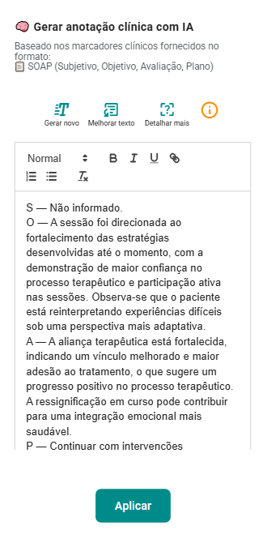

1. Revise e edite a anotação clínica e clique em "Aplicar".

    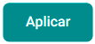

1. Marque o campo "Compartilhar com a pessoa atendida" se quiser disponibilizar para que a pessoa atendida visualize a anotação na Área da pessoa atendida e acione o botão "Salvar anotação clínica".

    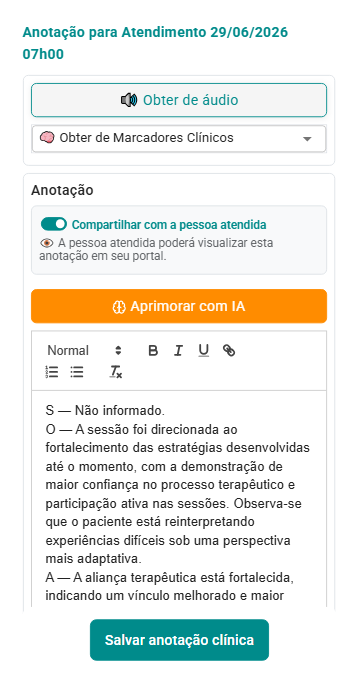

1. O sistema atualizará a tela "Anotações Clínicas" com a nova anotação.

    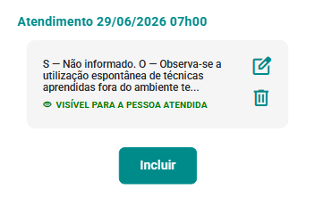

1. Ao fechar esta tela, o sistema atualiza o *card* do atendimento, indicando que há uma anotação registrada  para o atendimento em questão.

    

## Incluir anotação para o atendimento sem utilização de marcadores clínicos e sem utilização de IA

1. Acione a opção  no *card* do atendimento para o qual deseja incluir uma anotação.

1. O sistema abre a tela "Anotações Clínicas".

    

1. Acione o botão "Incluir" .

1. O sistema abre o formulário "Anotações Clínicas".

    

1. Altere o campo "Formato da anotação" para a opção "📝 Texto livre".

    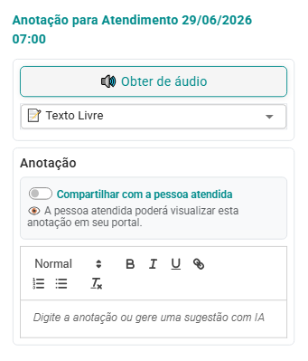

1. Marque o campo "Compartilhar com a pessoa atendida" se quiser disponibilizar para que a pessoa atendida visualize a anotação no Portal Relacional, preencha o campo correspondente à anotação e acione o botão "Salvar anotação clínica".

    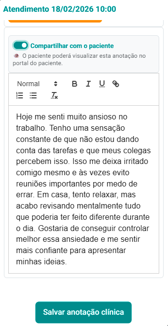

1. O sistema atualizará a tela "Anotações Clínicas" com a nova anotação.

    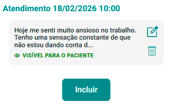

1. Ao fechar esta tela, o sistema atualiza o *card* do atendimento, indicando que há uma anotação registrada  para o atendimento em questão.

    

## Incluir anotação para o atendimento sem utilização de marcadores clínicos usando IA

1. Acione a opção  no *card* do atendimento para o qual deseja incluir uma anotação.

1. O sistema abre a tela "Anotações Clínicas".

    

1. Acione o botão "Incluir" .

1. O sistema abre o formulário "Anotações Clínicas".

    

1. Altere o campo "Formato da anotação" para uma das opções:

    - 📝 Texto livre
    - 📋 SOAP (Subjetivo, Objetivo, Avaliação, Plano)
    - 📋 PPR (Prontuário Psicológico Resumido)
    - 📋 DAR (Data, Action, Response)
    - 📋 DAP (Data, Avaliação, Plano)
    - 📋 PIE (Problema, Intervenção, Avaliação)
    - 📋 EEM (Exame do Estado Mental)
    - 📋 BIRP (Comportamento, Intervenção, Resposta, Plano)
    - 📋 GIRP (Objetivo, Intervenção, Resposta, Plano)

    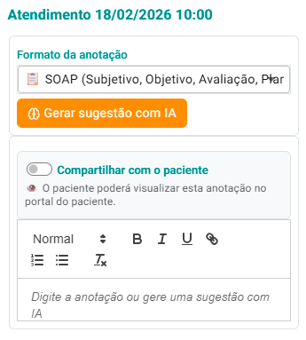

1. Acione a opção "Gerar sugestão com IA".

    

1. Preencha o campo base correspondente para que a IA possa gerar uma sugestão.

    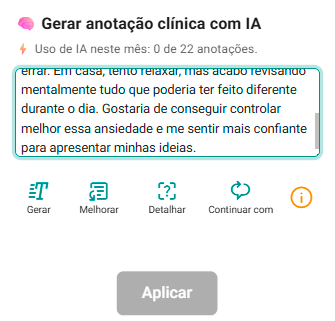

1. Acione o botão "Gerar", "Melhorar" ou "Detalhar".

    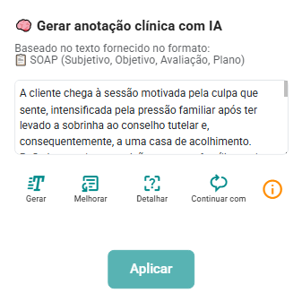

1. O sistema preencherá o campo de anotação com uma sugestão da IA.

    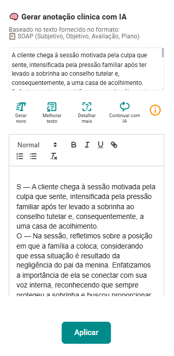

1. Revise e edite a anotação clínica e clique em "Aplicar".

    

1. Marque o campo "Compartilhar com a pessoa atendida" se quiser disponibilizar para que a pessoa atendida visualize a anotação no Portal Relacional e acione o botão "Salvar anotação clínica".

    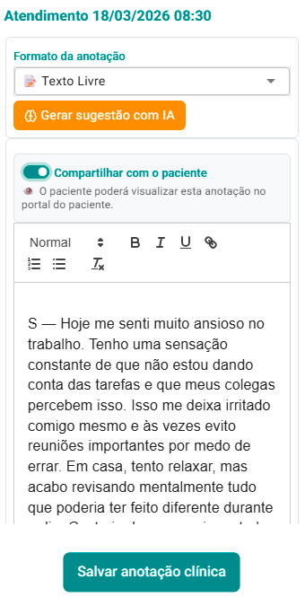

1. O sistema atualizará a tela "Anotações Clínicas" com a nova anotação.

    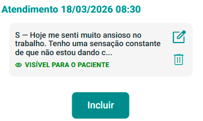

1. Ao fechar esta tela, o sistema atualiza o *card* do atendimento, indicando que há uma anotação registrada  para o atendimento em questão.

    

:::tip
Você pode incluir quantas anotações desejar por atendimento, sem limite. Na tela "Anotações Clínicas", é possível utilizar os botões "Alterar"  e "Excluir"  para modificar ou remover uma anotação conforme necessário.
:::

:::tip
Na tela de IA, você pode utilizar os botões "Gerar novo", "Melhorar texto", "Detalhar mais" ou "Continuar com IA".

    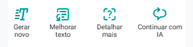

Para saber o que cada um desses botões faz, basta acionar a opção "info ", que o sistema abrirá a tela explicativa.

    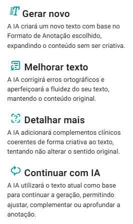

:::

## Limitações de uso da Inteligência Artificial no eConsult

O eConsult conta com inteligência artificial nativa para agilizar tarefas do dia a dia, como no caso de anotações clínicas.

Esse recurso faz parte de uma ferramenta interativa projetada para apoiar a criação, revisão e desenvolvimento de textos.

Utilizando IA, você terá uma experiência intuitiva e eficiente, facilitando a produção de conteúdos mais claros, objetivos e bem estruturados — mesmo sem familiaridade com técnicas de escrita.

Os limites de uso da IA em anotações clínicas variam conforme o plano contratado:

| **Recurso** | **Free** | **Pro** | **Plus** | **Premium** |
|------------|----------|--------|---------|------------|
| Anotações clínicas por IA | 0 | 0 | 176/mês | Ilimitado |

:::warning **Importante:**
- Se você atingir o limite mensal, a IA será temporariamente desativada até o início do próximo mês, quando o saldo de tokens será renovado automaticamente.
:::