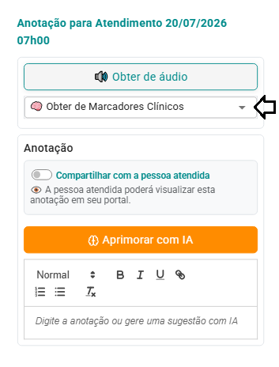
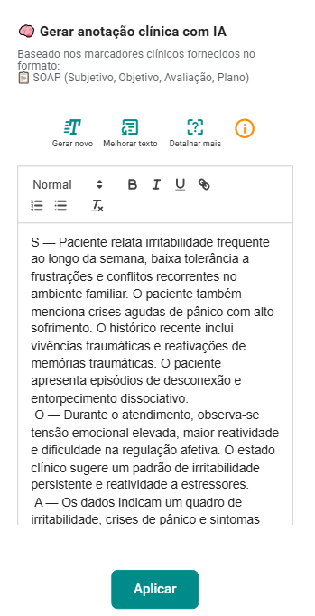
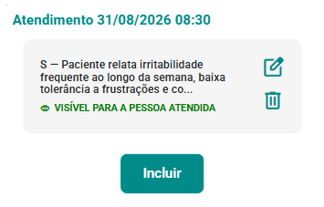

# Marcadores Clínicos

Os **Marcadores Clínicos** do eConsult são recursos utilizados para registrar, de forma rápida e estruturada, **aspectos relevantes observados durante os atendimentos**.

Eles funcionam como pontos de referência clínica que ajudam o profissional a identificar acontecimentos, sinais, mudanças ou condições importantes ao longo do processo terapêutico.

Durante uma sessão, o psicólogo pode selecionar os marcadores relacionados às observações realizadas, utilizando-os também como um **checklist de aspectos clínicos que merecem atenção**. Dessa forma, o registro estruturado não precisa representar aumento da carga de trabalho: ele pode apoiar a organização do raciocínio clínico durante ou após o atendimento.

### Acompanhamento longitudinal

O principal valor dos Marcadores Clínicos aparece quando os registros são observados **ao longo do tempo**.

A ocorrência, recorrência, redução ou ausência de determinados marcadores entre as sessões ajuda a tornar visíveis mudanças no acompanhamento da pessoa atendida.

Com isso, o eConsult pode organizar essas informações em uma **leitura longitudinal do processo terapêutico**, auxiliando o profissional a identificar tendências, momentos de atenção e possíveis mudanças na trajetória clínica.

### Apoio ao registro clínico

Os marcadores também podem servir como contexto para outros recursos do eConsult.

A partir dos marcadores selecionados e das observações registradas pelo profissional, o sistema pode auxiliar na elaboração de **anotações clínicas estruturadas**, inclusive utilizando o formato **SOAP**, quando esse recurso estiver disponível.

Quando utilizados recursos de áudio ou transcrição, o conteúdo registrado também pode ser analisado para **sugerir possíveis Marcadores Clínicos**, cabendo sempre ao profissional revisar e confirmar as sugestões antes de incorporá-las ao atendimento.

### Apoio ao raciocínio clínico

Os Marcadores Clínicos não substituem a avaliação, interpretação ou decisão do profissional.

Seu objetivo é **organizar evidências observadas durante os atendimentos e facilitar sua análise ao longo do tempo**, oferecendo uma visão mais estruturada da evolução do caso.

Assim, informações que poderiam permanecer dispersas entre diferentes registros passam a contribuir para uma compreensão mais clara da trajetória clínica da pessoa atendida.

> **Importante:** Marcadores Clínicos são recursos de apoio ao registro, organização e acompanhamento clínico. Não constituem diagnóstico, instrumento psicológico ou avaliação automatizada e devem sempre ser interpretados dentro do contexto clínico pelo profissional responsável.

## Atribuir marcador clínico ao atendimento

1.  Acione a opção  no _card_ do atendimento que deseja atribuir lembrete.

    

1.  O sistema abre a tela "Marcador clínico para o Atendimento".

    

1.  Selecione os marcadores desejados clicando nas cores disponíveis e, se necessário, adicione uma breve anotação para cada marcador.

        

:::tip
Recomenda-se que a anotação associada ao marcador registre o **relato da pessoa atendida** e os **elementos observados clinicamente** que fundamentaram a seleção do marcador.

Esse registro ajuda a contextualizar **por que o marcador foi utilizado**, preservando as evidências clínicas que poderão ser consultadas e comparadas ao longo do acompanhamento.

**Exemplo:**

> ***(1)*** Paciente relata irritabilidade frequente ao longo da semana, baixa tolerância a frustrações e conflitos recorrentes no ambiente familiar. ***(2)*** Durante o atendimento, observa-se tensão emocional elevada, maior reatividade e dificuldade na regulação afetiva.

**(1)** Relato da pessoa atendida: informações, percepções, experiências ou sintomas relatados durante o atendimento.

**(2)** Observação clínica: elementos percebidos pelo profissional durante a sessão que contribuíram para a seleção do marcador.

Registrar essas duas perspectivas torna o marcador mais contextualizado e clinicamente significativo, especialmente para o acompanhamento longitudinal.
:::

1.  Após fechar a tela de marcadores o sistema atualizará automaticamente o _card_ do atendimento, exibindo as cores dos marcadores associados e suas respectivas anotações.

    

    :::tip    
    Para desvincular todos os marcadores de um atendimento, basta acionar a opção "Excluir todos os marcadores" na tela "Marcadores Clínicos".
    :::

## Usando Marcadores Clínicos em Anotações Clínicas

Você pode utilizar os marcadores clínicos diretamente nas anotações clínicas. Para isso, siga os passos abaixo:

1. Acione a opção  no _card_ do atendimento para o qual deseja incluir uma anotação.

1. O sistema abre a tela "Anotações Clínicas".

   

1. Acione o botão "Incluir" .

1. O sistema abre o formulário "Anotações Clínicas".

   

1. Selecione no campo "Formato da anotação" a opção "🧠 Obter de Marcadores Clínicos".

   

1. Acione a opção "Aprimorar com IA".

   

1. O sistema abrirá a tela de geração de anotação com IA já com a sugestão de anotação.

   

1. Revise e edite a anotação clínica e clique em "Aplicar".

   

1. Marque o campo "Compartilhar com a pessoa atendida" se quiser disponibilizar para que o paciente visualize a anotação no Portal Relacional e acione o botão "Salvar anotação clínica".

   

1. O sistema atualizará a tela "Anotações Clínicas" com a nova anotação.

   

1. Ao fechar esta tela, o sistema atualiza o _card_ do atendimento, indicando que há uma anotação registrada  para o atendimento em questão.

Após estas ações, o eConsult gerará automaticamente uma **anotação clínica no formato SOAP**, utilizando os marcadores registrados no atendimento como base para a sugestão.

> ⚠️ **Importante:** A anotação gerada pela IA é um apoio ao registro clínico e deve sempre ser revisada e validada pelo profissional responsável.
