# Informes de Presença e Pagamentos

O eConsult disponibiliza uma ferramenta prática e eficiente para o **registro de pagamentos, presenças e ausências** dos participantes em **grupos terapêuticos**, proporcionando um controle detalhado e organizado da participação de cada paciente ao longo das sessões.

Com essa funcionalidade, é possível acompanhar, de forma centralizada, o **engajamento individual dos membros do grupo**, identificando com facilidade quem compareceu, quem se ausentou e quais pagamentos foram realizados. Isso não apenas **otimiza a gestão administrativa**, mas também contribui para um melhor planejamento terapêutico e financeiro, tanto para os profissionais quanto para as instituições que conduzem os atendimentos em grupo.

O recurso permite ainda **visualizações rápidas e precisas**, que auxiliam na tomada de decisões, no acompanhamento da evolução dos participantes e no cumprimento das metas estabelecidas. A transparência no registro dessas informações fortalece a relação com os pacientes, ao mesmo tempo em que assegura maior controle e segurança nos processos internos.

Em suma, essa ferramenta do eConsult é um diferencial importante para quem trabalha com **atendimentos coletivos**, oferecendo **mais organização, agilidade e confiabilidade** na gestão de grupos.

## Registrar recebimento de um membro do grupo terapêutico

1. Acione a opção  no *card* do atendimento desejado.

    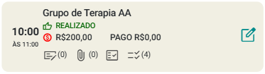

1. O sistema abre a tela "Informe de Presença e Pagamentos".

    

1. Acione a opção "Ver Recebimentos" .

1. O sistema abre a tela de pagamentos.

    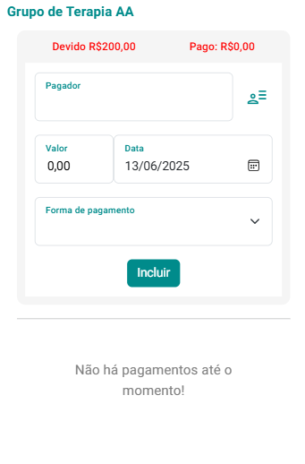

1. Acione a opção membros .

1. O sistema abre opção para você escolher um dos membros como "Pagador" – escolha um pagador.

    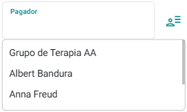

1. Preencha os campos "Valor", "Data" e "Foma de Pagamento".    

    

1. Acione a opção "Incluir" .

1. O sistema atualiza a tela de pagamento com o registro de recebimento feito.

    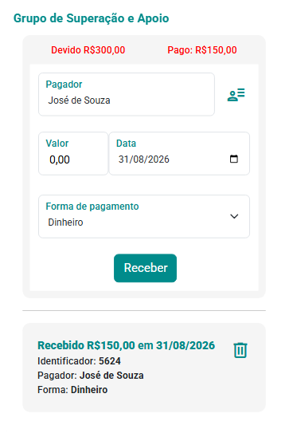

1. Feche a tela e, você notará que na tela "Informe de Presença e Pagamentos" a informação de pagamento contará no *card* do membro respectivo.

    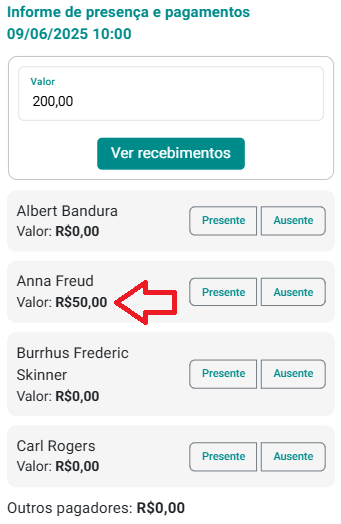

1. Feche a tela.

1. Repare que o *card* de atendimento passa a mostrar o valor "Pago".

    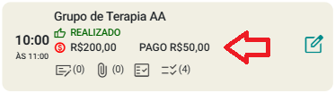

1. Acione novamente a opção .

1. O sistema abre a tela "Informe de Presença e Pagamentos". Repare que o sistema passa a mostrar a informação "Pago".

    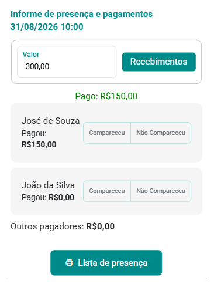

## Registrar recebimento de alguém de fora do grupo terapêutico

**Imagine o seguinte cenário:** um instituto contrata seus serviços para oferecer terapia em grupo. Nesse caso, quem arca com o pagamento não são os participantes, mas sim o próprio instituto. Como proceder diante dessa situação?

1. Acione a opção  no *card* do atendimento desejado.

    

1. O sistema abre a tela "Informe de Presença e Pagamentos".

    

1. Acione a opção "Ver Recebimentos" .

1. O sistema abre a tela de pagamentos.

1. Preencha o campo "Pagador" com o nome do instituto ou da pessoa física ou jurídica que pagou pelo serviço.

    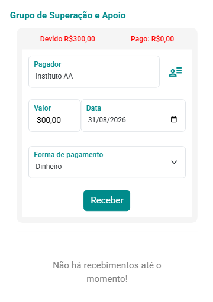

1. Preencha os campos "Valor", "Data" e "Foma de Pagamento".    

    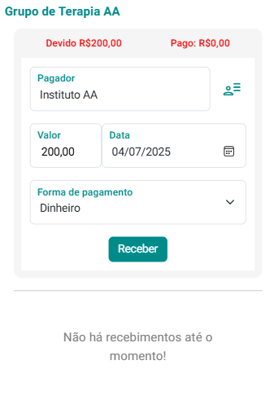

1. Acione a opção "Incluir" .

1. O sistema atualiza a tela de pagamento com o registro de recebimento feito.

    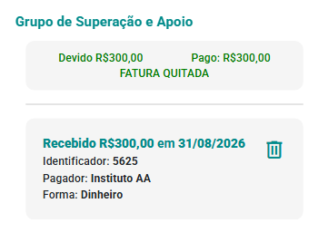

1. Feche a tela e, você notará que na tela "Informe de Presença e Pagamentos" a informação de pagamento contará em "Outros pagadores".

    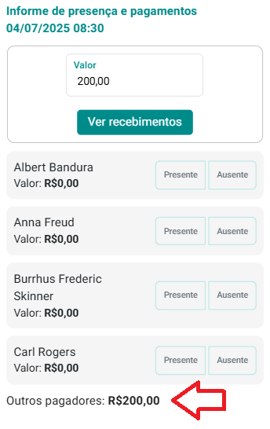

1. Feche a tela.

1. Repare que o *card* de atendimento passa a mostrar o valor "Pago".

## Registrar presença/ausência dos membros do grupo terapêutico

1. Acione a opção  no *card* do atendimento desejado.

    

1. O sistema abre a tela "Informe de Presença e Pagamentos".

    

1. Acione as opções "Presente" ou "Ausente" para cada membro.

    

## Imprimir Lista de Presença

1. Acione a opção "Lista de Presença".

    

1. O sistema abrirá a tela "Configurações da impressão".

    

1. Acione o botão "Gerar PDF" para abrir a lista de presença em PDF ou "Gerar Word" para abrir em Word.

    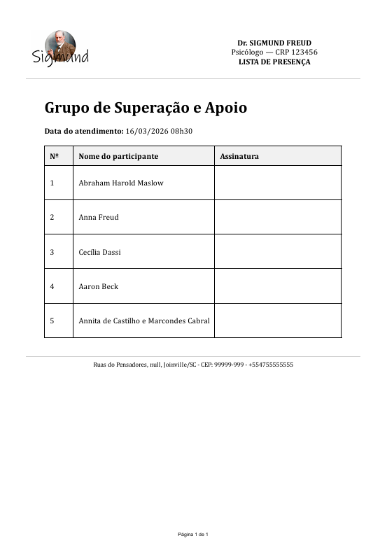
