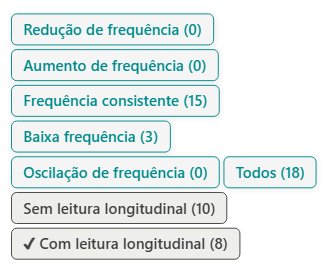
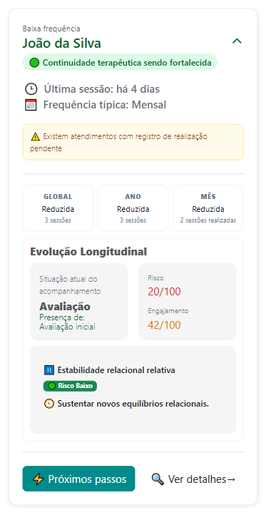
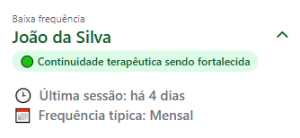
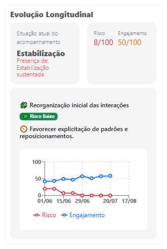

# Sobre Acompanhamento Inteligente

O **Acompanhamento Inteligente** apresenta uma visão sintética do acompanhamento das pessoas atendidas, reunindo informações de frequência, continuidade terapêutica e evolução longitudinal. Seu objetivo é permitir que o profissional identifique rapidamente a situação atual do acompanhamento e possíveis pontos que merecem atenção.

Nele são apresentados dados como última sessão, frequência típica dos atendimentos, quantidade de sessões realizadas no período e eventuais pendências de registro.

A seção Evolução Longitudinal complementa essa visão com indicadores clínicos derivados dos registros realizados ao longo dos atendimentos, incluindo situação atual do acompanhamento, risco, engajamento, tendência observada e orientação de manejo.

Os botões "Próximos passos" e "Ver detalhes" permitem, respectivamente, consultar sugestões de ações relacionadas ao acompanhamento e acessar uma visão mais completa das informações que fundamentam os indicadores apresentados.

Importante: os indicadores e sugestões apresentados nos ***cards*** têm caráter de apoio ao acompanhamento e ao raciocínio clínico. Eles devem ser interpretados pelo profissional em conjunto com os registros, contexto clínico e demais informações disponíveis.

Essa funcionalidade permite compreender rapidamente:

-   o estado clínico atual
-   o nível de engajamento no tratamento
-   o risco de interrupção do cuidado
-   a evolução do relacionamento terapêutico ao longo do tempo

---

## Filtros de acompanhamento

Na parte superior da tela, os filtros permitem visualizar os acompanhamentos de acordo com o comportamento recente da frequência:

- **Redução de frequência:** acompanhamentos cuja frequência recente apresenta redução.
- **Aumento de frequência:** acompanhamentos que passaram a apresentar maior frequência de sessões.
- **Frequência consistente:** acompanhamentos que mantêm um padrão relativamente estável.
- **Baixa frequência:** acompanhamentos com maior intervalo entre as sessões.
- **Oscilação de frequência:** acompanhamentos que apresentam variações relevantes na frequência das sessões.
- **Todos:** apresenta todos os acompanhamentos disponíveis.

Também é possível diferenciar:

- **Sem leitura longitudinal:** acompanhamentos que ainda não possuem informações suficientes para uma leitura longitudinal.
- **Com leitura longitudinal:** acompanhamentos para os quais o sistema já consegue apresentar uma análise longitudinal.

O número exibido em cada filtro indica a quantidade de acompanhamentos naquela condição.

### 🔎 Pesquisa

Utilize o campo **Pessoa atendida** para localizar rapidamente uma pessoa, casal, família ou grupo específico.

---

## *Card* de acompanhamento

Cada *card* apresenta uma **visão sintética do acompanhamento**, reunindo frequência, continuidade terapêutica, evolução longitudinal, risco, engajamento e possíveis pontos de atenção clínica.

### Frequência do acompanhamento

No início do *card* é apresentada a classificação da frequência recente, como:

- **Frequência consistente**
- **Baixa frequência**
- **Redução de frequência**
- **Aumento de frequência**
- **Oscilação de frequência**

Também são apresentadas informações como:

- **Última sessão:** tempo transcorrido desde o último atendimento realizado.
- **Frequência típica:** padrão habitual identificado no acompanhamento, como semanal, quinzenal ou mensal.
- **Continuidade terapêutica:** indicador relacionado à manutenção ou possível comprometimento da continuidade dos atendimentos.

:::info

A frequência é um **indicador de acompanhamento** e deve ser interpretada considerando o contexto terapêutico, o planejamento clínico e os acordos estabelecidos entre profissional e pessoa atendida.

:::

---

## Alertas

Quando houver alguma situação administrativa ou assistencial que possa interferir na leitura das informações, o sistema apresenta um alerta no *card*.

Por exemplo:

> ⚠️ Existem atendimentos com registro de realização pendente.

Regularizar esses registros contribui para que os indicadores apresentados reflitam adequadamente o histórico do acompanhamento.

---

## Indicadores de frequência

Ao expandir o *card*, são apresentados indicadores que permitem comparar a frequência de sessões em diferentes períodos:

- **Global:** considera o histórico geral do acompanhamento.
- **Ano:** considera os atendimentos realizados no ano.
- **Mês:** considera os atendimentos realizados no mês.

Cada período pode indicar se a frequência está **dentro do padrão, reduzida, aumentada ou apresentando outra variação relevante**, juntamente com a quantidade de sessões consideradas.

---

## Evolução Longitudinal

Quando existem registros suficientes, o **card** apresenta uma síntese da **Evolução Longitudinal**, permitindo compreender o momento atual do acompanhamento e observar como seus principais indicadores vêm se comportando ao longo do tempo.

A seção pode apresentar:

- **Situação atual do acompanhamento:** síntese do momento clínico identificado a partir dos registros mais recentes, acompanhada dos principais elementos que sustentam essa leitura.

- **Risco:** indicador sintético, apresentado em uma escala de **0 a 100**, que sinaliza a intensidade dos elementos de atenção identificados no acompanhamento.

- **Engajamento:** indicador de **0 a 100** relacionado à participação e continuidade da pessoa atendida no processo terapêutico.

- **Síntese longitudinal:** apresenta a tendência ou dinâmica predominante observada no período, ajudando a contextualizar o momento atual do acompanhamento.

- **Nível de risco:** classificação visual que facilita a identificação da condição atual de risco, como **Risco Baixo**, moderado ou elevado.

- **Manejo sugerido:** orientação de apoio que destaca aspectos que podem ser considerados pelo profissional na condução dos próximos atendimentos.

- **Histórico dos indicadores:** gráfico que apresenta a evolução de **Risco** e **Engajamento** ao longo do tempo, permitindo identificar tendências, oscilações e mudanças relevantes durante o acompanhamento.

:::tip
A leitura do gráfico deve considerar a **trajetória dos indicadores**, e não apenas seus valores atuais. Mudanças progressivas ou oscilações ao longo das sessões podem fornecer informações importantes para a compreensão do acompanhamento.
:::

:::warning Importante
Os indicadores e sínteses apresentados na Evolução Longitudinal **não constituem diagnóstico, avaliação psicológica automatizada ou decisão clínica**.

Eles funcionam como recursos de **apoio ao acompanhamento e ao raciocínio clínico** e devem ser interpretados pelo profissional em conjunto com os registros das sessões, o contexto clínico e as demais informações disponíveis.
:::

---

## Próximos passos

O botão **⚡ Próximos passos** apresenta ações ou pontos de atenção relacionados ao atenimento da pessoa atendida.

As sugestões têm caráter de **apoio à gestão do atendimento**.

---

## Ver detalhes

Clique em **🔍 Ver detalhes** para acessar informações mais completas sobre o acompanhamento e compreender os elementos que contribuíram para os indicadores apresentados no *card*.

---

:::tip

Utilize os filtros de frequência em conjunto com a **Evolução Longitudinal**.

Uma alteração na frequência não representa, isoladamente, melhora ou piora clínica. A combinação entre **frequência, continuidade, registros clínicos, risco, engajamento e contexto terapêutico** oferece uma visão mais consistente da trajetória do acompanhamento.

:::