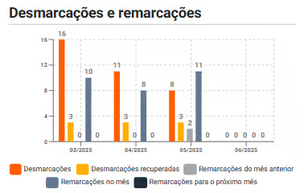

# Gráfico Remarcações e Desmarcações

Monitora o comportamento dos reagendamentos, cancelamentos e remarcações, permitindo avaliar a estabilidade e confiabilidade da agenda.

## Informações

- **Desmarcações:** Atendimentos cancelados sem nova remarcação.

- **Desmarcações recuperadas:** Cancelamentos cujo horário foi reaproveitado por um novo agendamento.

- **Remarcações do mês anterior:** Agendamentos transferidos do mês passado para o atual.

- **Remarcações no mês:** Mudanças de agendamento feitas dentro do mesmo mês.

- **Remarcações para o próximo mês:** Agendamentos adiados para o mês seguinte.

## Vantagens do gráfico

Ajuda a identificar padrões de instabilidade na agenda e medir a efetividade das ações de remarcação.

## Como interpretar

- Este gráfico mostra a instabilidade da agenda e o comportamento de reagendamento das pessoas atendidas.

- Altas desmarcações sem recuperação são sinais de perda de receita e ociosidade.

- Um bom volume de desmarcações recuperadas mostra que há um processo eficiente de retenção ou reativação de disponibiliddes de horário.

- Muitas remarcações do mês anterior podem indicar adiamentos recorrentes e falta de comprometimento das pessoas atendidas.

- Remarcações no mês e para o próximo mês podem ser normais, mas seu aumento contínuo pode gerar efeito cascata na organização da agenda.