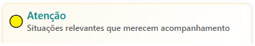
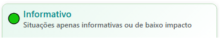
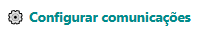
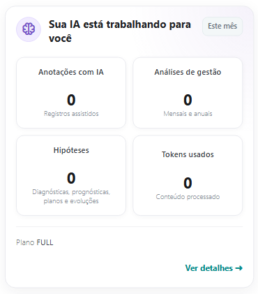
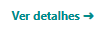
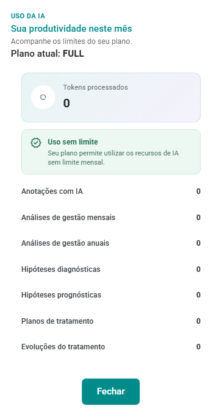
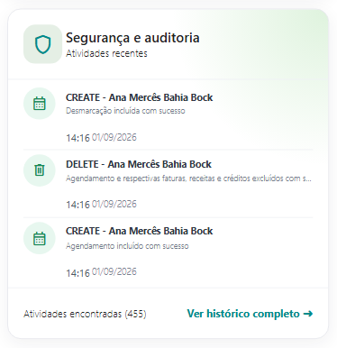
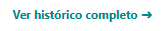
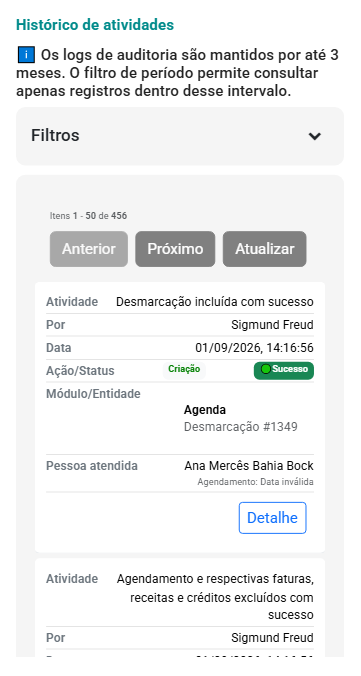

# Situações de Atendimento

A tela **Situações de Atendimento** reúne, em um único painel, situações que podem exigir ação, acompanhamento ou apenas conhecimento do profissional.

Seu objetivo é facilitar a gestão da rotina do consultório, destacando pendências administrativas, financeiras e relacionadas aos atendimentos, além de permitir acesso rápido às pessoas envolvidas e às ações disponíveis para cada situação.

> Os indicadores apresentados nesta tela são atualizados conforme os registros existentes no sistema.

## Visão geral da tela

As situações são organizadas por nível de atenção, utilizando cores para facilitar a identificação da prioridade:

- 🔴 **Ação imediata:** situações que exigem atenção mais rápida.
- 🟡 **Atenção:** situações relevantes que merecem acompanhamento.
- 🟢 **Informativo:** situações de caráter informativo ou de menor impacto.

Cada item apresenta uma descrição resumida e, quando aplicável, a quantidade de ocorrências encontradas.

:::tip Leitura rápida

Os números exibidos entre parênteses indicam a quantidade de registros encontrados para aquela situação.

Por exemplo, **Pagamentos pendentes (25)** indica que existem 25 ocorrências que atendem aos critérios dessa situação.

:::

## Filtrar por pessoa atendida

Na parte superior da tela, o campo **Pessoa atendida** permite filtrar as situações de uma pessoa específica.

Esse recurso é útil quando você deseja revisar apenas as pendências, alertas ou informações relacionadas a determinado indivíduo, casal, família ou grupo.

Ao remover o filtro, o painel volta a apresentar as situações gerais encontradas pelo sistema.

## 🔴 Ação imediata

A coluna **Ação imediata** reúne situações que podem exigir uma providência mais rápida do profissional.

Entre elas podem aparecer:

- **📝 Registro de realização pendente:** Indica atendimentos cuja data já passou, mas que ainda aguardam o registro de realização.

- **📅 Agendamentos não confirmados:** Apresenta atendimentos futuros que ainda não possuem confirmação registrada.

- **⚠️ Pagamentos pendentes:** Identifica atendimentos com pagamentos vencidos e ainda não quitados.

- **💵 Créditos antecipados:** Apresenta créditos previstos ou registrados para pessoas atendidas que ainda possuem alguma situação financeira pendente.

## 🟡 Atenção

A coluna **Atenção** reúne situações que não necessariamente exigem uma ação imediata, mas que merecem acompanhamento.

Podem ser apresentadas, entre outras:

- **📝 Anotações clínicas pendentes:** Indica atendimentos realizados recentemente que ainda não possuem anotação clínica registrada.

- **📄 Pendências de cadastro:** Apresenta pessoas atendidas cujo cadastro possui informações incompletas ou que podem precisar de atualização.

- **❌ Desmarcação de atendimento:** Destaca atendimentos que foram cancelados.

- **🔄 Remarcação de atendimento:** Destaca atendimentos cuja data ou horário foi alterado.

- **⏳ Vencimento nos próximos 7 dias:** Valores em aberto com vencimento próximo (7 dias).

- **📅 Atendimentos prováveis:** Apresenta pessoas que tiveram atendimentos recentes, mas ainda não possuem um próximo atendimento agendado.

- **💰 Recebimentos pendentes:** Apresenta pessoas para os quais foi gerado uma intenção de pagamento que ainda não foi concluída.

- **🔁 Retomada após longo intervalo:** Pessoas sem agendamentos há 60 dias ou mais (possível interrupção do vínculo).

- **📅 Pessoas atendidas sem nenhum agendamento:** Identifica pessoas atendidas cadastradas que ainda não possuem atendimento agendado.

- **⚠️ Casais, famílias ou grupos:** Reúne situações relacionadas aos atendimentos de casais, famílias ou grupos que merecem atenção do profissional.

## 🟢 Informativo

A coluna **Informativo** apresenta situações de menor urgência ou eventos relevantes para conhecimento do profissional.

Podem ser apresentadas, entre outras:

- **✅ Agendamentos confirmados:** pessoas atendidas que tiveram atendimento agendado e confirmado com sucesso.

- **💳 Pagamentos feitos nos últimos 7 dias ou antecipados:** Referente a pagamentos quitados considerando: 
    
    - pagamentos registrados nos últimos 7 dias; ou 
    - pagamentos com data de vencimento futura, desde que o valor pago seja igual ou superior ao valor devido; ou 
    - ausência de comunicação prévia para este tipo de aviso.

- **🎂 Aniversários:** Destinada à parabenização de aniversários de pessoas atendidas.

## Consultando os detalhes de uma situação

Para visualizar os registros relacionados a uma situação, clique na **seta →** localizada ao lado do item.

Uma janela será aberta com as ocorrências encontradas e, dependendo do tipo de situação, poderão ser apresentadas ações específicas.

As opções disponíveis variam conforme o contexto. Por exemplo, uma situação de agendamento pode permitir confirmação ou envio de solicitação, enquanto uma situação financeira pode direcionar para os créditos ou pagamentos relacionados.

:::info Importante

A tela **Situações de Atendimento** funciona como um painel de apoio à rotina profissional.

Ela não altera automaticamente atendimentos, registros clínicos, cadastros ou lançamentos financeiros. As ações somente são realizadas quando o profissional utiliza uma das opções disponíveis.

:::

## Configurar política de comunicações

A opção **Configurar comunicações**, localizada na parte superior da tela, permite acessar as configurações relacionadas às mensagens, lembretes e alertas utilizados pelo sistema.

Essas configurações podem influenciar funcionalidades como solicitação de confirmação de atendimento e outras comunicações vinculadas à rotina do consultório.

## Sua IA está trabalhando para você

Quando disponível no plano contratado, o painel **Sua IA está trabalhando para você** apresenta um resumo da utilização dos recursos assistidos por Inteligência Artificial no período.

Podem ser exibidos indicadores como:

- **Anotações com IA:** quantidade de registros produzidos com apoio de IA;
- **Análises de gestão:** análises geradas no período;
- **Hipóteses:** conteúdos assistidos relacionados a hipóteses, planos ou evoluções;
- **Tokens usados:** volume de conteúdo processado pelos recursos de IA.

Os indicadores têm caráter informativo e permitem acompanhar a utilização dos recursos contratados.

Ao acionar o botão "Detalhes", o sistema mostra maiores detalhes sobre o uso de IA.

## Segurança e auditoria

O painel **Segurança e auditoria** apresenta atividades recentes registradas pelo sistema.

Ele pode exibir operações realizadas, como inclusões e alterações de informações, juntamente com data e horário.

A opção **Ver histórico completo** permite acessar um conjunto mais amplo dos registros de auditoria disponíveis.

:::tip Boa prática

Utilize a tela **Situações de Atendimento** como um ponto de revisão da rotina: confira primeiro os itens em **Ação imediata**, depois os itens de **Atenção** e, por fim, os indicadores **Informativos**.

Isso ajuda a organizar as prioridades sem precisar consultar separadamente agenda, prontuário, cadastros e financeiro.

:::
