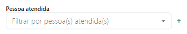

# Sobre Situações de Atendimento

O **Situações de Atendimento** reúne, em uma única tela, ocorrências
operacionais e administrativas relacionadas à rotina clínica.

Essa funcionalidade permite identificar rapidamente situações que exigem
atenção ou ação por parte do profissional, facilitando a organização da
prática e reduzindo a necessidade de verificações manuais em diferentes
partes do sistema.

Entre os principais objetivos do painel estão:

-   identificar pendências operacionais
-   acompanhar situações administrativas relevantes
-   facilitar a priorização de tarefas
-   apoiar a organização da rotina clínica

------------------------------------------------------------------------

## Visão geral do painel

A tela organiza diferentes **tipos de situações operacionais** que podem
ocorrer durante o acompanhamento dos pacientes.

Cada situação representa um conjunto de registros que compartilham a
mesma condição administrativa.

Exemplos comuns incluem:

- atendimentos que ainda aguardam confirmação
- registros de realização pendentes
- pagamentos não quitados
- pacientes sem novo agendamento

Cada categoria funciona como um **indicador de monitoramento da rotina**.

------------------------------------------------------------------------

## Lista de situações

O painel apresenta as situações disponíveis organizadas em blocos.

Cada bloco informa:

- o nome da situação
- a quantidade de ocorrências
- o tipo de ação que pode ser realizada

As situações podem ser acessadas clicando diretamente sobre o item
desejado.

------------------------------------------------------------------------

## Tipos de situações mais comuns

### Agendamentos não confirmados

Indica atendimentos futuros que ainda não foram confirmados pelo
paciente.

Esse indicador ajuda a identificar possíveis riscos de ausência ou
desorganização na agenda.

------------------------------------------------------------------------

### Registros de realização pendentes

Indica atendimentos passados que ainda não foram marcados como
**Realizados**.

Essa situação pode afetar:

- a precisão das análises do sistema
- o acompanhamento longitudinal
- os indicadores financeiros

------------------------------------------------------------------------

### Pagamentos em aberto

Apresenta atendimentos realizados cujo pagamento ainda não foi
registrado como quitado.

Essa visualização ajuda a acompanhar a situação financeira do
atendimento.

------------------------------------------------------------------------

### Pacientes sem novo agendamento

Indica pacientes que realizaram atendimentos recentemente, mas que não
possuem uma nova sessão agendada.

Esse indicador pode sinalizar possíveis interrupções do processo
terapêutico.

------------------------------------------------------------------------

## Lista de ocorrências

Ao acessar uma situação, o sistema apresenta a lista de pacientes ou
grupos relacionados àquela condição.

A lista normalmente apresenta:

- nome do paciente ou grupo
- data do atendimento
- informações administrativas associadas
- ações disponíveis

------------------------------------------------------------------------

## Ações disponíveis

Dependendo da situação selecionada, o sistema pode oferecer ações como:

- confirmar atendimento
- registrar realização
- registrar pagamento
- entrar em contato com o paciente
- revisar informações do agendamento

Essas ações ajudam a resolver rapidamente as pendências identificadas.

------------------------------------------------------------------------

## Comunicação com pacientes

Em algumas situações, o sistema permite iniciar comunicações com o
paciente diretamente a partir da tela.

Isso pode incluir:

- envio de e-mail
- envio de mensagem por WhatsApp
- solicitação de confirmação de presença
- lembretes administrativos

Essas mensagens têm caráter **operacional**, voltadas à organização do
atendimento.

------------------------------------------------------------------------

## Atualização das situações

As situações são atualizadas automaticamente conforme novas informações
são registradas no sistema, como:

- confirmação de atendimentos
- registro de sessões realizadas
- atualização de pagamentos
- novos agendamentos

Isso garante que o painel reflita sempre o estado atual da rotina
clínica.

------------------------------------------------------------------------

## Relação com o Acompanhamento Inteligente do Paciente

As **Situações de Atendimento** e o **Acompanhamento Inteligente do
Paciente** são funcionalidades complementares.

Enquanto o **Acompanhamento Inteligente** oferece uma leitura
longitudinal e clínica do acompanhamento de cada paciente, o painel de
**Situações de Atendimento** organiza a prática a partir de ocorrências
administrativas da rotina.

De forma simplificada:

- **Acompanhamento Inteligente** → visão clínica do paciente
- **Situações de Atendimento** → visão administrativa da rotina

Essa combinação permite ao profissional acompanhar simultaneamente:

- a evolução clínica dos pacientes
- a organização prática do consultório

------------------------------------------------------------------------

## Finalidade administrativa

O painel **Situações de Atendimento** foi desenvolvido para:

- reduzir esquecimentos operacionais
- facilitar o acompanhamento da agenda
- melhorar a organização financeira
- tornar visíveis pendências da rotina clínica

------------------------------------------------------------------------

#### Conclusão

O módulo Situações de Atendimento ajuda o profissional a manter uma
visão clara da rotina do consultório, permitindo:

- identificar pendências administrativas
- priorizar ações importantes
- manter a agenda organizada
- reduzir riscos de descontinuidade do atendimento