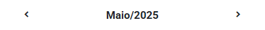
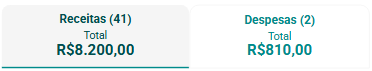

# Sobre Receitas e Despesas

O Painel Receitas e Despesas do eConsult foi desenvolvido para fornecer uma visão clara e detalhada da gestão financeira da organização, permitindo acompanhar o fluxo de caixa de forma eficiente. Este painel reúne informações sobre todas as entradas (receitas) e saídas (despesas) financeiras, oferecendo uma visão geral essencial para o planejamento e controle financeiro.

## Organização das Informações Financeiras

Com o seletor de mês, é possível alterar o período exibido no painel, selecionando diferentes meses para visualizar suas respectivas receitas, despesas e outros detalhes financeiros relevantes.

|Seletor|Descrição|
|-|-|
||Seleciona o mês anterior ao que está atualmente selecionado.|
||Seleciona o mês posterior ao que está atualmente selecionado.|

O painel, em conjunto com a funcionalidade seletor de mês, oferece uma maneira prática de visualizar as entradas e saídas financeiras, apresentadas em duas sub-abas principais:

- **Receitas:** Mostrando o número e valor total das receitas no mês.
- **Despesas:** Mostrando o número e valor total das despesas no mês.

    

Cada aba, quando selecionada, exibe os eventos correspondentes: a aba de Receitas mostra os eventos relacionados à entrada de recursos financeiros, enquanto a aba de Despesas exibe os eventos de saída de recursos.

<figure style={{ margin: 0, textAlign: "left", marginBottom: "20px" }}>
  
  <figcaption style={{ fontStyle: "italic"}}>Receitas</figcaption>
</figure>

<figure style={{ margin: 0, textAlign: "left", marginBottom: "20px" }}>
  
  <figcaption style={{ fontStyle: "italic"}}>Despesas</figcaption>
</figure>

Os *cards* em vermelho claro indicam transações planejadas, ou seja, ainda pendentes (a pagar ou a receber). Por outro lado, os *cards* em verde claro sinalizam que a transação já foi concluída, seja ela paga ou recebida.

Cada *card* exibe informações como a Descrição, Recebedor ou Pagador (no caso de grupos terapêuticos mostra o nome do grupo), a Data e o Valor de Vencimento, e, por fim, a Data e o Valor de Pagamento.

Você pode utilizar o campo Filtro para filtrar eventos financeiros com base no pagador ou recebedor, facilitando a visualização específica dos eventos desejados.

Você pode utilizar as opções "Todas", "Quitadas" e "Não quitadas" para mostrar Receitas ou Despesas que foram quitadas, não quitadas ou todas.

:::note
Os *cards* podem exibir os botões "Excluir " e "Alterar ", permitindo que você exclua ou modifique o evento financeiro. Isso inclui a gestão de recebimentos, pagamentos, ou o cancelamento de transações já registradas.

*Cards* com eventos de fatura relacionados a atendimentos não exibem o botão Excluir, pois não é possível remover faturas associadas a atendimentos.
:::