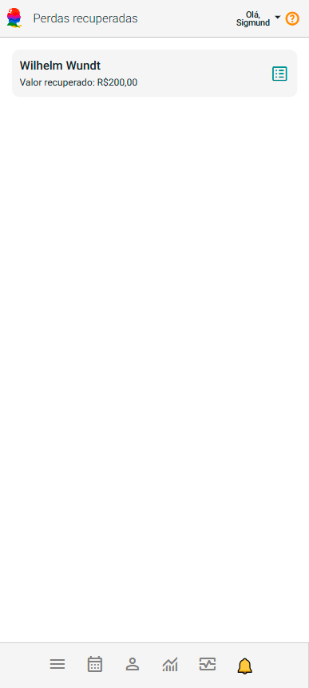
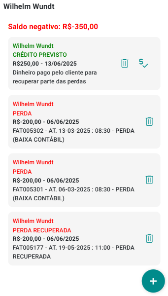
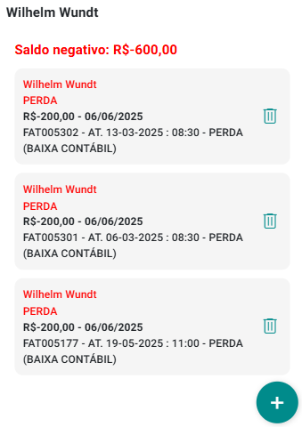
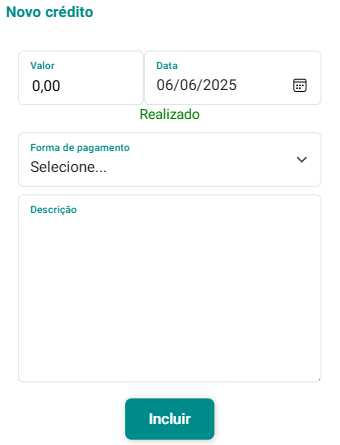
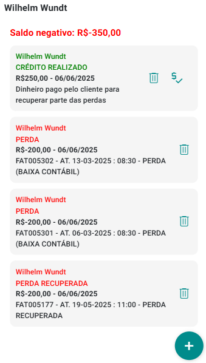
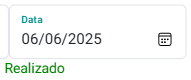
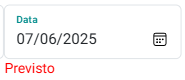
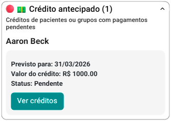
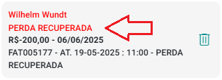

# Sobre Perdas Recuperadas

O Painel Perdas Recuperadas do eConsult é uma ferramenta estratégica desenvolvida para monitorar e gerenciar com eficiência os atendimentos que, mesmo após terem sido classificados como perdas contábeis, tiveram seus valores posteriormente recuperados.

Essa funcionalidade permite identificar de forma clara quais pacientes ou grupos terapêuticos realizaram pagamentos referentes a créditos anteriormente considerados de difícil recebimento. Com isso, é possível manter o controle preciso sobre os valores efetivamente recuperados e reverter, quando necessário, registros de baixa contábil.

O painel oferece uma visão consolidada dessas recuperações, auxiliando na análise de desempenho das ações de cobrança, na revisão de estratégias financeiras e na melhoria da acurácia dos relatórios contábeis.

Mais do que um controle operacional, o Painel de Perdas Recuperadas reforça a transparência dos processos financeiros e apoia uma gestão mais inteligente da inadimplência e da recuperação de receita.

No painel, os pacientes e grupos terapêuticos são apresentados de maneira visualmente intuitiva por meio de *cards* interativos, projetados para facilitar a identificação rápida mostrando o nome do paciente e valor total das perdas recuperadas.

Para consultar os atendimentos com perdas recuperadas ou não, basta clicar no botão  localizado no *card* do paciente ou grupo.

Após selecionar o paciente ou grupo, o sistema exibirá as informações relevantes.

## Recuperar perdas

A recuperação de perdas no eConsult é feita exclusivamente por meio da adição de crédito ao paciente.

Ao incluir um novo crédito, o sistema identifica automaticamente as perdas registradas e realiza a recuperação utilizando o valor disponível para cobrir o máximo possível das perdas pendentes.

## Adicionar fundos para recuperação de perdas

Você pode adicionar fundos (crédito) para o paciente a fim de fazer uma recuperação de perdas.

Este crédito gerará uma fatura no sistema como um recebimento contabilmente realizado.

1. Acione o botão  no *card* do paciente ou grupo terapêutico.

1. O sistema abre tela mostrando todas as perdas registradas para este paciente ou grupo.

    

1. Acione a opção "Incluir Crédito Antecipado" .

1. O sistema abre a tela "Novo Crédito".

    

1. Preencha os campos "Valor", "Data", "Forma de Pagamento", opcionalmente "Descrição" e acione o botão "Salvar".

    

1. O sistema atualizará a tela já com as perdas que puderam ser recuperadas com o valor do crédito.

    

## Mudar status de crédito de "Previsto" para "Realizado"

No eConsult, créditos com data futura são automaticamente classificados como "Previstos".

Para que sejam considerados "Realizados", é necessário confirmar a efetivação do pagamento. Essa mudança só ocorrerá se a data do pagamento for igual ou anterior à data atual.

1. No *card* do crédito acione a opção .

1. Preencha no campo "Data" a data que você recebeu efetivamente o valor correspondente ao crédito.

1. Ao indicar a data, o sistema passa a mostrar "Realizado" ao invés de "Previsto".

    

1. Acione o botão "Confirmar" .

1. O sistema passa a mostrar no *card* do crédito a informação "Realizado".

    

:::warning
    - Se o campo "Data" for preenchido com a data atual ou uma data anterior, o sistema exibirá automaticamente a indicação "Realizado" ao lado da data. 

        
    
    - Caso a data informada seja futura, o sistema mostrará a indicação "Previsto", sinalizando que o pagamento ainda está pendente.

        

    - Essa informação (Previsto ou Realizado) também estará visível no *card* correspondente ao crédito.

    Além disso, créditos com o status "Previsto" serão incluídos automaticamente no alerta respectivo do painel "Situações de Atendimento", indicando que há um pagamento pendente de confirmação.

    

    Dessa forma, o painel "Situações de Atendimento" reúne, em um só lugar, todos os créditos com pagamento previsto, facilitando o acompanhamento e a gestão dessas pendências.
:::

## Excluir registros de perdas recuperadas

1. Acione o botão  correspondente ao paciente ou grupo terapêutico no painel "Perdas Recuperadas".

1. O sistema abre tela mostrando todas as perdas (recuperdas ou não) registradas para este paciente ou grupo.

1. Localize o *card* correspondente a perda recuperada cuja recuperação se quer excluir.

    

1. Acione a opção "".

1. Clique em "Sim" para confirmar.

1. O sistema excluirá o registro de recuperação da perda e atualizará créditos e saldo.

