# Sobre Marcadores Clínicos

Os **Marcadores Clínicos** são uma ferramenta estruturante do eConsult que permite ao psicólogo **destacar temas, focos terapêuticos e acontecimentos relevantes** que atravessam os atendimentos ao longo do tempo.

Eles ajudam a **organizar a narrativa clínica**, facilitando a visualização de:

- padrões recorrentes  
- momentos críticos  
- mudanças de funcionamento  
- evolução do processo terapêutico  

Mais do que simples etiquetas, os marcadores funcionam como **eixos de sentido clínico**:  
eles agrupam atendimentos que compartilham o mesmo foco, tornando possível **enxergar o caso como continuidade**, e não como encontros isolados.

---

## Como funciona

No cadastro de **Atendimentos**, você pode:

- atribuir **um ou mais marcadores** a cada sessão  
- registrar uma **observação clínica específica** daquele marcador naquele encontro  

Na tela **Marcadores Clínicos**, o eConsult:

- agrupa automaticamente os atendimentos por marcador  
- apresenta a sequência cronológica de ocorrências  
- permite visualizar rapidamente **a evolução de cada tema ao longo do tempo**

> Isso possibilita acompanhar o **movimento do processo terapêutico**, e não apenas eventos pontuais.

---

## Estrutura da Tela

Na tela *Marcadores Clínicos*:

- Cada marcador aparece como um **item expansível**, com:
  - sua **cor clínica**
  - o **contador de atendimentos relacionados**

Ao expandir um marcador, são exibidos **cards de atendimento** contendo:

- Nome do paciente  
- Data e horário da sessão  
- Status da sessão (Realizado, Confirmado, etc.)  
- Modalidade (Presencial ou Remoto)  
- Valor acordado  
- Marcadores associados  
- Observação clínica daquele marcador na sessão (quando houver)  

Cada card também possui ação direta para:

- revisar anotações  
- alterar status  
- remarcar ou desmarcar  
- registrar pagamentos  

Tudo sem sair do painel de leitura clínica.

---

## O papel das cores nos Marcadores Clínicos

As cores dos marcadores **não são decorativas**.  
Elas fazem parte do **modelo clínico-visual do eConsult**, permitindo que o psicólogo compreenda o estado do cuidado **em poucos segundos**.

A definição das cores segue quatro critérios combinados:

| Critério | O que representa | Pergunta clínica implícita |
|----------|------------------|----------------------------|
| **Gravidade / urgência** | Intensidade do risco ou sofrimento | *Preciso agir agora?* |
| **Domínio fenomenológico** | Tipo de fenômeno clínico | *É sintoma, risco, contexto ou processo?* |
| **Posição no processo terapêutico** | Momento do cuidado | *Estamos em crise, intervenção ou estabilização?* |
| **Legibilidade cognitiva** | Rapidez de leitura visual | *Entendo o estado do caso em 1 segundo?* |

### Significado clínico das famílias de cores

| Família de cor | Categoria clínica | Sentido terapêutico |
|----------------|-------------------|---------------------|
| **Preto / vermelho escuro** | Risco clínico | Prioridade máxima, necessidade de cuidado imediato |
| **Vermelho / laranja** | Sintomas e sofrimento ativo | Alta carga emocional e ativação psíquica |
| **Rosa / roxo médio** | Funcionamento e padrões | Aspectos estruturais do caso, não necessariamente crise |
| **Amarelo / âmbar** | Contexto e rede | Fatores ambientais relevantes ao tratamento |
| **Roxo / violeta** | Processo terapêutico | Elaboração, insight, dinâmica relacional |
| **Azul / verde** | Estágio do tratamento | Organização do cuidado, estabilização e alta |

> A cor comunica rapidamente **onde o paciente está no processo**, sem substituir o julgamento clínico do psicólogo.

---

## Por que usar Marcadores Clínicos?

Os marcadores contribuem diretamente para a qualidade do cuidado:

| Benefício | Descrição |
|-----------|-----------|
| **Clareza do processo** | Permite perceber recorrências e acompanhar transformações clínicas. |
| **Preparação para supervisão** | Reconstrói rapidamente o percurso terapêutico do caso. |
| **Base para documentos clínicos** | Apoia relatórios, pareceres e laudos com maior precisão. |
| **Memória clínica longitudinal** | Evita perda de informações relevantes ao longo do tempo. |
| **Leitura rápida de risco** | As cores destacam situações que exigem maior atenção. |

---

## Exemplo ilustrativo

---

Ao clicar sobre um dos botões  localizados nos *cards*, o sistema abre a tela "Resultados Integrados do Paciente", cujo conteúdo é similar ao apresentado na tela de *Cadastro de paciente / Aba Resultados*.

## Tela Resultados Integrados do Paciente

Esta tela está organizado em três sub-abas:

-   **Panorama**
-   **Resumos**
-   **Evolução**

Cada uma oferece um nível diferente de leitura do acompanhamento.

---

### Sub-aba Panorama

A sub-aba **Panorama** apresenta uma visão gráfica longitudinal dos principais indicadores administrativos do paciente.

Ela permite identificar rapidamente:

- tendências de frequência  
- comportamento financeiro  
- padrão de comparecimento  
- utilização da agenda  

Os gráficos consideram uma janela temporal móvel (ex.: meses anteriores, mês atual e projeção), facilitando o monitoramento contínuo.

---

#### Indicadores disponíveis

##### **LTV e CLC**

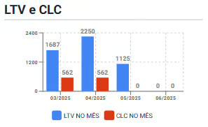

Apresenta a relação entre:

- **LTV (Lifetime Value):** valor gerado pelo paciente  
- **CLC (Customer Lifetime Cost):** custo associado à manutenção do paciente  

Essa leitura ajuda a compreender a sustentabilidade financeira do acompanhamento.

---

##### **Detalhe da frequência**

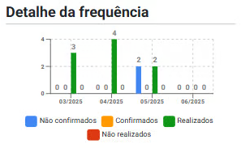

Mostra o comportamento de comparecimento do paciente, incluindo:

- não confirmados  
- confirmados  
- realizados  
- não realizados  

Permite identificar padrões de adesão ao tratamento.

---

##### **Inadimplência**

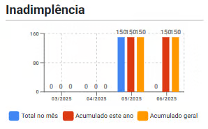

Exibe os valores em atraso:

- total no mês  
- acumulado no ano  
- acumulado geral  

Funciona como um sinalizador de risco financeiro do vínculo.

---

##### **Perdas (baixas contábeis)**

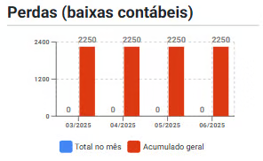

Representa valores reconhecidos como perda definitiva no período.

---

##### **Perdas recuperadas**

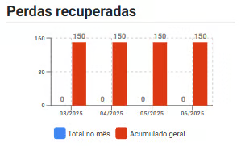

Indica valores previamente inadimplentes que foram posteriormente recuperados.

---

##### **Ocupação**

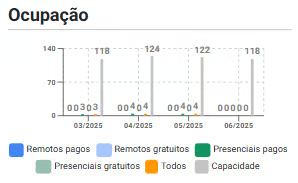

Mostra como o paciente utiliza a agenda, discriminando:

- remotos pagos  
- remotos gratuitos  
- presenciais pagos  
- presenciais gratuitos  
- capacidade total  

Ajuda a avaliar eficiência de uso da agenda.

---

##### **Valor dos atendimentos**

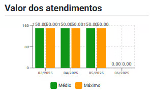

Apresenta os valores praticados nos atendimentos do paciente, incluindo métricas como valor médio e máximo no período.

---

##### **Desmarcações e remarcações**

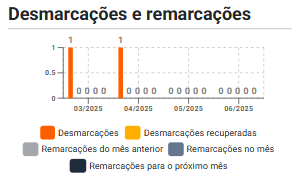

Aponta movimentações de agenda, como:

- desmarcações  
- desmarcações recuperadas  
- remarcações no mês  
- remarcações herdadas de mês anterior  
- remarcações para o próximo mês  

Esse indicador ajuda a avaliar estabilidade do comparecimento.

---

:::note Seletor de período
O período analisado pode ser ajustado pelos controles no topo da tela, permitindo ampliar ou reduzir a janela temporal de análise.

Essa flexibilidade facilita a identificação de tendências, oscilações e mudanças de comportamento ao longo do tempo.

:::

---

### Sub-aba Resumos

A sub-aba **Resumos** apresenta um consolidado administrativo do mês selecionado, organizado em *cards* sintéticos.

Ela responde rapidamente:

- como está o vínculo com o paciente  
- qual o volume financeiro do período  
- qual o nível de ocupação  
- se há sinais de risco administrativo  

---

#### Cards disponíveis

##### **Dados da relação com o paciente/grupo**

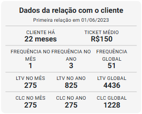

Apresenta:

- tempo de relacionamento  
- ticket médio  
- frequência (mês, ano e global)  
- LTV e CLC (mês, ano e global)  

Esse bloco ajuda a entender o histórico e o valor do vínculo.

---

##### **Atendimentos do mês**

Mostra:

- quantidade total de atendimentos  
- valor total do mês  
- valores quitados e não quitados  

---

##### **Inadimplência**

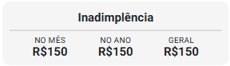

Exibe o montante inadimplente:

- no mês  
- no ano  
- no total  

---

##### **Perdas (baixas contábeis)**

Apresenta valores reconhecidos como perda.

---

##### **Perdas recuperadas**

Mostra valores recuperados de inadimplência.

---

##### **Ocupação**

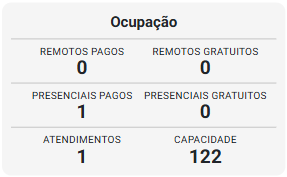

Detalha o uso da agenda pelo paciente, incluindo:

- atendimentos remotos e presenciais  
- pagos e gratuitos  
- total de atendimentos  
- capacidade da agenda  

---

##### **Custos pagos**

Apresenta a faixa de valores pagos pelo paciente no mês:

- mínimo  
- médio  
- máximo  

---

##### **Detalhe da frequência**

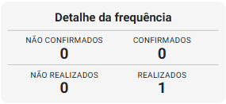

Mostra o status dos atendimentos:

- não confirmados  
- confirmados  
- não realizados  
- realizados  

---

##### **Remarcações e desmarcações**

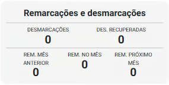

Apresenta a movimentação de agenda do paciente no período.

---

#### Leitura estratégica

A visualização consolidada permite ao profissional:

- identificar padrões de adesão  
- monitorar risco financeiro  
- avaliar estabilidade do comparecimento  
- compreender o valor longitudinal do paciente  
- ajustar estratégias de manejo administrativo  

---

### Sub-aba Evolução

A sub-aba **Evolução** apresenta a leitura longitudinal clínica baseada nos **marcadores clínicos** registrados ao longo das sessões.

Seu objetivo é apoiar o raciocínio clínico, tornando visível a progressão do caso ao longo do tempo.

---

#### Indicadores sintéticos do momento clínico

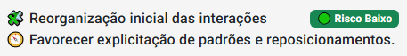

No topo da tela, o eConsult apresenta:

- **Direção:** tendência recente do caso (ex.: evolução favorável inicial)  
- **Risco atual:** nível estimado de risco clínico  
- **Manejo sugerido:** orientação assistiva baseada nos marcadores  

Esses elementos oferecem uma leitura rápida do estado atual do processo terapêutico.

---

#### Hipótese dinâmica do processo

A seção apresenta uma **síntese clínica assistida**, construída a partir dos marcadores registrados.

A análise busca:

- integrar sinais clínicos relevantes  
- identificar movimentos do processo terapêutico  
- apontar focos potenciais de manejo  
- apoiar a leitura longitudinal  

> ⚠️ A hipótese é **assistiva** e não substitui a formulação clínica do profissional.

O texto narrativo pode incluir, conforme o caso:

- sinais de estabilização  
- indicadores de aliança terapêutica  
- movimentos de enfrentamento  
- elementos transferenciais/relacionais  
- ganhos de autonomia  
- padrões de engajamento  

A leitura considera a progressão temporal dos marcadores.

---

#### Linha temporal dos atendimentos

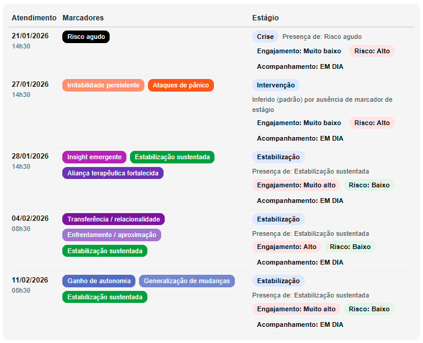

Na parte inferior, o sistema apresenta a **progressão clínica por sessão**, incluindo:

- data do atendimento  
- marcadores identificados  
- estágio do processo  
- nível de engajamento  
- nível de risco  
- status do acompanhamento  

Essa visualização permite observar:

- mudanças de fase  
- padrões de estabilidade ou oscilação  
- momentos de maior risco  
- consolidação de ganhos terapêuticos  

---

### Finalidade clínica

A aba **Resultados** foi desenvolvida para:

- apoiar a leitura longitudinal do paciente  
- integrar dimensões clínicas e administrativas  
- tornar visível a evolução do acompanhamento  
- qualificar o planejamento do manejo  
- fortalecer a tomada de decisão baseada em dados  

---

> ⚠️ **Importante:** As análises apresentadas são ferramentas de apoio. A interpretação clínica e as decisões terapêicas são sempre de responsabilidade do profissional.

---

## Em resumo

Os **Marcadores Clínicos**:

- não são apenas etiquetas coloridas  
- constituem uma **ferramenta de leitura clínica longitudinal**  
- permitem observar o caso como **processo contínuo**  
- apoiam decisões terapêuticas com mais consistência  

> **Eles nomeiam o que atravessa o processo —  
> para que possa ser reconhecido, acompanhado e transformado.**
