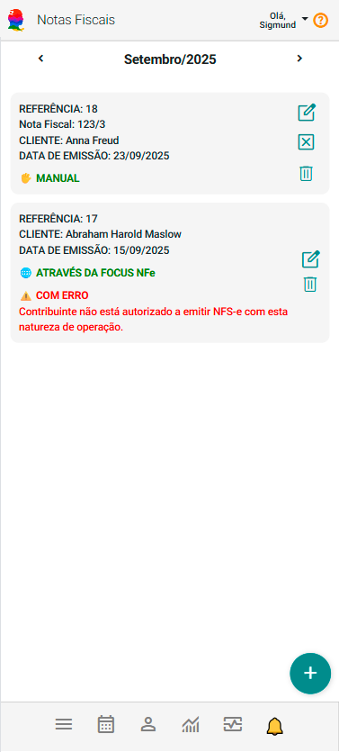

# Sobre Notas Fiscais

O painel Notas Fiscais reúne, de forma clara e organizada, todos os registros relacionados às Notas Fiscais — sejam elas cadastradas manualmente (canceladas ou não) ou emitidas por meio da integração com a plataforma Focus NFe. Cada nota é apresentada em cards individuais, destacando rapidamente as informações essenciais. Essa estrutura facilita a identificação do status e dos detalhes de cada documento, oferecendo mais controle, agilidade e segurança na gestão fiscal.

## Card de Nota Fiscal

Cada registro de nota fiscal aparece em formato de *card*, contendo:

- **Referência:** número de controle interno da nota.

- **Nota Fiscal:** número e série.

- **Cliente:** nome da pessoa atendida (cliente) vinculada.

- **Data de Emissão:** data da emissão da nota.

- **Identificação do Tipo de Emissão:**

    - 🖐 **MANUAL** – nota cadastrada manualmente no sistema.

    - 🌐 **ATRAVÉS DA FOCUS NFe** – nota emitida via integração com a plataforma Focus NFe.

        - **Status de Erro**

            - ⚠️ **COM ERRO** – exibe mensagem explicando o motivo da falha.

- **Botão de Visualização:** Permite a visualização dos dados da nota (não é permitida a edição).

- **Botão Cancelamento:** Permite indicar que a nota fiscal foi cancelada (irreversível).

- **Botão Excluir:** Permite excluir o registro da Nota Fiscal (irreversível).

## Como Utilizar

1. **Visualizar notas do mês atual** – A lista já carrega automaticamente o período em vigor.

1. **Navegar entre meses** – Use as setas laterais para ver notas anteriores ou futuras.

1. **Identificar a origem da emissão** – Verifique se foi feita manualmente ou via integração Focus NFe.

1. **Verificar status** – Caso a nota apresente erro, leia a mensagem para corrigir a emissão.

1. **Visualizar, Cancelar ou Excluir** – Utilize os ícones de ação quando necessário.

## Incluir Registros de Nota Fiscal

Você pode incluir novos registros de Notas Fiscais utilizando o botão .

Siga os passos:

1. Acione o botão "Incluir Nota Fiscal" .

1. Selecione uma pessoa atendida.

1. O sistema mostra as faturas já recebidas da pessoa atendida selecionada.

1. Marque as faturas que não tenham ainda nota fiscal associada.

1. Acione o botão "Incluir Nota Fiscal".

1. Preencha os campos relativos a nota fiscal se a NF foi emitida em outro sistema.

1. Acione o botão "Salvar dados de NF" se a NF foi emitida em outro sistema.

1. Acione o botão "Emitir NF com Focus NFe" se desejar emitir a NF utilizando sua integração com a plataforma Focus NFe.