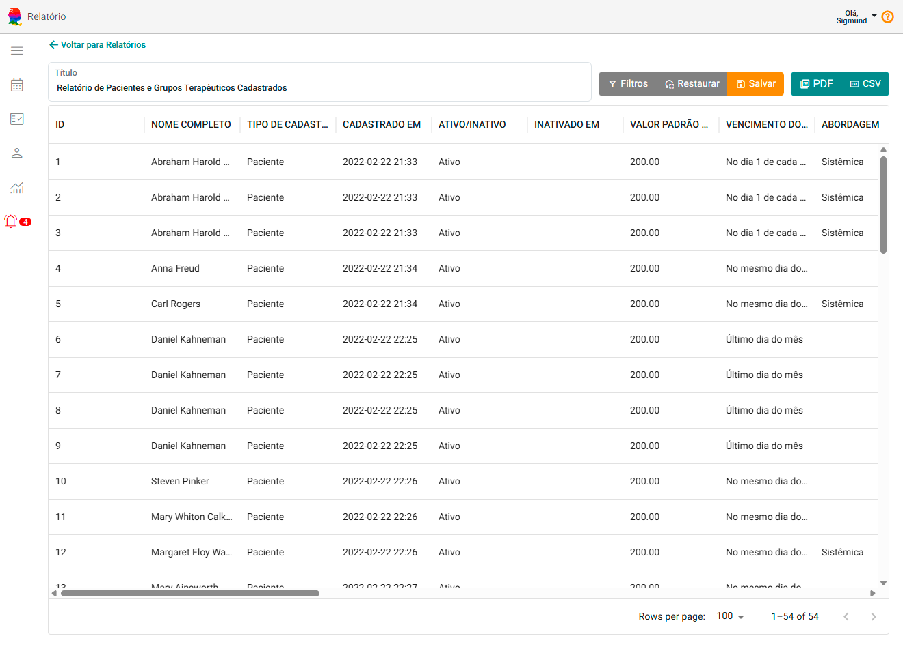
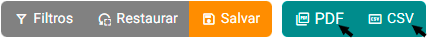

# Sobre Relatórios

O **Painel Relatórios** permite visualizar informações importantes do sistema de forma organizada, podendo aplicar filtros, escolher quais colunas mostrar e exportar os dados para **PDF** ou **planilha (CSV)**.
É uma ferramenta útil para acompanhar atendimentos, aspectos financeiros, evolução de pessoas atendidas e outros indicadores relevantes na sua rotina.

---

## Onde acessar

No menu principal do sistema na opção **"Relatórios"**.

---

## Tela de Lista de Relatórios

Ao acessar Relatórios, você encontrará uma lista com todos os modelos disponíveis.

Existem dois tipos:

| Tipo | Significado |
|------|-------------|
| **Relatórios de Sistema** | Modelos que já vêm prontos no eConsult. |
| **Relatórios Personalizados** | Relatórios criados e adaptados por você. |

### Ações possíveis nesta tela

- **Pesquisar** um relatório pelo nome
- **Abrir** um relatório para visualizar os dados
- **Criar novo relatório** baseado em um modelo existente (herança)
- **Excluir** relatórios personalizados
- **Restaurar relatórios do sistema** para o padrão original

     OU 

---

## Visualizando o Relatório

Ao abrir um relatório, os dados serão exibidos em uma **tabela dinâmica**, onde você pode:

- Ordenar colunas
- Redimensionar colunas
- Ocultar/mostrar colunas
- Ajustar quantidade de registros por página

Isso permite adaptar a visualização conforme sua necessidade, sem alterar os dados do sistema.

---

## Aplicando Filtros

Clique em **Filtros** para criar condições de filtragem.

[IMAGEM: Aba lateral de filtros aberta (drawer)]

Você pode, por exemplo:
- Mostrar apenas sessões de um determinada pessoa atendida
- Filtrar por período
- Listar apenas registros pagos ou pendentes
- Combinar condições usando **E / OU (AND / OR)**

Ao finalizar, clique em **Aplicar**.

Se quiser desfazer todos os filtros, clique em **Limpar**.

---

## Salvando sua Visualização

Se após ajustar colunas, filtros e ordenação você quiser manter esse formato para as próximas visualizações:

Clique em **Salvar**.

Da próxima vez que abrir o relatório, ele já virá configurado conforme suas preferências.

Se quiser voltar ao formato original, clique em **Restaurar**.

---

## Exportando os Dados

Você pode exportar os dados exibidos no relatório:

| Botão | Uso recomendável |
|------|-----------------|
| **PDF** | Ideal para impressão ou envio por e-mail. |
| **CSV** | Ideal para abrir em Excel, Google Sheets ou fazer cálculos. |

---

## Criando um Relatório Personalizado

1. Na lista de relatórios, clique em **Incluir novo relatório**.
2. Dê um **nome** ao relatório.
3. Escolha outro relatório como **modelo** (herança).
4. Salve.
5. Clique no botão de editar no relatório que você acabou de criar para visualizá-lo.

  

<small style={{marginBottom: "20px"}}>_Fluxo de inclusão de um relatório personalizado._</small>

**Sobre a Herança:** Ao escolher um modelo, o novo relatório herdará a **estrutura de colunas** e os **filtros padrão** do modelo original. Isso agiliza a criação, permitindo que você comece a partir de uma base já configurada.

Depois disso, entre no relatório e personalize colunas, ordenação e filtros, se desejar.

---

## Dicas Úteis

- Você não precisa entender de SQL para **usar** os relatórios.
- Personalize uma vez e **salve** para não precisar repetir a configuração.
- Use **PDF** para relatórios que serão enviados.
- Use **CSV** para trabalhar dados em planilhas.

---

## Conclusão

A funcionalidade **Relatórios** foi criada para oferecer ao psicólogo **autonomia e clareza** na visualização de informações do sistema, permitindo adaptar o modo de visualização conforme a necessidade, sem perder tempo configurando toda vez.