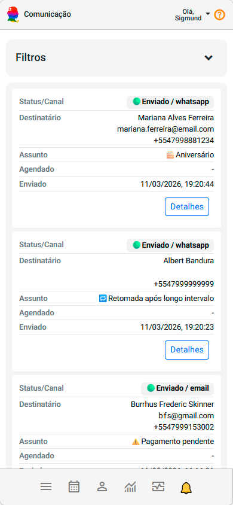
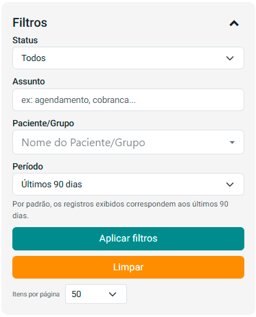
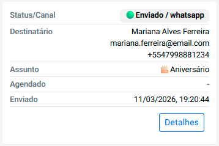
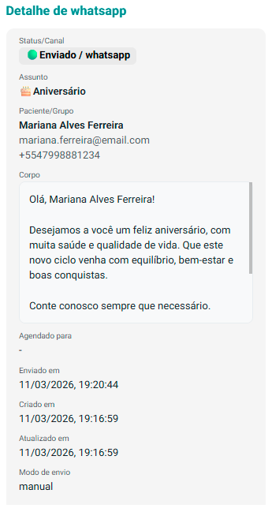

# Sobre Comunicação

O painel **Comunicação** permite acompanhar todas as mensagens enviadas a pessoas atendidas através da plataforma. Ele registra os envios realizados pelo sistema, como e-mails e outras notificações, possibilitando acompanhar o histórico de comunicações e verificar o status de cada envio.

Esse painel ajuda a compreender **quais mensagens foram enviadas, para qual pessoa atendida, quando o envio ocorreu e se a comunicação foi concluída com sucesso**, facilitando o acompanhamento da interação com as pessoas atendidas.

Os registros exibidos nesta tela correspondem à **fila e ao histórico de comunicações enviadas pelo sistema**.

Por meio dessa visualização, é possível identificar rapidamente mensagens enviadas, pendentes ou que apresentaram algum tipo de erro durante o processo de envio.

:::info
O painel Comunicação mostra tanto mensagens enviadas automaticamente pelo sistema quanto comunicações realizadas manualmente pelo profissional.
:::

---

# Filtros de consulta

A seção **Filtros** permite refinar a busca pelas comunicações registradas no sistema.

Ao expandir essa seção, você pode definir critérios para localizar mensagens específicas dentro do histórico de comunicação.

Os filtros podem incluir, por exemplo:

- Status da comunicação
- Assunto da mensagem
- Pessoa atendida relacionada à comunicação
- Período

Esses filtros facilitam a localização de mensagens específicas dentro da lista de comunicações registradas.

---

# Estrutura dos registros de comunicação

Cada comunicação registrada no painel é apresentada em formato de **card**, contendo as principais informações relacionadas ao envio da mensagem.

Cada registro apresenta os seguintes elementos:

### **Status / Canal**

Indica o estado atual da comunicação e o canal utilizado para o envio.

Exemplos de status:

- **Pendente:** a mensagem ainda está aguardando envio.
- **Processando:** a mensagem está em processo de envio.
- **Enviado:** a comunicação foi enviada com sucesso.
- **Erro:** ocorreu uma falha durante o envio.

O canal indica o meio utilizado para a comunicação, como:

- **E-mail**
- **WhatsApp**

---

### **Destinatário**

Mostra as informações da pessoa atendida que recebeu a comunicação.

Essas informações podem incluir:

- Nome da pessoa atendida
- Endereço de e-mail
- Número de celular

Isso permite identificar rapidamente quem foi o destinatário da mensagem.

---

### **Assunto**

Apresenta o assunto da comunicação enviada.

O assunto ajuda a identificar rapidamente o objetivo da mensagem, como por exemplo:

- lembretes de atendimento
- notificações administrativas
- avisos relacionados a pagamentos
- outras comunicações automáticas do sistema

---

### **Agendado**

Indica a data e o horário em que a mensagem estava programada para envio.

Algumas comunicações podem ser agendadas automaticamente pelo sistema, como lembretes de atendimento ou notificações programadas.

---

### **Enviado**

Mostra a data e o horário em que a comunicação foi efetivamente enviada a pessoa atendida.

Esse registro ajuda a confirmar quando o envio ocorreu.

---

# Visualização de detalhes

Cada comunicação possui o botão **Detalhe**, que permite visualizar informações adicionais sobre a mensagem enviada.

Ao acessar os detalhes, é possível visualizar:

- status/canal completo da comunicação
- assunto da mensagem
- destinatário da mensagem
- corpo de mensagem
- agendado para (data do agendamento do envio da mensagem)
- possíveis mensagens de erro
- outros metadados da comunicação enviada

Essas informações ajudam a compreender melhor o histórico de envio e investigar eventuais problemas de comunicação.

---

# Importância do painel de comunicação

O painel **Comunicação** é uma ferramenta importante para acompanhar e gerenciar as mensagens enviadas a pessoas atendidas.

Ele permite:

- acompanhar o histórico de comunicações enviadas
- verificar se mensagens foram enviadas corretamente
- identificar falhas ou problemas no envio
- revisar o conteúdo das comunicações enviadas
- garantir uma comunicação mais transparente com as pessoas atendidas

Esse recurso contribui para uma gestão mais organizada das interações com pessoas atendidas e ajuda a manter o controle sobre as mensagens enviadas pela plataforma.

:::tip
Utilize os filtros para localizar rapidamente comunicações específicas, especialmente ao verificar envios automáticos de lembretes ou mensagens administrativas.
:::