# Explorando o Painel Inicial

O Painel Inicial foi desenvolvido para proporcionar acesso rápido e prático às principais funcionalidades do eConsult. Nele, são exibidos alertas de pendências relacionadas a agendamentos e pagamentos, garantindo uma visão clara das tarefas prioritárias. Além disso, o painel conta com atalhos diretos para as funcionalidades mais utilizadas do sistema, otimizando o acesso e simplificando a gestão das operações essenciais.

## Mensagens de alerta, avisos e atalhos

O Painel Inicial exibe primeiro os alertas e informes mais importantes, destacando pendências e orientações que ajudam a priorizar tarefas e garantir uma gestão eficiente.

- **Atendimentos no dia DD/MM/YYYY** – Exibe a quantidade de atendimentos agendados para o dia atual. Ao clicar, abre a agenda já posicionada no dia atual.

  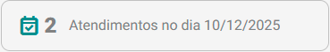

- **Próximo atendimento em DD/MM/YYYY às hh:mm com [nome do paciente ou grupo]** – Exibido apenas quando há um próximo atendimento agendado. Mostra data, horário e o paciente/grupo correspondente. Ao clicar, abre a agenda diretamente no dia desse atendimento.

  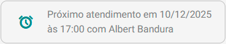

- **Organize seus atendimentos ou finalize seus registros** – Exibido somente quando não há próximos atendimentos agendados. Exibe uma mensagem de orientação para produtividade. Ao clicar, abre a agenda no dia atual.

  

- **Atendimento a confirmar com paciente/grupo** – Exibido apenas quando há atendimentos pendentes de confirmação. Mostra a quantidade de atendimentos que ainda precisam de retorno do paciente/grupo. Ao clicar, abre a tela de Alertas com os itens pendentes destacados para ação.

  
  
- **Atendimentos aguardando registro de realização** – Exibido somente quando existem atendimentos já ocorridos que ainda não tem anotação de realização registrados. Mostra a quantidade de registros pendentes. Ao clicar, abre a tela de Alertas com esses atendimentos destacados para conclusão.

  
  
- **Pagamentos vencidos** – Exibido apenas quando existem pagamentos pendentes com data de vencimento já expirada. Mostra a quantidade de cobranças em atraso. Ao clicar, abre a tela de Alertas com esses pagamentos destacados para regularização.

  
  
- **Pacientes com cadastro incompleto** – Exibido somente quando há pacientes com informações essenciais faltando (E-mail, Celular ou Data de Nascimento). Mostra a quantidade de cadastros incompletos. Ao clicar, abre a tela de Alertas com esses pacientes destacados para atualização dos dados.

  
  
- **Sua conta:** Atalho para o Painel Conta.

- **Ajuda**: Atalho para a Central de Ajuda, onde você encontra orientações sobre o uso do sistema.

- **Sair**: Encerra sua sessão e retorna para a página inicial do site eConsult.

Além destes alertas e informações, o Painel Inicial oferece ainda atalhos rápidos para as principais funcionalidades do sistema. Esses atalhos foram projetados para facilitar a navegação e agilizar o acesso às ferramentas mais utilizadas, otimizando o fluxo de trabalho e a gestão das operações diárias.

|Atalho|Destino|
|--------------|-------------|
| | Abre o [Painel Pacientes e Grupos Terapêuticos](/docs/funcionalidades/clientes-grupos/visao-clientes-grupos) |
|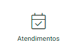 | Abre o [Painel Atendimentos](/docs/funcionalidades/atendimentos/visao) |
|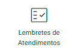 | Abre o [Painel Marcadores Clínicos](/docs/funcionalidades/marcadores-clinicos/visao) |
| | Abre o [Painel Resultados](/docs/funcionalidades/resultados/visao) |
|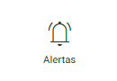 | Abre o [Painel Alertas](/docs/funcionalidades/alertas/visao) |
|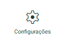 | Abre o [Painel Configurações](/docs/funcionalidades/configuracoes/visao-configuracoes) |
|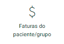 | Abre o [Painel Faturas do Paciente/Grupo](/docs/funcionalidades/faturas-cliente/visao) |
| | Abre o [Painel Atendimentos do Mês](/docs/funcionalidades/atendimentos-do-mes/visao) |
| | Abre o [Painel Receitas e Despesas](/docs/funcionalidades/receitas-e-despesas/visao) |
| | Abre o [Painel Consolidação Financeira](/docs/funcionalidades/consolidacao-financeira/visao) |
| | Abre o [Painel Inadimplências](/docs/funcionalidades/inadimplencias/visao) |
|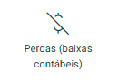 | Abre o [Painel Perdas (baixas contábeis)](/docs/funcionalidades/perdas-baixas-contabeis/visao) |
| | Abre o [Painel Perdas Recuperadas](/docs/funcionalidades/perdas-recuperadas/visao) |
| | Abre o [Painel Acompanhamento Inteligente do Paciente](/docs/funcionalidades/analise-score/visao) |
| | Abre o [Painel Campanhas de Cashback](#) |
|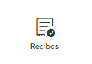 | Abre o [Painel Recibos](/docs/funcionalidades/recibos/visao) |
| | Abre o [Painel Notas Fiscais](#) |
|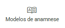 | Abre o [Painel Modelos de Anamnese](/docs/funcionalidades/modelo-anamnese/visao) |
|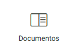 | Abre o [Painel Documentos](/docs/funcionalidades/documentos/visao) |
| | Abre o [Painel Relatórios](/docs/funcionalidades/relatorios/visao) |
|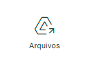 | Abre o [Painel Arquivos](/docs/funcionalidades/arquivos/visao) |

Por fim, ao final da página, o painel exibe os seis posts mais recentes do blog, com conteúdos relevantes para a atuação do psicólogo.

