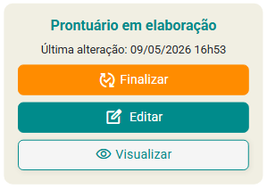
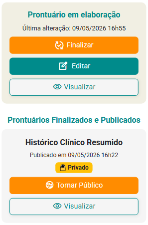

# Finalizando o prontuário

📌 Finalize e publique o prontuário para consolidar um recorte do acompanhamento clínico do paciente.

> 💡 No eConsult, finalizar um prontuário significa transformar o conteúdo registrado ao longo do acompanhamento em uma versão consolidada do histórico clínico.

Agora que você já:

✔ registrou atendimentos  
✔ realizou anotações clínicas  
✔ utilizou marcadores clínicos  
✔ estruturou o prontuário ao longo do processo terapêutico  

É hora de:

👉 publicar o prontuário

---

## 🎞️ Vídeo rápido (recomendado)

- gerando hipóteses diagnóticas, prognósticas, planos e evolução terapêutica com IA
- finalizando o prontuário
- publicando como público
- mostrando prontuário na Área do Paciente

<video controls preload="metadata" poster="/img/thumbs/video-tutorial.jpg" style={{  borderRadius: '15px', margin: '1.5rem 0', maxHeight: '670px', maxWidth: '100%', border: '1px solid whitesmoke', boxShadow: '0 10px 30px rgba(15, 23, 42, 0.10)', overflow: 'hidden', background: '#000', cursor: 'pointer' }}>
  <source src="/video/prontuario-finalizado.mp4" type="video/mp4" />
  Seu navegador não suporta vídeo.
</video>

---

## 🧠 O que significa finalizar um prontuário?

Ao finalizar:

- o prontuário é publicado no histórico clínico  
- o conteúdo daquele período fica consolidado  
- o registro deixa de ser apenas rascunho  
- você preserva um recorte clínico do acompanhamento  

👉 É como “congelar” uma versão organizada do prontuário naquele momento do tratamento.

---

## ▶️ Como finalizar

1. Acesse o prontuário do paciente

2. Revise os principais campos:
   - anamnese
   - hipóteses clínicas
   - evolução
   - plano terapêutico
   - anotações clínicas
   - salve

3. Clique em **Finalizar prontuário**

4. Defina a visibilidade:
   - 🔒 Privado
   - 🌐 Público

---

## 🔒 Diferença entre público e privado

### 🔒 Privado

Somente você poderá visualizar o prontuário.

Indicado para:
- registros internos
- hipóteses clínicas
- observações de apoio profissional

---

### 🌐 Público

O prontuário poderá ser disponibilizado ao paciente na Área do Paciente, caso você autorize.

Indicado para:
- devolutivas
- documentos compartilháveis
- registros clínicos preparados para apresentação

---

⚠️ A decisão sobre compartilhamento deve sempre considerar critérios clínicos, éticos e legais.

---

## 🧩 O que acontece após finalizar?

Depois da publicação:

✔ o prontuário recebe um recorte temporal dentro do histórico clínico do paciente
✔ o prontuário continua em edição normalmente, mas o recorte publicado permanece congelado
✔ você poderá consultar versões anteriores (recortes) do prontuário ao longo do acompanhamento
✔ o histórico clínico fica mais organizado e estruturado longitudinalmente
✔ se publicado como público, o recorte poderá ser visualizado na Área do Paciente
✔ se publicado como privado, o recorte ficará visível apenas para o profissional responsável

---

## ✍️ Posso continuar evoluindo o caso depois?

Sim.

Após finalizar e publicar um prontuário, o acompanhamento continua normalmente.

O prontuário permanecerá:

disponível para continuidade do acompanhamento clínico
apto para receber novos atendimentos, evoluções e marcadores clínicos
pronto para iniciar uma nova fase ou etapa do processo terapêutico
mantendo preservado o recorte temporal já publicado anteriormente

👉 Isso permite organizar diferentes momentos do acompanhamento ao longo do tempo, sem perder o histórico clínico longitudinal do paciente.

---

## 🤖 IA clínica assistiva na finalização

Durante a finalização, a IA pode auxiliar na geração de:

- hipóteses diagnósticas
- hipóteses prognósticas
- sugestões de plano terapêutico
- leitura evolutiva do caso

---

⚠️ Importante

A Inteligência Artificial atua apenas como apoio ao raciocínio clínico do profissional.

As sugestões geradas pela IA são exibidas somente como campos assistivos dentro do sistema e devem sempre ser revisadas, ajustadas e validadas pelo profissional responsável.

Esses campos assistivos **não aparecem na impressão ou publicação do prontuário**, o profissional decide incorporar manualmente alguma informação ao campo específio do prontuário.

---

## 💡 Boas práticas antes de finalizar

Antes de publicar o prontuário:

✔ revise as informações principais  
✔ verifique se as anotações estão claras  
✔ mantenha linguagem objetiva e ética  
✔ valide hipóteses clínicas  
✔ confirme se o conteúdo público está adequado ao compartilhamento no botão Visualizar  

---

## 🎯 Por que finalizar é importante?

Porque o prontuário publicado:

✔ organiza um recorte temporal do acompanhamento clínico
✔ preserva uma versão estruturada daquele momento do processo terapêutico
✔ facilita consultas futuras e revisões clínicas
✔ ajuda na visualização longitudinal da evolução do paciente
✔ permite documentar hipóteses, manejo, evolução e direcionamentos clínicos
✔ contribui para um histórico clínico mais organizado ao longo do tempo
✔ possibilita compartilhar um recorte do acompanhamento com o paciente, quando desejado pelo profissional

---

## 🚀 Dica prática

Muitos profissionais utilizam a finalização:

- ao concluir ciclos terapêuticos
- em devolutivas clínicas
- em mudanças importantes do caso
- periodicamente para organizar o histórico

👉 Isso ajuda a manter o acompanhamento mais estruturado e fácil de revisar ao longo do tempo.

---

## ▶️ Próximo passo

Agora que você já publicou o prontuário:

👉 continue registrando os próximos atendimentos e acompanhando a evolução clínica do paciente ao longo do tempo.

O acompanhamento longitudinal é construído sessão após sessão.