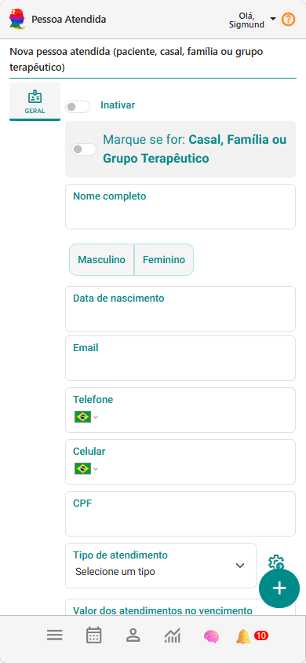
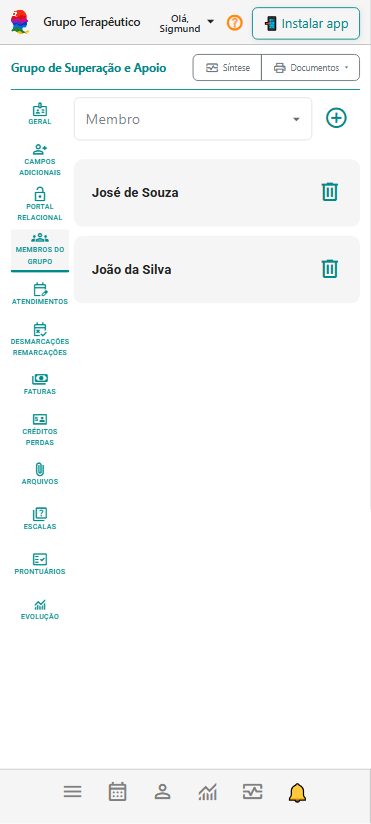

# Cadastre seus pacientes e grupos terapêuticos

👥 Cadastre seus pacientes e grupos para começar seus atendimentos no eConsult.

> 💡 Leva menos de 1 minuto para cadastrar um paciente.

O primeiro passo no eConsult é simples:

👉 começar a utilizar o eConsult no seu fluxo clínico real

Não precisa migrar tudo de uma vez.  
Comece com **2 ou 3 pacientes ativos** — isso já é suficiente para começar a usar o sistema na prática.

---

## 🎞️ Vídeo rápido (recomendado)

<video controls style={{borderRadius: '12px', margin: '1rem 0', maxWidth: '85%', border: '1px solid silver'}}>
  <source src="/video/pacientes-grupos-terapeuticos.mp4" type="video/mp4" />
  Seu navegador não suporta vídeo.
</video>

Este vídeo mostra:
- cadastrando um paciente  
- cadastrando um grupo terapêutico

---

## 👤 Como cadastrar um paciente

Cadastrar um paciente é rápido e direto.

### Passo a passo:

1. Acesse o painel de **Pacientes e Grupos Terapêuticos**

    

2. Clique em **Incluir novo paciente ou grupo **    

3. Preencha os dados principais:
   - Nome (obrigatório)
   - Sexo (obrigatório)
   - Informações básicas relevantes (não obrigatórias neste momento)

    

4. Salve o cadastro .

👉 Pronto. Agora você já pode utilizar esse paciente em:
- agendamentos
- registros clínicos
- acompanhamento longitudinal

🚀 Experimente cadastrar agora 1 paciente real antes de continuar.

---

## 💡 Dica importante

Você não precisa preencher tudo agora.

O mais importante é:

✔ Ter o paciente cadastrado  
✔ Começar a utilizar nos atendimentos  

Você pode complementar as informações depois.

---

## 👥 Como cadastrar grupos terapêuticos

> 💡 Se você trabalha com casais, famílias ou grupos terapêuticos, essa organização ajuda a manter vínculos, registros e acompanhamentos mais claros ao longo do tempo.

Se você trabalha com grupos, o eConsult também permite organizar isso de forma estruturada.

### Para criar um grupo terapêutico:

1. Acesse o painel de **Pacientes e Grupos Terapêuticos**  
2. Clique em **Incluir novo paciente ou grupo**  
3. Selecione a opção **Grupo Terapêutico**  
4. Preencha os dados principais:
   - **Nome** (obrigatório)  
   - **Informações adicionais** (opcional neste momento)  
5. Clique em **Incluir** para salvar o cadastro  
6. Acesse a aba **Membros do Grupo** e adicione os pacientes que participam do grupo  

    

:::tip
Antes de criar o grupo, certifique-se de que todos os participantes já estão cadastrados como pacientes no sistema.
:::

👉 Os grupos facilitam:
- organização de atendimentos coletivos  
- gestão de participantes  
- acompanhamento estruturado  

---

## 🎯 Por que começar por aqui?

Porque tudo no eConsult gira em torno disso:

- pacientes/grupos → atendimentos → registros → evolução

Ao cadastrar seus primeiros pacientes e/ou grupos, você já desbloqueia:

✔ Agenda  
✔ Prontuário  
✔ Marcadores clínicos  
✔ Acompanhamento longitudinal  

---

## 🚀 Comece simples

Uma boa forma de começar:

- Cadastre **3 pacientes reais**
- (Opcional) Cadastre **1 grupo terapêutico**

Isso já é suficiente para seguir para o próximo passo.

---

## 📚 Manual completo de Pacientes e Grupos Terapêuticos

Quer explorar mais recursos relacionados aos pacientes e grupos terapêuticos?

No manual completo você encontra orientações sobre:

- síntese clínica do paciente/grupo
- emissão de documentos
- dados gerais do cadastro
- área do paciente
- campos adicionais personalizados
- membros do grupo terapêutico
- endereços
- gestão de atendimentos
- remarcações e desmarcações
- faturas
- arquivos
- créditos e perdas
- prontuário eletrônico
- dashboard de evolução clínica

👉 [Acessar manual completo de Pacientes e Grupos Terapêuticos](/docs/clientes-grupos)

---

## 👉 Próximo passo

Continue para o próximo item dos primeiros passos:

👉 [Organize sua agenda](./03_agendamento-de-multiplos-atendimentos.md)
