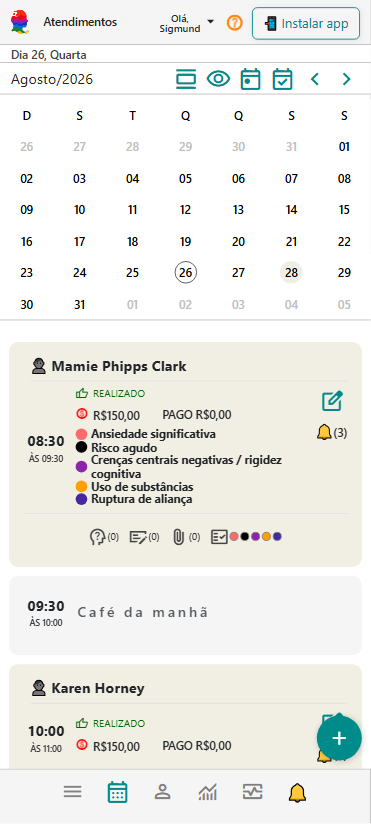
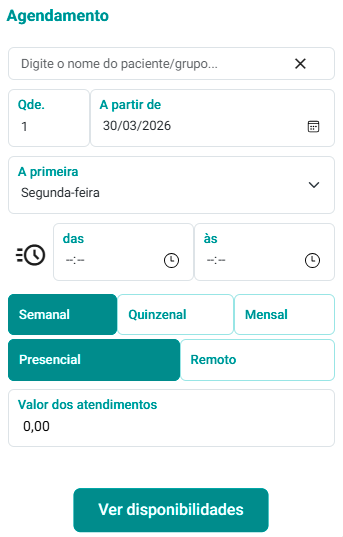
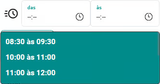

# Organize sua agenda

📅 Organize sua agenda para estruturar sua rotina de atendimentos.

> 💡 Com poucos cliques, você consegue agendar várias sessões de um paciente de uma só vez.

> 💡 Manter os atendimentos organizados facilita não apenas a rotina administrativa, mas também a continuidade do processo terapêutico.

Agora que você já cadastrou seus pacientes, o próximo passo é simples:

👉 **montar sua agenda real de atendimentos**

⏱️ Leva menos de 1 minuto

---

## 🎞️ Vídeo rápido (recomendado)

<video controls style={{borderRadius: '12px', margin: '1rem 0'}}>
  <source src="/video/agendamento-de-multiplos-atendimentos.mp4" type="video/mp4" />
  Seu navegador não suporta vídeo.
</video>

- fazendo agendamentos múltiplos

---

## 🚀 Por que usar agendamentos múltiplos?

Em vez de cadastrar sessão por sessão, você pode:

✔ Criar várias sessões automaticamente  
✔ Definir frequência (semanal, quinzenal, mensal)  
✔ Organizar sua agenda do mês inteiro em segundos  

👉 Isso economiza tempo e ajuda a manter sua agenda organizada.

---

## 👤 Como agendar múltiplos atendimentos

### Passo a passo:

1. Acesse o painel de **Atendimentos**

    

2. Clique em **Incluir Agendamento **

    

3. No campo **Paciente/Grupo**, selecione o paciente ou grupo terapêutico desejado
4. Informe a **quantidade de atendimentos** (Qtde.)
5. Defina a data inicial em **A partir de**
6. Escolha o dia da semana em **A primeira**
7. Informa os horários de início e fim dos atendimentos **das** e **às**
8. Escolha a **periodicidade**:
   - Semanal
   - Quinzenal
   - Mensal
9. Selecione se os atendimentos serão **Presenciais** ou **Remotos**
10. Informe o **valor dos atendimentos**

:::tip

### 🕒 Escolha de horários

Você pode:

👉 Utilizar suas **[disponibilidades configuradas](/docs/funcionalidades/configuracoes/agenda/carga-horária-semanal)**  
👉 Ou selecionar manualmente os horários

Se quiser usar as disponibilidades configuradas:

- Clique em 
- Escolha o horário desejado

    

:::

---

### 📅 Revisando os agendamentos

Antes de finalizar:

1. Clique em **Ver Disponibilidades **
2. Revise os dias sugeridos
3. Marque ou desmarque os atendimentos
4. Clique em **Agendar Marcados **

👉 Pronto. Sua agenda será preenchida automaticamente.

---

## 💡 Dica importante

Você não precisa deixar sua agenda perfeita agora.

O mais importante é:

✔ Ter sua agenda preenchida  
✔ Começar a usar o sistema no seu dia a dia  

Você pode ajustar horários e detalhes depois.

---

## 🎯 Por que isso é importante?

Porque a agenda conecta toda a sua rotina clínica:

- agenda → atendimentos → registros → evolução clínica

Ao organizar sua agenda, você já começa a usar o eConsult de forma real.

---

## 🚀 Comece agora

Uma boa forma de começar:

- Escolha **1 paciente**
- Agende **4 sessões semanais**

👉 Isso já simula um mês completo de acompanhamento.

---

## 📚 Manual completo da Agenda e Atendimentos

Quer explorar mais recursos relacionados à agenda e aos atendimentos?

No manual completo você encontra orientações sobre:

- interação e navegação da agenda
- cards de atendimentos
- desmarcações, remarcações e exclusões
- confirmação e realização de atendimentos
- modalidades presencial e remota
- avaliações psicológicas vinculadas
- anotações clínicas
- arquivos do atendimento
- marcadores clínicos
- informes de presença e pagamentos
- recebimentos de valores
- teleatendimento

👉 [Acessar manual completo da Agenda](/docs/atendimentos)

---

## ▶️ Próximo passo

Agora que sua agenda está organizada:

👉 [Acompanhe sua rotina](./04_situacoes-de-atendimento-clinico.md)
