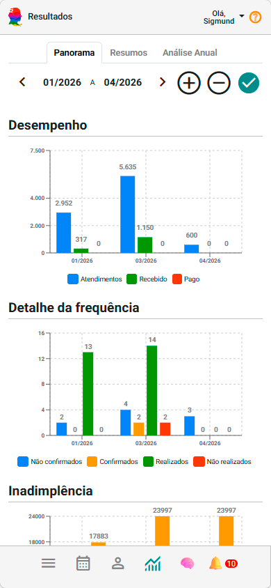

# Entenda seus resultados

📊 Entenda seus resultados e acompanhe indicadores da sua prática clínica.

> 💡 Acompanhar resultados ao longo do tempo ajuda a transformar informações isoladas em uma leitura mais clara da prática clínica.

Agora que você já está utilizando o sistema no dia a dia, surge uma nova necessidade:

👉 **entender como está seu consultório**

O painel de **Resultados** te ajuda a enxergar isso de forma clara, visual e prática.

---

## 🎞️ Vídeo rápido (recomendado)

<video controls style={{borderRadius: '12px', margin: '1rem 0'}}>
  <source src="/video/resultados.mp4" type="video/mp4" />
  Seu navegador não suporta vídeo.
</video>

- explorando painel de resultados

---

## 🎯 O que é o painel de Resultados?

O painel reúne informações importantes sobre:

- Atendimentos realizados  
- Receita gerada  
- Organização financeira  
- Evolução da sua prática clínica

👉 Tudo em um só lugar, com leitura visual e prática da sua rotina clínica.

---

## 👀 O que você vai encontrar aqui

O painel está dividido em três partes principais:

- **Panorama** → visão rápida e visual  
- **Resumos** → indicadores do mês  
- **Análise Anual** → evolução ao longo do tempo  

👉 Cada aba te ajuda a entender seu consultório em um nível diferente.

---

## 📊 Aba Panorama (visão rápida)

Aqui você tem uma visão visual dos últimos meses.

Você consegue identificar rapidamente:

- Variações de atendimentos  
- Mudanças na receita  
- Tendências recentes  

👉 Ideal para uma leitura rápida da situação atual.

---

## 📈 Aba Resumos (visão detalhada)

Aqui você encontra os principais indicadores do mês selecionado.

Você consegue:

- acompanhar sua receita  
- entender seu volume de atendimentos  
- analisar seu desempenho no período  

👉 Essa é a aba mais prática para o dia a dia.

---

## 📅 Aba Análise Anual (visão estratégica)

Aqui você acompanha sua evolução ao longo do tempo.

Você consegue:

- comparar meses  
- identificar crescimento ou queda  
- planejar melhor os próximos períodos  

👉 Ideal para decisões mais estratégicas.

---

## 💡 Dica importante

Você não precisa analisar tudo profundamente agora.

Comece simples:

✔ Acesse o painel  
✔ Olhe o Panorama  
✔ Veja como está seu mês  

👉 Isso já ajuda a criar uma leitura mais clara da sua rotina clínica.

---

## 🎯 Por que isso é importante?

Porque, no dia a dia, muitos profissionais acabam acompanhando o consultório apenas pela percepção do momento.

- quanto estão atendendo  
- quanto estão faturando  
- como estão evoluindo  

👉 O painel transforma isso em indicadores claros e organizados ao longo do tempo.

---

## 🧠 Como usar na prática

Uma rotina simples:

- 1x por semana → ver o Panorama  
- 1x por mês → analisar os Resumos  
- ocasionalmente → olhar a Análise Anual  

👉 Isso já é suficiente para ter controle do consultório.

---

## 🚀 Comece agora

Uma boa forma de começar:

- Acesse o painel de Resultados  
- Observe o mês atual  
- Compare com o mês anterior  

👉 Você já vai perceber padrões importantes.

---

## 📚 Manual completo de Resultados e Indicadores

Quer aprofundar sua leitura sobre os indicadores e gráficos do consultório?

No manual completo você encontra orientações sobre:

- leitura detalhada da aba Panorama
- gráficos dos últimos meses
- interpretação de tendências recentes
- indicadores mensais da aba Resumos
- análise anual retrospectiva
- leitura cruzada de indicadores
- interpretação estratégica dos gráficos
- análise da evolução do consultório ao longo do tempo
- utilização de IA para análise do ano clínico e operacional

👉 [Acessar manual completo de Resultados](/docs/resultados)

---

## ▶️ Próximo passo

Agora que você entende sua operação:

👉 **Registre seus atendimentos utilizando marcadores clínicos**

Isso vai permitir acompanhar também a evolução clínica dos pacientes.

👉 [Registre suas anotações](./06_anotacoes-clinicas-com-marcadores-clinicos.md)
