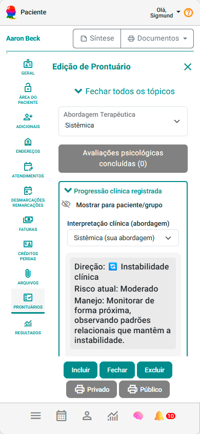
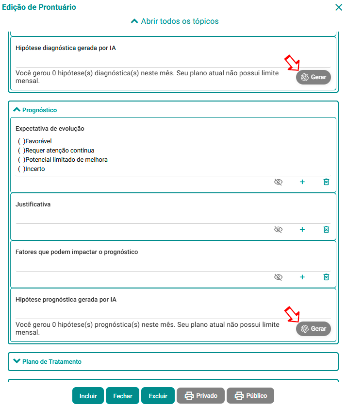

# Organize o prontuário

Agora que você já:

✔ cadastrou o paciente  
✔ realizou atendimentos  
✔ utilizou marcadores e anotações clínicas  

É hora de centralizar tudo:

👉 no **Prontuário Eletrônico**

---

## 🧠 O que é o prontuário no eConsult?

O prontuário é onde você organiza:

- histórico do paciente  
- avaliações psicológicas  
- anotações clínicas  
- evolução do caso  
- hipóteses e plano terapêutico  

👉 tudo em um único lugar

---

## ▶️ Onde acessar

1. Acesse **Pacientes e Grupos Terapêuticos**  
2. Selecione um paciente  
3. Clique na aba **Prontuário**

---

## 📂 Como funciona a estrutura

Cada paciente pode ter:

👉 **mais de um prontuário**

Isso permite organizar por:

- fases do tratamento  
- mudanças de abordagem  
- novos ciclos clínicos  

---

### Status do prontuário

- 🟡 **Em elaboração** → apenas você vê  
- 🟢 **Publicado** → salvo no histórico  

---

💡 **Importante**

👉 Apenas **um prontuário em elaboração** pode existir por paciente

---

## ✍️ Criando um novo prontuário

1. Clique em **Novo prontuário**

2. Escolha um **modelo de anamnese**

3. Defina a **abordagem terapêutica**

4. O sistema abrirá a estrutura do prontuário

---

## 🧩 O que você pode registrar

Dentro do prontuário, você pode incluir:

- identificação do paciente  
- histórico clínico  
- anamnese estruturada  
- avaliações psicológicas  
- evolução do atendimento  
- anotações clínicas  
- documentos anexos  

---

👉 Tudo organizado por seções, facilitando leitura e continuidade

---

## 🤖 Uso de Inteligência Artificial no Prontuário

O prontuário pode contar com apoio de **Inteligência Artificial clínica assistiva**, auxiliando na organização e análise do caso a partir dos dados já registrados.

A IA pode sugerir:

- **Hipóteses diagnósticas**  
- **Hipóteses prognósticas**  
- **Sugestões de plano de tratamento**  
- **Leitura evolutiva do caso ao longo do tempo**  

---

⚠️ **Importante**

A IA atua como **apoio ao raciocínio clínico**, não como substituição.

👉 Todas as sugestões devem ser **revisadas e validadas pelo profissional**.

---

## 🧠 Qualidade das sugestões

Para gerar hipóteses consistentes, a IA depende dos dados clínicos registrados no sistema.

👉 Recomenda-se:

- Ter ao menos **um atendimento com anotação clínica registrada**  
- Utilizar **marcadores clínicos** nas sessões  
- Manter o histórico atualizado  

---

💡 **Quanto mais dados clínicos estruturados você registra, mais relevantes e precisas serão as análises geradas pela IA.**

---

## 💾 Editando e finalizando

Durante o uso, você pode:

- **Editar** → rascunho → continuar depois   
- **Finalizar** → publicar no histórico → não se pode mais editar 

---

## 🔒 Público ou privado

Ao finalizar, você pode definir:

- 🔒 **Privado** → só você visualiza  
- 🌐 **Público** → visível ao paciente na Área do Paciente se você autorizar  

---

## 📌 Após finalizar o prontuário

Você poderá:

- visualizar  
- duplicar para nova versão  
- alternar público/privado  

---

## 🎯 Por que isso é importante?

Porque o prontuário deixa de ser apenas registro:

❌ não é só documentação  

✔ passa a ser organização clínica  
✔ facilita continuidade do cuidado  
✔ integra tudo que você já registrou  

---

## 🚀 Comece agora

Faça isso com um paciente:

1. Crie um prontuário  
2. Preencha os principais campos  
3. Salve  
4. Finalize  

👉 Em poucos minutos você terá um registro estruturado completo

---

## ⚠️ Boas práticas

- mantenha registros objetivos  
- atualize conforme evolução do paciente 
- use o modo público apenas quando fizer sentido clínico 
- procure usar os campos de IA depois que todos os dados estiverem completos  

---

## ▶️ Próximo passo

Agora que você já estruturou o prontuário:

👉 continue alimentando com novas sessões e avaliações

É assim que você constrói um acompanhamento clínico completo ao longo do tempo.