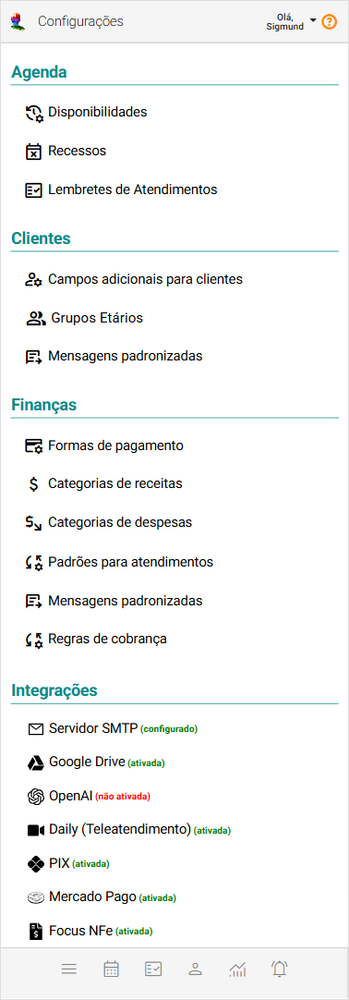

# Sobre Configurações

O **Painel Configurações** do eConsult é uma ferramenta essencial que centraliza e organiza todas as personalizações e definições necessárias para a gestão eficiente do sistema. 

Este painel é projetado para facilitar a administração e a adaptação do eConsult às necessidades específicas do seu negócio, permitindo um controle completo sobre as funcionalidades e ajustes do sistema.

O **Painel Configurações** pode ser acessado pela opção **Configurações** no **Menu Principal**.

As configurações são divididas em quatro grupos, cada um com suas funcionalidades específicas:

## Agenda

O objetivo aqui é configurar e personalizar a agenda para otimizar o planejamento e a organização do tempo.

- **Disponibilidades:** Configure os dias e horários em que você estará disponível para atendimentos, incluindo intervalos entre sessões/atendimentos.
- **Recessos:** Defina períodos de pausa, férias ou feriados nos quais sua agenda ficará bloqueada para agendamentos.
- **Lembretes de Atendimentos:** Configure agrupamentos de atendimentos com base em ações pendentes, como emissão de recibos ou preenchimento de prontuários, para não esquecer de realizá-las.

## Clientes

Objetiva facilitar o gerenciamento e a personalização das informações dos clientes para melhorar o atendimento e a comunicação.

- **Campos Adicionais para Clientes:** Adicione e configure campos adicionais personalizados para clientes a fim de coletar informações específicas dos clientes, conforme as necessidades do seu negócio.
- **Grupos Etários:** Crie e gerencie Grupos Etários para segmentação.
- **Mensagens Padronizadas:** Crie padrões de mensagens relacionadas a clientes.

## Finanças
Gerencia aspectos financeiros relacionados ao sistema e garantir o controle e a precisão nas transações e relatórios financeiros.
- **Formas de Pagamento:** Configure os métodos de pagamento aceitos por você, como cartões de crédito, transferências bancárias e pagamentos online.
- **Categorias de Receitas:** Defina e organize categorias para classificar receitas, facilitando a análise financeira e o planejamento.
- **Categorias de Despesas:** Defina e organize categorias para classificar despesas, facilitando a análise financeira e o planejamento.
- **Padrões para Atendimento:** Estabeleça configurações e personalizações relacionadas a atendimentos.
- **Mensagens Padronizadas:** Crie padrões de mensagens relacionadas a atendimentos.
- **Regras de Cobrança:** Permite o cadastro de regras de cobrança para os atendimentos, incluindo descontos, multas, juros por atraso e mora diária.

## Integrações

Integra, de forma facilitada, o eConsult com outras ferramentas e sistemas para melhorar a eficiência e a fluidez dos processos.
- **Servidor SMTP:** Configure os parâmetros relacionado ao seu servidor de envio de e-mails.
- **GoogleDrive:** Configure a integração do eConsult com seu GoogleDrive.
- **OpenAI:** Configure a integração do eConsult com a sua conta OpenAI.
- **Daily (Teleatendimento):** Configure a integração do eConsult com a plataforma Daily e tenha um sistema de teleatendimento totalmente integrado.
- **PIX:** Configure seu PIX para permitir que o sistema gere QRCodes de pagamento para seus clientes.
- **Mercado Pago:** Configure a integração do eConsult com seu Mercado Pago.
- **Focus NFe:** Configure a integração do eConsult com a plataforma Focus NFe.

## Benefícios do Painel Configurações

- **Centralização e Organização:** O painel proporciona uma visão unificada e organizada de todas as configurações, facilitando o acesso e a gestão das personalizações do sistema.
- **Eficiência Operacional:** Permite ajustes e atualizações rápidas e eficazes nas configurações, melhorando a eficiência e a adaptabilidade do eConsult às necessidades do seu negócio.
- **Controle e Precisão:** Oferece controle total sobre as funcionalidades e ajustes do sistema, garantindo que as operações sejam realizadas de acordo com as políticas e necessidades estabelecidas.

O Painel de Configurações do eConsult é uma ferramenta central para a personalização e gestão do sistema, dividida em grupos distintos que cobrem todas as áreas essenciais para o funcionamento eficiente e adaptado às necessidades específicas do seu negócio.