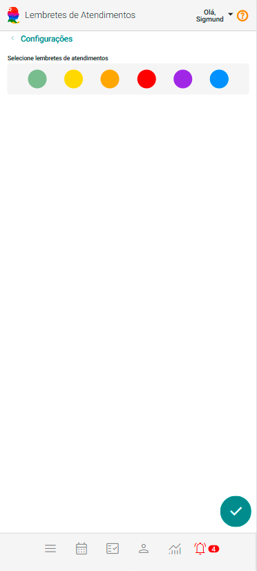
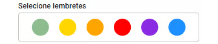
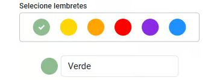
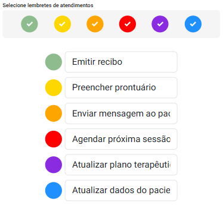

# Lembretes de Atendimentos

Os **Lembretes de Atendimentos** funcionam como destaques que você pode atribuir aos seus atendimentos, permitindo agrupar atendimentos em atenção a informações importantes ou momentos significativos em diversos contextos. 

No eConsult, é possível configurar até 6 (seis) tipos de lembretes de atendimentos, cada um identificado por uma cor distinta para facilitar a organização e visualização.

Lembretes de atendimentos podem ser extremamente úteis para organizar atendimentos, acompanhar o progresso dos seus pacientes e garantir a eficiência na gestão das sessões.

## Configurar Lembretes de Atendimentos

1. Acesse o "Painel Configurações" e clique na opção "Lembretes de Atendimentos".

    

2. Escolha uma cor para o lembrete que você deseja configurar.

    

3. Logo abaixo da cor selecionada, o sistema exibirá um campo. Insira um rótulo personalizado.

    

4. Se preferir, personalize o rótulo do lembrete com o nome desejado.

5. Acione o botão  para salvar a configuração.

:::note Sugestão de configuração de lembretes de atendimentos
- **Emitir recibo** - "Para lembrar de gerar o comprovante de pagamento dos atendimentos realizados."
    - **Cor:** Verde
- **Preencher prontuário** - "Lembrar de registrar observações clínicas ou notas após a sessão" 
    - **Cor:** Amarela
- **Enviar mensagem ao paciente** - "Lembrar de enviar orientação pós-sessão, material de apoio, ou confirmar agendamento futuro." 
    - **Cor:** Laranja
- **Agendar próxima sessão** - "Para não esquecer de combinar a continuidade do atendimento com o paciente." 
    - **Cor:** Vermelho
- **Atualizar plano terapêutico** - "Revisar objetivos e estratégias com base na evolução do paciente." 
    - **Cor:** Roxo
- **Atualizar dados do paciente** - "Lembrar de revisar ou completar informações cadastrais, como endereço, contato, convênio ou dados clínicos relevantes." 
    - **Cor:** Azul

Com este exemplo, o resultado seria:

    
:::
