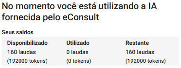

# IA eConsult

**O eConsult já conta com inteligência artificial nativa para agilizar tarefas do dia a dia, como geração de textos e análises automáticas. Mas, se preferir, você também pode configurar sua própria conta do ChatGPT e personalizar ainda mais a experiência.**

A integração é simples e acessível (não requer conhecimentos avançados de informática), permitindo que você aproveite todos os recursos do ChatGPT diretamente na plataforma eConsult. Com isso, é possível gerar anotações, resumos, análises e automatizar partes do seu trabalho com o suporte da IA de forma prática, inteligente e adaptada ao seu perfil.

Mesmo com a IA já ativa por padrão no eConsult, essa configuração com a sua própria chave de API do ChatGPT permite:

- Maior controle sobre os dados utilizados
- Personalização da capacidade de uso  
- Escalabilidade conforme suas necessidades

## Funcionalidades com Inteligência Artificial no eConsult

A Inteligência Artificial (IA) integrada ao eConsult foi desenvolvida para apoiar o profissional da saúde nas áreas clínica e gerencial, oferecendo recursos que se adaptam à sua especialidade (psicologia, terapia integrativa, coaching, fisioterapia, nutrição, entre outras).

### 1. Anotações Inteligentes

A IA auxilia na elaboração e revisão de anotações clínicas, permitindo:

- Geração de textos completos com base nas informações do atendimento;
- Reformulação, resumo ou expansão de anotações;
- Adaptação ao vocabulário e à lógica da especialidade do profissional.

### 2. Respostas no Contexto Profissional

A IA responde perguntas e oferece sugestões sempre dentro do contexto da área de atuação do especialista. Por exemplo:

- **Psicólogos** recebem respostas baseadas em conceitos da psicologia;
- **Nutricionistas** recebem sugestões alinhadas às práticas da nutrição.

### 3. Hipóteses Diagnósticas e Prognósticas

Com base nos dados do prontuário, nos testes aplicados (como testes psicológicos) e anotações feitas durante os atendimentos, a IA pode sugerir:

- Hipóteses diagnósticas iniciais;
- Possíveis prognósticos;
- Pistas clínicas úteis ao raciocínio do profissional.

> **Observação:** essas sugestões são auxiliares e não substituem a análise clínica do especialista.

### 4. Análises Mensais com Insights

A IA gera relatórios mensais com insights sobre:

- Desempenho clínico (número de atendimentos, taxa de comparecimento, entre outros);
- Resultados financeiros (faturamento, média por sessão, etc.).

Essas informações ajudam o profissional a acompanhar e melhorar sua performance mensalmente.

### 5. Análises Anuais com Visão Estratégica

Além dos relatórios mensais, a IA também oferece uma análise anual com:

- Dados consolidados de desempenho e finanças;
- Comparações ao longo do tempo;
- Insights para decisões estratégicas de médio e longo prazo.

---

**Importante:** A IA é uma ferramenta de apoio. Todas as decisões clínicas e administrativas continuam sob responsabilidade do profissional.

- **Anotação de Atendimento**: ao incluir ou editar uma anotação, aparece o botão , que abre um editor que permite sugestões automáticas baseadas em IA.

- **Painel de Resultados – Indicadores**: botão  permite gerar análise com insights com base nos indicadores de um determinado mês.

- **Painel de Resultados – Análise Anual**: permite gerar análise com insights com base nos indicadores de um determinado ano.

- **Prontuário:** no prontuário o botão Gerar , nos campos "Hipóteses diagnósticas sugeridas por IA" e "Prognóstico gerado por IA (sugestivo)" permite gerar hipóteses considerando o prontuário, as anotações dos atendimentos e os testes psicológigos. 

---

## Política de Uso de Tokens no eConsult

### Limite Mensal de Tokens no eConsult

Cada usuário do **eConsult** tem acesso a **192.000 tokens por mês** para utilizar os recursos de inteligência artificial integrados à plataforma.

Esse limite é **renovado automaticamente no primeiro dia de cada mês** e corresponde a uma quantidade generosa de uso, suficiente para os atendimentos e tarefas do dia a dia.

:::warning **Importante:**  
- Esse limite existe apenas como medida de proteção contra abusos e uso excessivo fora do propósito da ferramenta. Ele garante que todos os usuários tenham uma experiência estável, rápida e segura no uso da IA.

- Se você atingir o limite mensal, a IA será temporariamente desativada até o início do próximo mês, quando o saldo de tokens será renovado automaticamente.
:::

Você pode acompanhar o uso dos seus tokens no painel "Configurações" na opção "ChatGPT".

## Qual modelo de IA o eConsult utiliza?

O **eConsult utiliza exclusivamente o modelo GPT-4o-mini** da OpenAI para todas as funcionalidades nativas de geração de texto.

:::warning **Vantagens do GPT-4o-mini:**

- **Alta eficiência com baixo custo de tokens**
- Excelente para tarefas como:
  - Anotações de atendimento
  - Análises clínicas e psicológicas
  - Resumos e relatórios

- **Mais econômico** que modelos como o GPT-4o e GPT-4-turbo, ideal para uso contínuo
:::

Essas funcionalidades funcionam de forma nativa do eConsult. 

Você pode também conectar sua própria conta da OpenAI caso queira personalizar ainda mais essa experiência.

## Se você usar a sua própria API da OpenAI?

Se preferir usar a sua **API da OpenAI diretamente**, você será responsável por inserir créditos e gerenciar o uso.

:::note **Exemplo:** 
Com apenas **$2 por mês**, usando o modelo GPT-4o-mini, você consegue gerar com folga:
- 8 anotações de atendimento por dia (~300 tokens cada)
- 1 análise mensal (~900 tokens)
- 1 análise anual (~900 tokens)  
- 20 hipóteses disgnóticas por mês
- 20 hipóteses prognósticas por mês
:::

## Resumo

| Recurso                     | Uso via eConsult (nativo)        | Uso via API/ChatGPT pessoal      |
|-----------------------------|----------------------------------|----------------------------------|
| **Modelo usado**            | GPT-4o-mini                      | GPT-4o-mini                      |
| **Tokens disponíveis**      | 192.000 por mês (fixo)           | Depende dos créditos inseridos   |
| **Cobrança**                | Gratuito (incluso no sistema)    | Conforme consumo                 |
| **Bloqueio por excesso**    | Sim, até o próximo mês           | Você define o limite por crédito |

---

Se tiver dúvidas sobre o consumo de tokens ou desejar monitorar o uso, entre em contato com o suporte técnico do eConsult (atendimento@econsult.app.br).

---

## Configurar a integração do seu ChatGPT no eConsult

**1. Crie ou acesse sua conta na OpenAI**
    
    - Acesse: https://platform.openai.com/​

    - Clique em "Sign Up" para criar uma conta ou "Log In" se já tiver uma no canto superior direito da tela.

        

**2. Vá até a seção de API Keys**
    
    - Após fazer login, vá para: https://platform.openai.com/account/api-keys​

**3. Gere uma nova chave**
    
    - Clique no botão “+ Create new secret key”.
    
        
    
    - Dê um nome para identificar sua chave (ex: “Minha Chave para eConsult”).
    
        
    
    - Clique em "Create secret key" .

**4. Copie a chave**

    - Copie a chave exibida logo após criá-la .
    
        :::warning Você não poderá vê-la novamente depois de sair da página.
            - Guarde em local seguro, como um gerenciador de senhas ou arquivo de configuração local.
        :::

**5. Configure a Integração no eConsult**

    - No eConsult, no painel Configurações, acesse a opção "Integrações / ChatGPT".
    
    - Preencha o campo Chave API com a chave copiada anteriormente.
    
        
    
    - Acione o botão Salvar .
    
**Pronto! Sua integração está feita.**

---

## Inserir créditos na plataforma OpenAI

**1. Acesse a Plataforma da OpenAI**

- Acesse: [https://platform.openai.com](https://platform.openai.com)
- Faça login com sua conta OpenAI (a mesma do ChatGPT, se já tiver).

**2. Vá até a Seção de Faturamento**

- No canto superior direito, clique no seu **nome ou ícone de usuário**.
- No menu, selecione **Billing** (Faturamento).

**3. Adicione um Método de Pagamento**

- Acesse a aba **Payment methods**.
- Clique em **“+ Add payment method”**.
- Insira os dados do seu **cartão de crédito** (Visa, MasterCard, etc.).

**4. Configure Limites de Gasto**

- Vá para a aba **Usage limits**.
- Defina um **limite de uso mensal** (recomendado: $5 a $10 para uso moderado).
- Essa configuração ajuda a **evitar cobranças inesperadas**.

:::tip

Você pode acompanhar seu uso e gastos na aba **“Usage”** da plataforma, e ajustar limites sempre que necessário.

:::
