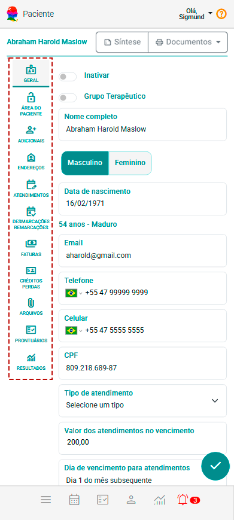
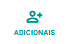
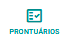
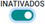
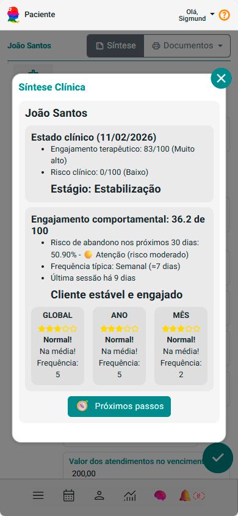

# Sobre Cadastro de Clientes e Grupos Terapêuticos

O cadastro de Clientes e Grupos Terapêuticos do eConsult é uma funcionalidade completa e centralizada que permite a gestão eficiente de todas as informações essenciais relacionadas aos clientes e grupos terapêuticos. Essa ferramenta foi projetada para garantir que os profissionais tenham acesso rápido e fácil a todos os dados relevantes, desde informações básicas até o histórico de interações e documentos importantes.

O cadastro foi pensado para reunir, em um único lugar, todas as informações e rotinas necessárias ao relacionamento operacional, administrativo e financeiro. Para isso, o cadastro foi subdividido em seções (abas), organizadas para facilitar o acesso e a gestão dos diferentes tipos de informações. A seguir, veja um panorama de cada aba e como elas apoiam seu trabalho diário.

## Abas do Cadastro de Clientes e Grupos Terapêuticos no eConsult

    

1. **Aba Geral**

    

    Reúne os **dados básicos de identificação e contato** — nome, CPF, data de nascimento, telefone, e-mail etc. São as informações mínimas exigidas para localizar rapidamente o cliente ou grupo e manter uma comunicação eficiente.

2. **Aba Campos Adicionais**

    

    Permite **criar campos personalizados** para atender necessidades específicas do seu serviço: preferências, referências internas, observações técnicas ou qualquer outro dado relevante. **Dessa forma, o cadastro se adapta ao seu fluxo de trabalho, mantendo tudo padronizado e pesquisável.

3. **Aba Grupo Terapêutico**

    

    (Exclusiva para cadastros de grupo) Facilita a **vinculação de membros**: adicione, remova ou consulte participantes de forma organizada, garantindo rastreabilidade e agilizando a gestão coletiva de atendimentos.

4. **Aba Endereços**

    

    Aceita **vários endereços por registro** (residencial, comercial, entrega de materiais etc.). **Isso simplifica rotas, deslocamentos e envios, além de manter o histórico completo de localizações.

5. **Aba Atendimentos**

    

    Exibe um **histórico detalhado de todos os atendimentos** já realizados — data, horário, modalidade (presencial ou online) e profissional responsável. **É aqui que você acompanha a evolução clínica, identifica padrões e planeja as próximas etapas.

6. **Aba Remarcações e Desmarcações**

    

    Registra automaticamente toda alteração de agenda, fornecendo **visão clara da frequência de mudanças** e ajudando a detectar comportamentos que merecem atenção (ex.: faltas recorrentes).

7. **Aba Faturas**

    

    Centraliza a **gestão financeira**: emissão, status de pagamento, valores e vencimentos de cada fatura vinculada ao cliente ou grupo. **Tudo em um painel único, pronto para consultas rápidas e relatórios.

8. **Aba Créditos e Perdas**

    

    - **Créditos Antecipados:** controla valores pré-pagos que poderão ser abatidos em atendimentos futuros, com total transparência.

    - **Perdas:** registra atendimentos não quitados considerados irrecuperáveis, permitindo análise e ações para reduzir prejuízos.

9. **Aba Arquivos**

    

    Armazena **documentos, exames, laudos ou quaisquer arquivos** relevantes ao atendimento. **Mantém tudo centralizado, acessível e seguro, dispensando buscas em diferentes sistemas ou pastas físicas.

10. **Aba Prontuário**

    

    Funciona como um **prontuário eletrônico completo**: diagnósticos, evoluções, prescrições e observações clínicas. **Garante continuidade de cuidado e conformidade com boas práticas de saúde.

11. **Aba Resultados**

    

    Oferece **gráficos e indicadores** que medem a evolução do cliente ou grupo, correlacionando volume de atendimentos, custos operacionais e receita. Essa visão analítica facilita a tomada de decisões estratégicas e melhora o equilíbrio entre resultados clínicos e financeiros.

## Por que essa estrutura importa?

    - **Agilidade:** cada aba foi desenhada para acelerar tarefas diárias sem perder detalhes importantes.
    - **Transparência e rastreabilidade:** históricos completos asseguram conformidade com normas (incluindo LGPD) e facilitam auditorias.
    - **Personalização:** campos adicionais e uploads de arquivos permitem adaptar o sistema à sua realidade, mantendo tudo sob controle.

Com essas abas, o eConsult transforma o cadastro em um hub centralizado de informações, unindo operacional, administrativo e financeiro em um fluxo coeso — do primeiro contato até a análise de resultados.

## Incluir novo cliente

1. No painel "Clientes e Grupos" acione o botão "Incluir Cliente ou Grupo" .

1. O sistema abre a tela de cadatro "Cliente" com a aba "Geral" aberta.

1. Escolha a opção "Masculino" ou "Feminino", preencha os campos "Nome Completo", "Data de Nascimento" (no caso de grupos você pode utilizar este campo - não obrigatório - para segmentar o grupo por faixa etária), "Email", "Telefone", "Celular", "CPF" e "Valor" (com o valor dos atendimentos).

1. Acione o botão "Incluir"  para salvar as informações.

    :::note
        Nesta aba, apenas os campos "Nome Completo" e "Sexo" (Masculino ou Feminino) são de preenchimento obrigatório, pois são essenciais para o registro básico do cliente. Os demais campos, como informações de contato e outros dados pessoais, são opcionais e podem ser preenchidos conforme a relevância para o objetivo do cadastro ou para a coleta de informações complementares. Essa abordagem oferece maior flexibilidade, permitindo que você registre apenas os dados que considerar necessários no momento.
    :::

## Incluir novo grupo terapêutico

No eConsult, você pode cadastrar e realizar atendimentos a grupos, como casais, famílias ou grupos terapêuticos.

Antes de criar o grupo, cadastre cada participante individualmente como cliente no sistema.

Com todos os membros cadastrados, siga o passo a passo abaixo para criar o grupo e vincular os clientes que fazem parte dele. Assim, o acompanhamento e o registro dos atendimentos em grupo ficam organizados em um único lugar.

1. No painel "Clientes e Grupos" acione o botão "Incluir Cliente ou Grupo" .

1. O sistema abre a tela de cadatro "Cliente" com a aba "Geral" aberta.

1. Acione a opção "Grupo Terapêutico" .

1. Escolha a opção "Masculino" ou "Feminino", preencha os campos "Nome Completo", "Data de Nascimento" (no caso de grupos você pode utilizar este campo - não obrigatório - para segmentar o grupo por faixa etária), "Email", "Telefone", "Celular", "CPF" e "Valor" (com o valor dos atendimentos).

1. Acione o botão "Incluir"  para salvar as informações.

1. O sistema habilitará a aba "Grupo".

1. Na aba "Grupo", localize o campo "Cliente" e selecione o membro que deseja adicionar ao grupo.

1. Clique no botão "" para incluir o cliente selecionado.

1. O sistema exibirá a lista de *cards* atualizada, na aba "Grupo", incluindo o novo membro vinculado.

## Alterar cliente ou grupo terapêutico

1. No painel Clientes ou Grupos selecione a opção  no *card* do cliente ou grupo terapêutico desejado.

2. O sistema abre a tela de cadastro "Cliente" com todas as suas abas disponíveis.

3. Navegue pelas abas, preencha os campos que deseja alterar e salve.

## Inativar cliente ou grupo terapêutico

No sistema eConsult, os cadastros de clientes e grupos terapêuticos não são excluídos de forma definitiva durante o uso da plataforma. Em vez disso, eles são inativados, garantindo a preservação do histórico de atendimentos e o cumprimento de obrigações legais e regulatórias, como os prazos de guarda definidos por normas da área da saúde.

No entanto, quando o profissional solicita a exclusão de sua conta no eConsult, todos os dados vinculados a ela — incluindo informações do profissional, de seus pacientes e de seus grupos terapêuticos — são excluídos de forma permanente e irreversível, em conformidade com a LGPD.

Essa política assegura o equilíbrio entre a preservação das informações necessárias durante a vigência do uso e o respeito ao direito de exclusão definitiva quando o vínculo com a plataforma é encerrado.

Para inativar o cadastro de um cliente ou grupo terapêutico, siga os seguintes passos:

- No painel "Clientes e Grupos" selecione a opção  no cartão do cliente ou grupo desejado.
- O sistema abre a tela de cadastro "Cliente".
- Na aba "Geral", marque a opção "Inativar".
- Acione a opção "Salvar"  para aplicar e Salvar a alteração.

Com isso, o registro ficará inativo no sistema, impedindo que ele seja acessado ou utilizado em operações futuras, mas mantendo o histórico para consultas ou auditorias, caso necessário.

## Reativar cliente ou grupo terapêutico

Caso seja necessário voltar a utilizar o cadastro de um cliente ou grupo terapêutico inativado no eConsult, o sistema oferece a opção de reativação, garantindo que todos os dados previamente registrados sejam recuperados de forma completa e segura. A reativação é um processo simples e prático, permitindo que o cliente ou grupo volte a ser incluído nas operações e interações do sistema sem a necessidade de recriar o cadastro do zero.

Para reativar um cadastro, siga os seguintes passos:

- No painel "Clientes e Grupos" marque a opção de filtro "INATIVADOS" .
- O sistema lista todos os clientes "INATIVADOS".
- Selecione a opção  no *card* do cliente que deseja reativar.
- O sistema abre a tela de cadastro "Cliente".
- Na aba "Geral", desmarque a opção "Inativar".
- Clique no botão "Salvar"  para aplicar e salvar a alteração.

Ao finalizar este processo, o status do cliente passará de inativo para ativo, possibilitando o acesso a todas as informações associadas a esse cadastro, incluindo o histórico de atendimentos, serviços ou transações. Isso proporciona agilidade e segurança ao retomar o relacionamento com o cliente ou grupo terapêutico, mantendo a integridade dos dados e o fluxo de trabalho eficiente.

# Score do Cliente

O Score do Cliente é uma ferramenta que avalia o desempenho do cliente com base em três dimensões principais: Global, Ano e Mês. Cada dimensão fornece uma visão específica da relação do cliente com o seu negócio, considerando histórico, comportamento recente e engajamento atual.

Essas informações são acompanhadas por indicadores que facilitam a análise do valor gerado, da frequência de interações e do custo de manutenção do cliente.

## Como acessar o Score

O Score pode ser visualizado clicando no botão "Score" , localizado no canto superior direito da tela de cadastro do cliente no sistema eConsult.

## *Card* de score

    

O *card* de score é composto pelos seguintes elementos:

- **Nome do cliente:** Mostra o nome do cliente ao qual o *card* de score referencia.

- **Classificação:** Mostra como o cliente foi classificado. A classificação pode ser:

    - **Cliente em declínio:** O cliente apresenta **redução progressiva na frequência de interações e no valor gerado**. Pode estar perdendo o interesse ou migrando para concorrentes. Exige atenção e possíveis ações de reativação, como campanhas de retenção ou ofertas personalizadas.
    - **Cliente em crescimento:** Cliente mostra **evolução positiva**, com aumento na frequência de compras ou atendimentos e no valor gerado. Está em processo de consolidação do relacionamento com a sua organização e pode ser um bom alvo para ações de fidelização e up-sell.
    - **Cliente estável e engajado:** Apresenta **comportamento consistente**, com boa frequência e geração de valor contínua. É um cliente **confiável e fiel**, já consolidado, ideal para manutenção do relacionamento, programas de recompensa e possível influenciador da sua marca.
    - **Cliente volátil:** Apresenta **comportamento irregular**, alternando períodos de alta e baixa atividade. Pode ser sensível a fatores externos ou promoções pontuais. Requer monitoramento e estratégias personalizadas para aumentar o engajamento e reduzir a oscilação.
    - **Dados incompletos para análise:** Significa que **não há informações suficientes registradas no histórico do cliente** para gerar um score confiável ou classificá-lo em uma das categorias acima.

## Seções de Score

O Score do Cliente é apresentado por meio de três seções principais (subcards), que representam diferentes recortes de tempo:

    

- **GLOBAL:** Considera todo o histórico do cliente desde o início do relacionamento com a sua organização.
- **ANO:** Refere-se aos dados acumulados no ano corrente.
- **MÊS:** Apresenta as informações referentes ao comportamento mais recente, no mês atual.

Cada uma dessas seções exibe um conjunto de indicadores que refletem o desempenho do cliente no período correspondente, sendo:

- **Score:** Valor numérico gerado com base na fórmula:

    *```(LTV - CLC) / 100```*

- **Classificação por Estrelas:** representação de estrelas, legenda e informação, variando de 1 a 5, conforme o desempenho do cliente:

    - **★★★★★ – Excelente – Muito acima da média:** O cliente, no período, demonstrou que está muito acima da média em valor gerado, frequência e engajamento. Costuma ser altamente fiel, constante e valioso para o negócio. Ideal para programas de fidelização e reconhecimento.
    - **★★★★ – Bom – Acima da média:** No período demostrou ter um bom histórico de interações e contribuições financeiras, com potencial para se tornar um cliente excelente. Merece atenção para fortalecimento do relacionamento.
    - **★★★ – Normal – Dentro da média:** Apresentou no período um comportamento regular e estável. Ainda não demonstra sinais claros de crescimento ou risco. Estratégias de engajamento e acompanhamento podem melhorar seu desempenho.
    - **★★ – Alerta – Abaixo da média:** Pode estar diminuindo, no período, o número de interações ou o valor gerado. Requer análise e ações de reengajamento para evitar perda de relacionamento.
    - **★ – Crítico – Muito abaixo da média:** Pouca ou nenhuma interação no período e baixo valor agregado. Pode estar em risco de perda ou abandono. Recomenda-se ação imediata de recuperação.
    - **Nenhuma estrela – Sem dados:** Não há dados suficientes do período para gerar um score confiável. Isso ocorre normalmente com clientes recém-cadastrados ou com histórico incompleto. É necessário aguardar o acúmulo de informações.

- **FREQ (Frequência):** número de atendimentos ou interações do cliente no período avaliado.

- **LTV (Lifetime Value):** valor total gerado pelo cliente para a organização no período.

- **CLC (Customer Lifetime Cost):** custo total no período relacionado à manutenção do cliente.

Esse conjunto de informações oferece uma visão abrangente e estratégica do comportamento e valor de cada cliente, permitindo ações direcionadas de marketing, atendimento e fidelização.