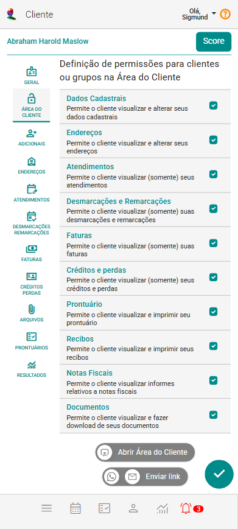

# Aba Área do Cliente 

No cadastro de Clientes e Grupos Terapêuticos, a aba "Área do Cliente" permite configurar, de forma personalizada, os acessos que cada cliente ou grupo terá dentro do eConsult. Nessa seção, o gestor define quais informações poderão ser visualizadas ou alteradas diretamente na área exclusiva do cliente, como dados cadastrais, endereços, atendimentos, faturas, créditos e perdas, além do prontuário, recibos, notas fiscais e documentos.

Essa configuração garante maior controle e segurança, permitindo que cada cliente ou grupo tenha acesso apenas ao que for relevante para o seu acompanhamento e relacionamento. Além disso, o sistema oferece flexibilidade para adaptar os acessos conforme a necessidade, preservando a confidencialidade das informações sensíveis e otimizando o fluxo de comunicação entre profissional e cliente.

:::note
- Você pode visualizar a área do cliente através do botão "Abrir Área do Cliente" .

- Você pode eviar o link da Área do Cliente para o cliente ou Grupo, por WhatsApp ou Email, através do grupo de botões específico .
:::