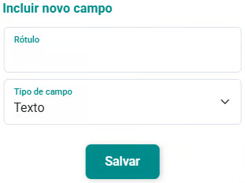

# Aba Campos Adicionais

O eConsult permite criar um formulário padrão de campos adicionais para o cadastro de novos pacientes ou grupos terapêuticos, por meio da opção **[Configuração / Campos Adicionais](/docs/funcionalidades/configuracoes/clientes/campos-adicionais)**. Esse formulário padrão pode ser aplicado sempre que um novo paciente for cadastrado, facilitando a padronização das informações coletadas.

No entanto, essa padronização é totalmente **flexível e adaptável**. Ao acessar o cadastro do paciente ou grupo, na aba Campos Adicionais, você pode modificar o formulário conforme necessário — seja alterando, removendo ou adicionando novos campos, de acordo com as particularidades do paciente ou grupo.

Dessa forma, o sistema oferece um equilíbrio entre **padronização e personalização**: você parte de um modelo pré-definido para garantir consistência, mas pode ajustá-lo livremente para registrar informações específicas e relevantes de cada paciente ou grupo. Isso torna o processo mais eficiente e o serviço mais direcionado e qualificado.

## Incluir novo campo

1. Clique no ícone de “” (Adicionar).

1. O formulário de cadastro "Incluir Novo Campo" será aberto.

    

1. Preencha os campos "Rótulo" e "Tipo de Campo".

1. Acione o botão "Salvar" .

1. O novo campo será inserido no formulário.

1. Por último, para que o formulário seja aplicado para o paciente, acione o botão "Salvar"  da aba.

## Alterar campo

1. Clique no botão "" do campo que deseja editar.

1. O formulário de cadastro "Alterar Campo" será aberto.

1. Altere o conteúdo dos campos "Rótulo" e "Tipo de Campo", conforme necessário.

1. Acione o botão "Salvar" .

1. O campo será mostrado no formulário já com as alterações feitas.

1. Por último, para que o formulário seja aplicado para o paciente, acione o botão "Salvar"  da aba.

## Excluir campo

1. Identifique o campo que deseja remover.

1. Clique no ícone "" à direita do campo.

1. Confirme a exclusão.

1. O campo será excluído do formulário deste paciente ou grupo.

1. Por último, para que o formulário seja aplicado para o paciente, acione o botão "Salvar"  da aba.

## Reordenar campos

1. Use os ícones de seta para cima () e seta para baixo () para mover o campo selecionado.

1. Isso permite reorganizar os campos na ordem que fizer mais sentido para o seu fluxo de atendimento.

1. Por último, para que o formulário seja aplicado para o paciente, acione o botão "Salvar"  da aba.

:::warning Salvar alterações
    Após realizar as modificações, não equeça de clicar em "Salvar"  no canto inferior direito da tela para aplicar o formulário atualizado.
:::