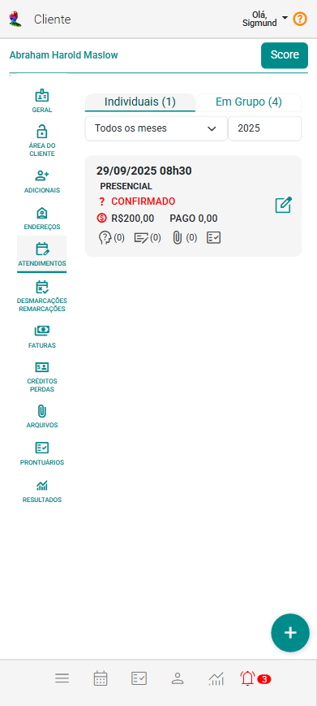
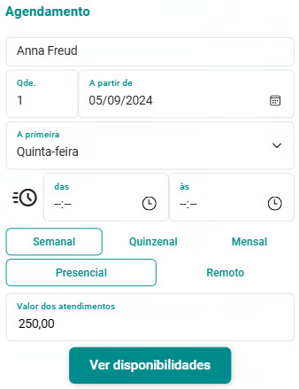
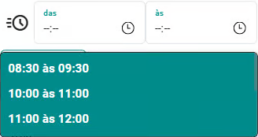

# Aba Atendimentos

A aba Atendimentos exibe o histórico completo de atendimentos realizados e auxilia no planejamento dos atendimentos futuros, oferecendo uma visão integrada e contínua do relacionamento com cada cliente. Esse registro detalhado é uma ferramenta essencial para os profissionais, pois permite acompanhar a evolução e o progresso de cada cliente ao longo do tempo.

No caso de clientes, a aba apresenta duas subabas distintas: "Individuais", destinada ao acompanhamento e organização dos atendimentos realizados de forma exclusiva para aquele cliente, e "Em Grupo", voltada para os atendimentos em que o cliente participa junto a outros, no contexto de grupos terapêuticos (como casais, famílias ou grupos maiores). Essa separação proporciona maior clareza na visualização e no gerenciamento, permitindo ao profissional identificar rapidamente o tipo de atendimento e acessar as informações de maneira estruturada e objetiva.

A aba conta ainda com filtros de "mês e ano", que possibilitam uma visualização segmentada dos compromissos realizados ou agendados dentro de períodos específicos. Essa funcionalidade apoia a análise de padrões, o acompanhamento da frequência e a gestão eficiente do tempo.

Além disso, em cada subaba é exibida uma lista de cards, onde cada card representa um atendimento agendado, oferecendo ao profissional uma forma prática e organizada de acompanhar os compromissos. 

    :::tip

        Os *cards* da aba Atendimentos permite você gerenciar anotações, arquivos, lembretes e informes de presença e pagamentos (no caso de grupos terapêuticos) do atendimento.

        

        - **Anotações:**  Permite incluir, alterar ou excluir anotações vinculadas a cada atendimento, oferecendo um espaço para registrar observações importantes que podem ser consultadas posteriormente e até mesmo publicadas no prontuário do cliente.
        
        - **Arquivos:**  Permite incluir, alterar ou excluir arquivos vinculados a cada atendimento.
        
        - **Lembretes de Atendimentos:**  Mostra as cores de todos os tipos de lembretes vinculados ao atendimento e permite fazer a gestão destes lembretes do atendimento.
        
        - **Informes de presença e pagamentos:**  Mostrado somente quando se tratar de um grupo terapêutico. Permite informar a presença dos clientes no atendimento em questão e ainda registrar pagamentos de membros do grupo.
        
        Você também tem acesso a diversas funcionalidades relacionadas ao atendimento, como "Desmarcar", "Remarcar", "Excluir", alterar "Modalidade" e "Status", além de realizar "Recebimentos". Tudo isso está disponível de forma prática através de um único botão .

    :::

É permitido ainda o **agendamento de múltiplos atendimentos para o cliente ou grupo terapêutico**, com ampla flexibilidade. Essa funcionalidade foi pensada para otimizar o fluxo de trabalho dos profissionais, possibilitando o planejamento de diversas sessões de forma centralizada, de acordo com as necessidades e a disponibilidade de cada cliente. Com isso, torna-se mais simples manter a regularidade dos atendimentos e garantir um acompanhamento contínuo e personalizado.

## Agendar múltiplos atendimentos

1. Acione o botão "Agendar atendimento" .

1. O sistema abrirá a tela "Agendamento".

    

1. Preencha o campo "Qtde." com o número total de atendimentos que você deseja agendar.

1. No campo "A partir de", informe a data em que os agendamentos devem começar.

1. No campo "A primeira", escolha o dia da semana em que os atendimentos devem ser realizados.

1. Se desejar configurar os agendamentos de acordo com disponibilidades previamente definidas, acione o botão "". O sistema exibirá opções de horário baseadas nas disponibilidades previamente configuradas. Selecione uma disponibilidade de horário adequada.

    

1. Escolha a periodicidade desejada para os atendimentos: "Semanal", "Quinzenal" ou "Mensal".

1. Selecione se os atendimentos serão presenciais ou remotos.

1. Informe o valor de cada atendimento no campo correspondente.

1. Acione a opção "Ver Disponibilidades" . O sistema abrirá a tela de análise de disponibilidades, onde você poderá revisar os horários disponíveis.

1. Marque ou desmarque as disponibilidades que deseja agendar e acione o botão "Agendar Marcados"  para confirmar e finalizar o agendamento dos atendimentos.

1. Em dias úteis, ou seja, sem recesso ou feriado, o sistema marcará automaticamente esses dias com um check. Mantenha esta marcação ou desmarque caso prefira não agendar neste dia.
​​
1. Em dias sem recesso, mas que são feriados, o sistema deixará esses dias inativados e desmarcados. Mantenha desmarcado ou marque caso queira agendar neste feriado.
​​
1. Em dias de recesso, o sistema manterá esses dias inativos. Você não tem a opção de marcar estes dias pois recessos são dias bloqueados para agendamentos.
​​

Ao seguir esses passos, você assegura que os múltiplos atendimentos sejam agendados de forma eficiente, alinhados às suas necessidades e às do cliente.
