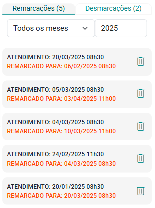

# Aba Remarcações e Desmarcações

A aba Remarcações e Desmarcações exibe o histórico detalhado de todas as remarcações e desmarcações de atendimentos do paciente.

A aba conta com filtros mês e ano, permitindo uma visualização segmentada dos registros dentro de períodos específicos.

Nesta aba, você encontrará também duas sub-abas distintas para uma navegação mais eficiente:

- **Sub-aba "Remarcações":** Nesta seção, são listadas todas as alterações de agendamentos em que os atendimentos foram remarcados para novas datas e horários. A sub-aba fornece um histórico completo das remarcações, permitindo visualizar as datas originais e as novas datas dos atendimentos, bem como qualquer informação adicional relevante.

    

- **Sub-aba "Desmarcações":** Aqui estão registradas todas as desmarcações de atendimentos. Essa seção exibe um histórico das consultas que foram canceladas, detalhando as datas e horários originais dos atendimentos que foram removidos.

    

:::note Exclusão de remarcações e dermarcações
Você pode utilizar o botão  para excluir registros de desmarcações e também de remarcações, conforme necessário.
Essas sub-abas facilitam o acompanhamento e a análise das alterações nos agendamentos, especificamente no que se refere a remarcações e desmarcações, proporcionando uma visão clara e organizada dos ajustes realizados ao longo do tempo.
:::