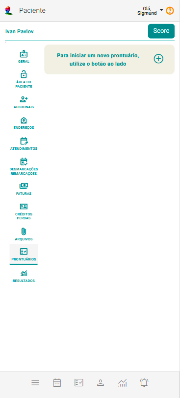
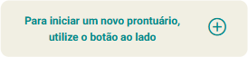
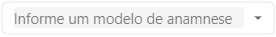
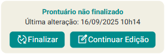
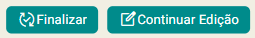
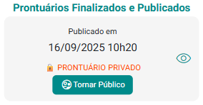

# Aba Prontuário

A aba **Prontuário**, disponível no painel **Pacientes e Grupos Terapêuticos**, reúne todas as informações clínicas relacionadas ao acompanhamento individual ou em grupo.  

No **eConsult**, cada paciente ou grupo pode possuir **múltiplos prontuários**, oferecendo flexibilidade na organização e registro das informações, seja para diferentes etapas do processo terapêutico, seja para separar versões relacionadas a fase do processo terapêutico ou enfoques distintos de acompanhamento.  

Os prontuários podem assumir dois estágios:  

**Prontuário em Elaboração** – encontra-se em fase de construção, ainda não publicado, sendo visível exclusivamente ao profissional responsável.  

:::warning
Cada paciente ou grupo pode ter apenas **um prontuário em elaboração** por vez.
:::  

**Prontuário Publicado** – já concluído e salvo, com duas possibilidades de acesso:  

  - **Privado**: restrito apenas ao profissional.  

  - **Público**: acessível ao paciente, caso o profissional opte por disponibilizar.  

Essa estrutura garante ao profissional **autonomia e segurança** para gerenciar o ciclo de elaboração dos registros, definindo com clareza **o que permanece restrito** e **o que pode ser compartilhado** com o paciente.

---

## Importância do Prontuário

O prontuário no eConsult cumpre funções assistenciais, jurídicas, administrativas e científicas.

Ele pode conter:

    - Dados pessoais e anamnese

    - Avaliações psicológicas

    - Histórico de atendimentos com suas devidas anotações clínicas

    - Arquivos anexados

A elaboração deve seguir normas éticas e técnicas, garantindo clareza, confidencialidade e precisão.

---

## Estrutura do Prontuário

O prontuário é criado com base em um Modelo de Anamnese previamente cadastrado e na Abordagem Terapêutica escolhida. O Modelo de Anamnese estabelece os campos e tópicos do formulário, garantindo padronização e agilidade no registro, enquanto a Abordagem Terapêutica apoia a geração de hipóteses por meio de inteligência artificial.

---

## Recursos disponíveis

- **Anamnese:** coleta das informações do paciente ou grupo (histórico, queixas, antecedentes, hábitos de vida etc.).

- **Avaliações Psicológicas:** aplicação de escalas validadas pelo CFP (como BDI, BAI, SDQ, CD-RISC). Os resultados ficam integrados ao prontuário.

- **Histórico de Atendimentos:** registro detalhado com datas e horários, organizado em linha do tempo para facilitar a visualização da evolução do caso. Cada atendimento reúne também todas as anotações clínicas correspondentes.

- **Arquivos:** upload e acesso a documentos vinculados.

- **Inteligência Artificial (IA):** recurso que apoia o profissional na prática clínica por meio da geração de hipóteses diagnósticas e prognósticas, além de sugerir planos de tratamento e evoluções clínicas. Essas sugestões são construídas a partir dos dados inseridos no prontuário e do nível de engajamento do paciente, oferecendo suporte adicional à tomada de decisão.

- **Acesso Seguro:** todos os dados são protegidos por criptografia avançada e rigoroso controle de permissões, garantindo que apenas profissionais autorizados possam visualizar ou editar informações, assegurando total confidencialidade e integridade dos prontuários.

---

## Como Criar e Gerenciar Prontuários

1. Acesse a aba Prontuário no painel **Pacientes e Grupos**.

    

1. Clique no botão **** para iniciar um novo prontuário.

    

1. Selecione um modelo de anamnese previamente cadastrado.

    

1. O sistema exibirá a estrutura do prontuário. Você pode:

    - Escolher uma Abordagem Terapêutica.

    - Adicionar, editar ou excluir tópicos e campos.

    - Incluir avaliações psicológicas.

    - Acionar a IA para gerar hipóteses diagnósticas e prognósticas, além de sugerir planos de tratamento e evoluções clínicas.

    - Mostrar/ocultar campos/tópicos para a versão pública do prontuário.

    - Salvar, fechar ou excluir o prontuário em elaboração (não finalizado).

    - Imprimir a versão Privada do prontuário (aquela que só o profissional tem acesso).

    - Imprimir a versão Pública do prontuário (aquela que o paciente pode ter acesso além do profissional).

1. Uma vez que você Salva e Fecha o prontuário o sistema apresenta um ***card*** correspondente a "Prontuário não Finalizado", ou seja, em elaboração.

    

1. Neste ***card*** você poderá **Finalizar** o prontuário ou ainda **Continuar Edição**.

    

1. Ao clicar em "Continuar Edição", o sistema reabre o prontuário exatamente do ponto em que você parou.

1. Ao clicar em "Finalizar", o sistema encerra a edição e publica o prontuário, que passa a integrar a lista de prontuários finalizados e publicados.

    

1. Na lista de prontuários publicados e finalizados, você pode:

    - **Visualizar um prontuário** 

    - **Tornar o prontuário público** 

    - **Tornar o prontuário privado** 

    - **Duplicar o prontuário e colocando a dulicata em edição** 

:::warning
Prontuários publicados **não podem mais ser editados ou excluídos**.  

A única ação disponível é alterá-los entre **Público** ou **Privado**.

A opção **Visualizar Prontuário** , abre o prontuário em **modo de visualização apenas**, ou seja, não será possível editá-lo.
:::

:::tip Boas Práticas
- Mantenha os registros claros, objetivos e atualizados.

- Use o prontuário público apenas quando necessário para compartilhar informações com o paciente.

- Utilize os recursos da IA como apoio, mas sempre valide as sugestões com base no julgamento clínico.

- Garanta que os modelos de anamnese estejam bem configurados para assegurar padronização.
:::

Com esse recurso, o eConsult permite que cada profissional mantenha vários prontuários organizados por paciente ou grupo terapêutico, com segurança, flexibilidade e suporte à prática clínica.