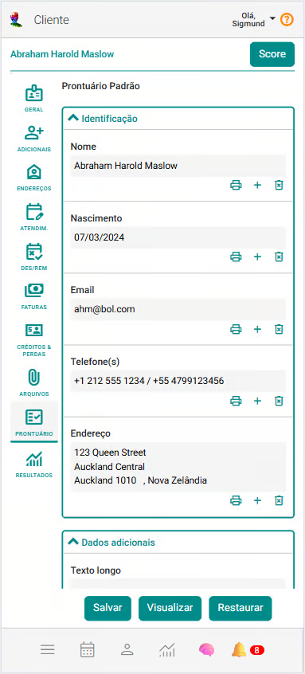
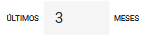
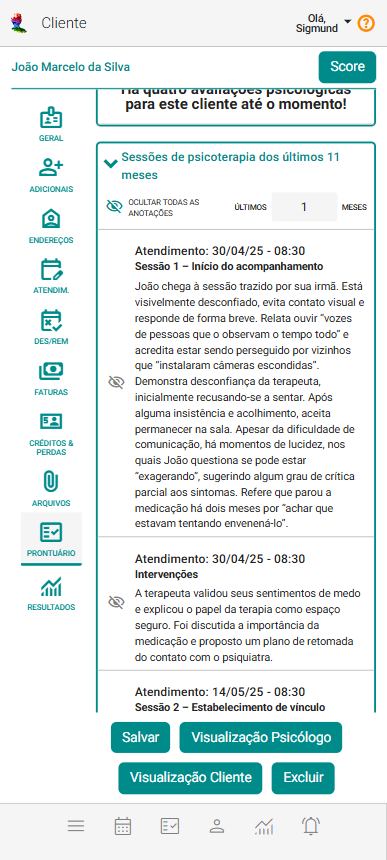
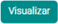
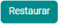

# Aba Prontuário

A aba **Prontuário** reúne, de forma sistematizada e organizada, todas as informações relevantes sobre os atendimentos realizados, seja a indivíduos ou grupos. Trata-se de um instrumento essencial para garantir a continuidade do cuidado, a qualidade dos serviços prestados e o cumprimento de funções legais, administrativas e científicas.

O prontuário pode conter dados pessoais, anamnese, testes psicológicos, histórico clínico, exames, diagnósticos, prescrições, anotações, evolução do quadro e outros registros pertinentes. Sua elaboração deve seguir normas técnicas e éticas, assegurando **confidencialidade, precisão e clareza**.

No **eConsult**, o prontuário é estruturado a partir de um modelo de anamnese previamente configurado, oferecendo agilidade no registro e facilitando a integração entre profissionais e clientes. A plataforma adota medidas rigorosas de **segurança da informação**, com controle de acesso e proteção robusta dos dados.

Sob o ponto de vista legal, o prontuário é um **documento oficial**, podendo ser utilizado como prova judicial — tanto em defesa do cliente quanto do profissional. Por isso, é fundamental que os registros sejam feitos com **exatidão e responsabilidade**.

Além da função assistencial e jurídica, o prontuário tem grande valor na **educação e na pesquisa científica**, contribuindo para a análise de casos, o aprimoramento das práticas clínicas e o desenvolvimento de novas abordagens terapêuticas.

Confira os principais recursos disponibilizados no Prontuário:

### **Anamnese**
Permite ao profissional registrar de forma estruturada as informações iniciais do cliente ou grupo, como queixas principais, histórico de saúde, antecedentes familiares, hábitos de vida e outros dados relevantes para o entendimento global do caso. A anamnese é o ponto de partida para um atendimento qualificado, servindo como base para avaliações futuras e para a construção de um plano de cuidado personalizado.

### **Testes psicológicos**
Permite aplicar e registrar testes psicológicos validados pelo CFP diretamente na plataforma. Inclui escalas como BDI, BAI, SDQ, CD-RISC, entre outras, com resultados automaticamente integrados ao prontuário do cliente.

### **Histórico de Atendimentos**
Permite registrar todos os atendimentos realizados, com datas e horários detalhados. Isso oferece uma linha do tempo clara da trajetória do cliente ou grupo, facilitando o entendimento da evolução dos casos e auxiliando na tomada de decisões.

### **Arquivos**
Disponibiliza a visualização de arquivos vinculados. Esses documentos ficam acessíveis por meio de links de download, garantindo que todas as informações relevantes estejam sempre disponíveis para o profissional e para as pessoas com quem ele optar por compartilhá-las.

### **Anotações e Observações**
O profissional pode adicionar anotações diretamente no prontuário, com a possibilidade de incluir campos personalizados conforme suas necessidades. Também é possível consultar observações registradas em atendimentos anteriores, contribuindo para um acompanhamento mais preciso e embasado.

### **Inteligência Artificial Gerando Hipóteses**
O profissional pode contar com o apoio da inteligência artificial para gerar hipóteses diagnósticas e prognósticas de forma mais precisa, considerando dados da anamnese, anotações em atendimentos, resultados de testes psicológicos e o contexto específico da sua área de atuação.

### **Acesso Seguro e Privado**
Todas as informações registradas são protegidas e criptografadas com rigorosos padrões de segurança e ficam disponíveis apenas para pessoas previamente autorizadas pelo profissional. Isso assegura a privacidade dos dados do cliente, em conformidade com as melhores práticas de proteção da informação.

Com essas funcionalidades, o **eConsult** garante ao profissional uma visão integrada, segura e de fácil acesso do histórico de cada cliente, contribuindo para um atendimento mais completo, personalizado e eficaz.

Para utilizar as funcionalidades de prontuário do eConsult, é necessário, primeiramente, cadastrar os [Modelos de Anamnese](/docs/funcionalidades/modelo-anamnese/visao). Esses modelos definem a estrutura e os campos personalizados que serão utilizados para o registro das informações no prontuário de cada cliente ou grupo de atendimento, garantindo padronização e organização dos dados.

Após o cadastramento de modelos de anamnese, você estará apto a iniciar os registros nos prontuários.

## Incluir prontuário do cliente

1. Na aba "Prontuário", na opção "Modelo de Anamnese", selecione um modelo.

1. o sistema passa a mostrar a estrutura (formulários) de prontuário do cliente.

1. Ajuste a estrutura do prontuário, incluindo, alterando ou excluindo tópicos e seus respectivos campos conforme suas necessidades.

    

    :::note Para ajuste da estrutura use:
        -  Mostra ou oculta o campo na impressão do prontuário.
        -  Inclui um novo campo para o prontuário.
        -  Exclui campo do prontuário.
    :::

1. Acione o botão "Salvar" .

## Tópico atendimentos

Ao final do prontuário, o sistema inclui uma seção (tópico) que lista todos os atendimentos realizados para o cliente. Neste tópico, é possível filtrar os atendimentos por períodos específicos, incluindo opções para visualizar apenas os atendimentos de meses anteriores através da seguinte opção:

Ao selecionar a opção "Últimos Meses", o sistema exibirá os atendimentos conforme a configuração definida, apresentando a data e hora de cada atendimento. Para cada registro, serão exibidas as anotações marcadas com a opção "Publicar no Prontuário".

:::note
    - O botão "Visualizar"  mostra um preview do prontuário disponibilizando-o para impressão.
    
    - O botão "Restaurar"  exclui o prontuário atual restaurando a tela.
:::