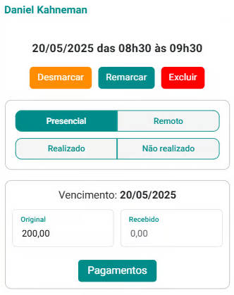
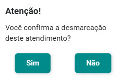
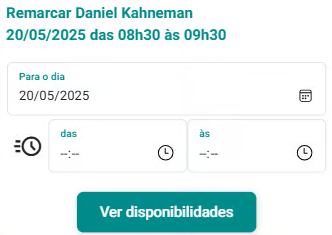
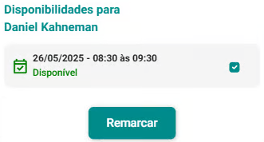
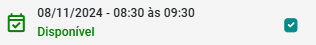
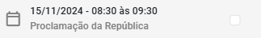
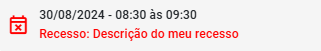
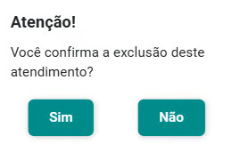

# Desmarcação, Remarcação e Exclusão de Atendimentos

No eConsult, existem funcionalidades específicas que permitem a desmarcação, remarcação e exclusão de agendamentos de atendimentos, garantindo maior flexibilidade e organização tanto para os pacientes quanto para o profissional.

## Desmarcação de Atendimento

A desmarcação de um agendamento de atendimento no eConsult é uma funcionalidade que permite cancelar um atendimento previamente agendado. Essa opção é importante para evitar que horários sejam ocupados desnecessariamente por atendimentos que não serão realizadas, permitindo que outros pacientes possam utilizar esse tempo. Ao desmarcar um atendimento, a plataforma registra esta desmarcação no cadastro do paciente como histórico.

### Desmarcar um atendimento

1. Acione a opção  no *card* do atendimento que deseja desmarcar.

1. O sistema abre a tela que permite a desmarcação.

  

1. Acione a opção "Desmarcar" .

1. O sistema apresenta a mensagem de confirmação.

  

1. Acione a opção "Sim" .

## Remarcação de Atendimento

A remarcação de um agendamento de atendimento no eConsult permite  a alteração da data e/ou horário de um atendimento previamente marcada. Essa funcionalidade é essencial para situações em que se precisa ajustar o atendimento devido a imprevistos ou mudanças na agenda. A remarcação facilita o processo, evitando a necessidade de desmarcar o agendamento e criar um novo, o que poderia ser mais demorado e confuso. Ao fazer uma remarcação, a plataforma registra esta informação no cadastro do paciente como histórico.

### Remarcar um atendimento

1. Acione a opção  no *card* do atendimento que deseja remarcar.

1. O sistema abre a tela que permite a remarcação.

    

1. Acione a opção "Remarcar" .

1. O sistema apresenta a tela de remarcação.

    

1. Selecione um dia no campo "Para o dia".

1. Acione o botão  se desejar que esta remarcação seja feita dentro de disponibilidades previamente configuradas para a data.

1. O sistema abrirá opções de horário correspondentes a disponibilidades pré-definidas em "Disponibilidades".

    

1. Selecione uma disponibilidade de horário.

1. Acione a opção "Ver disponibilidade" .

1. O sistema abre tela mostrando que o dia/horário indicado está disponível.

    

1. Acione o botão "Remarcar" .

    :::note
    - Em dias úteis, ou seja, sem recesso ou feriado, o sistema marcará automaticamente esses dias com um check. No entanto, você tem a opção de desmarcar essa seleção, caso prefira.

      

    - Em dias sem recesso, mas que são feriados, o sistema deixará esses dias inativados. No entanto, você pode ativá-los utilizando a opção check , se desejar.

      

    - Em dias de recesso, o sistema manterá esses dias inativos, e você não poderá ativá-los, pois estarão bloqueados.

      
    :::

## Exclusão de Atendimento

A exclusão de agendamento de atendimento no eConsult é uma ação que remove permanentemente um registro de atendimento da plataforma, removendo faturas, recebimentos e qualquer outra informação relacionado ao atendimento. Essa funcionalidade é utilizada em casos específicos, como quando o agendamento foi criado por engano ou quando não há mais necessidade de manter o registro na plataforma. A exclusão deve ser feita com cautela, pois uma vez realizada, não é possível recuperar as informações associadas ao agendamento.

### Excluir um atendimento

1. Acione a opção  no *card* do atendimento que deseja excluir.

1. O sistema abre a tela que permite a exclusão.

    

1. Acione a opção "Excluir" .

1. O sistema apresenta a mensagem de confirmação.

    

1. Acione a opção "Sim" .

---

Essas funcionalidades de desmarcação, remarcação e exclusão são ferramentas fundamentais no eConsult, garantindo uma gestão mais eficiente e personalizada dos agendamentos, atendendo às necessidades dos usuários e promovendo um fluxo de trabalho mais fluido dentro do ambiente profissional.