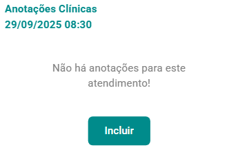
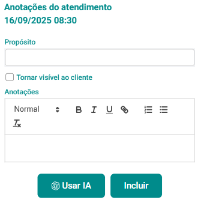
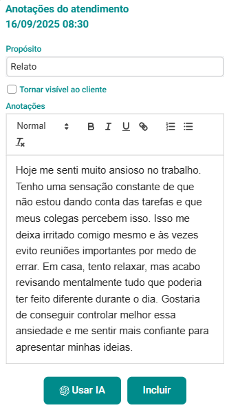
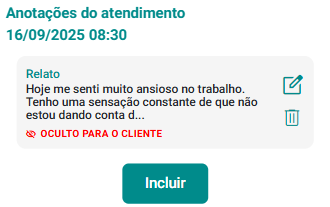
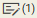
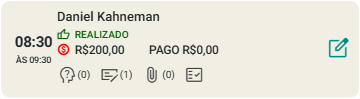

# Anotações do Atendimento

Você pode elaborar anotações detalhadas para os atendimentos realizados no eConsult, com o objetivo de registrar informações essenciais desde o motivo inicial do atendimento até observações feitas durante a interação. Essas anotações são fundamentais para documentar decisões, raciocínios, e orientações fornecidas ao cliente, garantindo que o atendimento seja compreendido e que haja continuidade adequada nos cuidados ou serviços prestados.

As anotações podem incluir detalhes como o histórico do cliente, relatos, respostas a perguntas específicas, além de orientações ou recomendações feitas durante o atendimento. A precisão e a clareza são cruciais para assegurar que todas as informações sejam facilmente compreendidas e possam ser referenciadas posteriormente.

Essas anotações podem ser de uso interno, servindo exclusivamente como referência para o profissional, ou podem ser integradas ao prontuário do cliente. Quando publicadas no prontuário, elas se tornam parte permanente do registro do cliente, acessíveis para futuros atendimentos e podendo ser visualizadas pelo cliente.

A decisão de publicar ou não as anotações no prontuário deve levar em conta a relevância das informações para o histórico do cliente e a necessidade de compartilhá-las para garantir um cuidado contínuo e eficaz. Independentemente de serem publicadas no prontuário, todas as anotações são realizadas com rigor e em conformidade com as normas de confidencialidade e privacidade, garantindo a proteção dos dados do cliente e a integridade do processo de atendimento.

## Incluir anotação para o atendimento

1. Acione a opção  no *card* do atendimento que deseja incluir uma anotação.

1. O sistema abre a tela "Anotações do Atendimento".

    

1. Acione o botão "Incluir" .

1. O sistema abre o formulário "Anotações do Atendimento".

    

1. Preencha o campo "Propósito" (opcional), marque a opção "Tornar visível ao cliente" se desejar que a anotação seja visível no prontuário do cliente. Em seguida, complete o campo "Anotações" e clique no botão "Incluir" para adicionar a anotação.

    

1. Após a inclusão, o sistema exibe a tela "Anotações do Atendimento" com a anotação registrada.

    

1. Ao fechar a tela, o sistema atualiza o *card* do atendimento, indicando que há uma anotação registrada  para o atendimento em questão.

    

:::tip
Você pode incluir quantas anotações desejar por atendimento, sem limite. Na tela "Anotações do Atendimento", é possível utilizar os botões "Alterar"  e "Excluir"  para modificar ou remover uma anotação conforme necessário.
:::

:::note

**Caso você queira utilizar inteligência artificial para a anotação, acione o botão .**

Ao clicar nesse botão, será aberta a tela de edição de texto com recursos de Inteligência Artificial. Nela, você poderá aprimorar conteúdos, desenvolver textos ou obter respostas para suas perguntas com base no texto fornecido e no propósito.

Se quiser saber mais sobre a funcionalidade de Inteligência Artificial em anotações clínicas [clique aqui](/docs/funcionalidades/atendimentos/anotacoes-ia).
:::