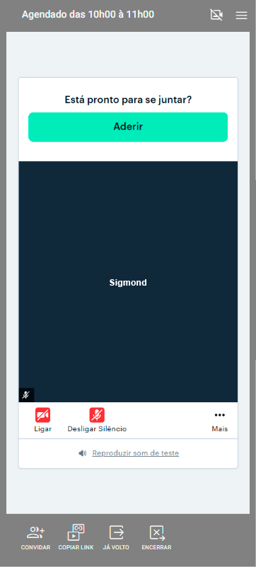
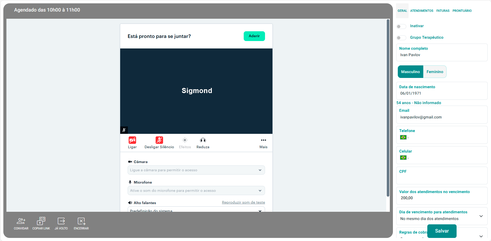

# Teleatendimento

O **eConsult** possui integração nativa com o **Daily.co**, uma plataforma moderna, estável e segura para **teleatendimento profissional**. 

Essa integração foi projetada para permitir que o psicólogo realize **consultas online diretamente pelo eConsult**, sem depender de aplicativos externos, instalações ou configurações complexas.

Com o **Daily.co**, você conta com:

- Áudio e vídeo de **alta qualidade**
- Conexão **estável e criptografada**
- Compatibilidade com **computadores, tablets e celulares**
- Interface simples e intuitiva, tanto para o **profissional** quanto para o **paciente**

---

## Requisitos

Para usar esta funcionalidade você deve ter uma conta na Daily.co e esta conta deve estar integrada ao eConsult. Os procedimentos para isso você pode encontrar [aqui](/docs/funcionalidades/configuracoes/integracoes/daily).

---

## Criando e entrando numa sala de teleatendimento

1. Acione a opção  no *card* do atendimento que deseja o teleatendimento.

1. Confirme se o atendimento está na modalidade "Remoto".

    :::warning
    A funcionalidade de teleatendimento é só para atendimentos remotos.
    :::

1. Clique no botão "Teleatendimento".

1. O sistema fechará a tela e mostrará em azul vivo a opção "Teleatendimento" .

_Versão mobile_

_Versão desktop_

1. Clique sobre esta opção e o sistema abrirá a sala virtual de teleatedimento Daily.co.

---

## Dentro da sala de teleatendimento Daily.co

Ao acessar a sala Daily.co, você verá a tela principal de videoconferência, com o nome do profissional e os seguintes controles:

- **Ligar/Desligar câmera**
- **Ativar/Desativar microfone**
- **Convidar paciente**  
  (gera o link direto de acesso)
- **Copiar link**  
  (para envio manual via WhatsApp, e-mail, etc.)
- **Encerrar sessão**

---

## Envio do link ao paciente

O link de teleatendimento pode ser:

1. **Enviado automaticamente** por e-mail, se o paciente possuir e-mail cadastrado; ou  
2. **Copiado manualmente** pelo botão **“Copiar link”** na tela da sala.

O paciente acessa o link **diretamente pelo navegador**, sem precisar instalar aplicativos, criar conta ou realizar login.

---

## 🔒 Segurança e conformidade

A integração com o **Daily.co** segue rigorosamente os princípios de **sigilo profissional** e **conformidade com a LGPD**:

- Criptografia ponta a ponta (E2EE)  
- Links únicos e intransferíveis por sessão  
- Nenhum dado audiovisual armazenado pelo eConsult  
- Controle total pelo profissional sobre início e término da sessão

---

:::tip Dicas práticas

- Antes do atendimento, teste câmera e microfone com o botão **“Reproduzir som de teste”**.  
- Mantenha seu navegador atualizado (Chrome, Edge ou Safari).  
- Utilize **fones de ouvido** para melhor qualidade de som e privacidade.  
- Evite conexões Wi-Fi públicas ou instáveis.  
- O paciente pode acessar pelo **celular**, basta abrir o link em qualquer navegador moderno.

:::

## Planos e limites do Daily.co

O **Daily.co** oferece:

- **10.000 minutos gratuitos por mês**, equivalentes a cerca de:
  - **5 atendimentos de 1 hora por dia**, durante todos os dias úteis.  
- Caso ultrapasse o limite, você pode contratar planos adicionais diretamente na plataforma [Daily.co](https://www.daily.co/pricing).

---

## ✅ Conclusão

O **Teleatendimento via Daily.co** no **eConsult** oferece uma experiência integrada, prática e ética, mantendo o foco no que realmente importa: o cuidado psicológico e o sigilo profissional.
