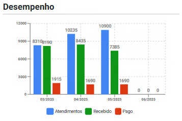
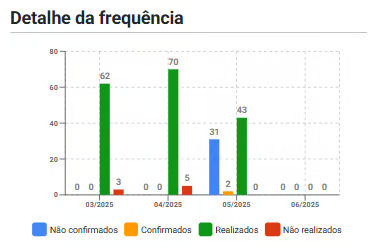
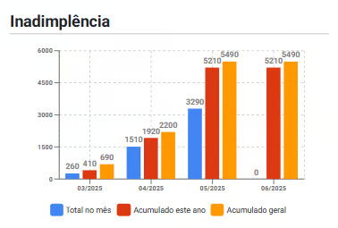
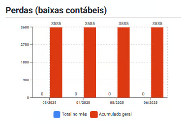
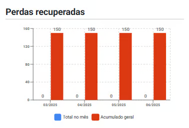
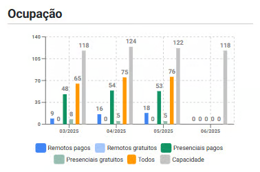
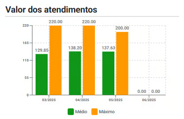

# Sobre Aba Gráficos

A aba "Gráficos" oferece uma visualização consolidada e evolutiva dos principais indicadores operacionais e financeiros, distribuídos em painéis que abrangem os dois meses anteriores, o mês atual e o mês seguinte. Essa estrutura permite uma análise temporal detalhada, facilitando o monitoramento contínuo e estratégico do desempenho da organização.

Os gráficos contemplados incluem:

- **Desempenho:** Apresenta uma visão geral da produtividade e dos principais resultados obtidos no período.

    

- **Detalhe da Frequência:** Mostra o comportamento de comparecimento dos pacientes, permitindo identificar padrões de assiduidade.

    

- **Inadimplência:** Exibe o valor de pagamentos em atraso, facilitando o acompanhamento da saúde financeira.

    

- **Perdas (Baixas Contábeis):** Representa os valores reconhecidos como perda definitiva no período.

    

- **Perdas Recuperadas:** Indica os valores previamente perdidos que foram recuperados no período.

    

- **Ocupação:** Mostra a taxa de ocupação da agenda, útil para avaliar a eficiência operacional.

    

- **Valor dos Atendimentos:** Apresenta os valores relacionados ao ticket médio e ao ticket máximo dos atendimentos realizados, permitindo uma análise financeira mais precisa. Esses indicadores ajudam a compreender o valor médio por atendimento e identificar os atendimentos de maior faturamento dentro do período analisado.

    

- **Desmarcações e Remarcações:** Permite visualizar tendências de cancelamentos e reagendamentos, auxiliando na análise de aderência dos pacientes aos atendimentos e na gestão da agenda.

    

Além disso, é possível ajustar o período analisado por meio do seletor de período, tornando a ferramenta flexível para diferentes necessidades de análise. Essa visualização gráfica facilita a identificação de tendências, anomalias e oportunidades de melhoria, apoiando decisões estratégicas e operacionais.