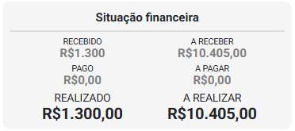
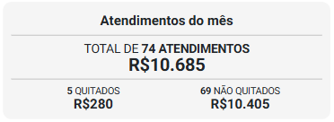
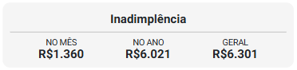
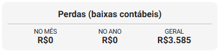
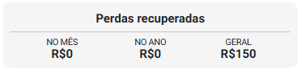
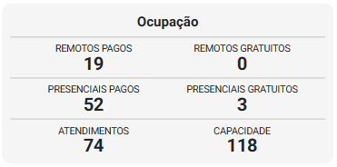
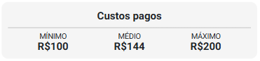
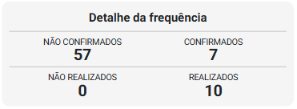
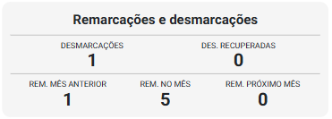

# Sobre Aba Indicadores

A aba Indicadores apresenta uma visão abrangente e consolidada do desempenho de todos os pacientes no mês selecionado. Nela, estão reunidas informações-chave como volume de atendimentos, principais demandas, níveis de satisfação e outros dados relevantes que possibilitam uma análise comparativa no mês e facilitam a identificação de padrões, oportunidades de melhoria e tomada de decisões estratégicas com base em dados concretos.

Os dados agregados permitem acompanhar, em um único painel, a performance financeira, o engajamento e o risco da carteira como um todo, bem como de grupos específicos de pacientes.

Os indicadores estão organizados nos seguintes *cards*:

1. **Situação financeira**

    

    - **Recebido:** Indica o valor total recebido no mês (receitas realizadas).
    - **Pago:** Indica o valor total pago no mês (despesas realizadas).
    - **Realizado:** Indica o total realizado no mês sendo ```[receitas realizadas] - [despesas realizadas]```.
    - **A receber:** Indica o valor total previsto a receber no mês (receitas previstas).
    - **A pagar:** Indica o valor total a pagar no mês (despesas previstas) .
    - **A realizar:** Indica o total a realizar no mês sendo ```[receitas previstas] - [despesas previstas]```.

1. **Atendimentos do Mês**

    

    - Quantidade e valor total dos atendimentos realizados no mês.
    - Quantidade e valor dos atendimentos quitados e não quitados.

1. **Inadimplência**

    

    - Valor inadimplente no mês, no ano e no geral.
    
1. **Perdas (Baixas Contábeis)**

    

    - Valor das perdas geradas pelo paciente no mês, no ano e no total.

1. **Perdas Recuperadas**

    

    - Valor das perdas recuperadas no mês, no ano e no total.

1. **Ocupação**

    

    - Horários ocupados pelo paciente, categorizados por:
        - Remotos pagos
        - Remotos gratuitos
        - Presenciais pagos
        - Presenciais gratuitos
        - Quantidade total de atendimentos realizados no mês.
        - Capacidade total da agenda no período.

1. **Custos Pagos**

    

    - Valor mínimo, médio e máximo pago pelo paciente em atendimentos no mês.
    
1. **Detalhamento da Frequência**

    

    - Quantidade de atendimentos:
        - Confirmados
        - Não confirmados
        - Realizados
        - Não realizados

1. **Remarcações e Desmarcações**

    

    - Quantidade de:
        - Desmarcações
        - Desmarcações recuperadas
        - Remarcações do mês anterior
        - Remarcações dentro do mesmo mês
        - Desmarcações reagendadas para o próximo mês

## Análises estratégicas

1. **Engajamento Global**

    Frequência de atendimentos e índices de presença mostram o nível de participação média dos pacientes; quedas sugerem necessidade de reengajamento.

1. **Saúde Financeira**

    A combinação de inadimplência, perdas e valor quitado evidencia risco de crédito e eficiência de cobrança da carteira.

1. **Potencial de Recuperação**

    Altos valores em perdas recuperadas versus perdas totais indicam efetividade de renegociação e potencial de retorno financeiro.

1. **Eficiência Operacional**

    A ocupação da agenda versus capacidade revela o quanto a operação está utilizada e onde há espaço ocioso ou sobrecarga.

1. **Perfil de Consumo e Precificação**

    Analisar o custo médio por atendimento ajuda a ajustar pacotes, descontos e políticas de preço para maximizar margem.

1. **Estabilidade de Agendamento**

    Índices de remarcações e desmarcações apontam previsibilidade de demanda e possíveis impactos na produtividade.

:::tip
Caso o mês selecionado seja anterior ao atual, o botão  será exibido. Ao clicar nesse botão, o sistema realiza, uma análise textual automatizada dos indicadores exibidos, gerando insights estratégicos e interpretações inteligentes com base nos dados do painel.

Essa análise ajuda a compreender tendências, identificar oportunidades de melhoria, sinalizar possíveis riscos e apoiar a tomada de decisões — de forma prática, rápida e orientada por dados.
:::

A leitura integrada desses indicadores permite não apenas avaliar o desempenho e a saúde financeira, mas também antecipar comportamentos, personalizar estratégias de atendimento, prever riscos e maximizar o valor ao longo do tempo. Com essa base, é possível tomar decisões mais assertivas e construir relacionamentos mais sólidos e sustentáveis.