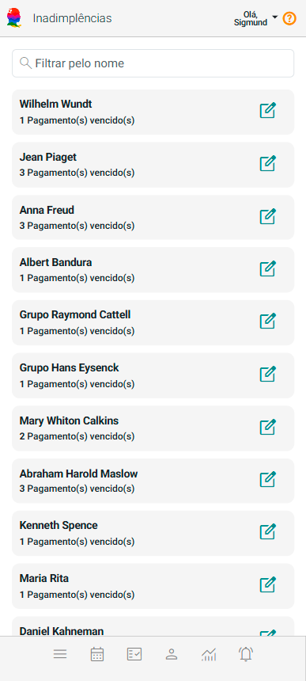
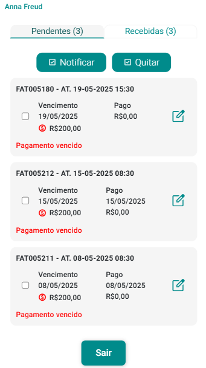
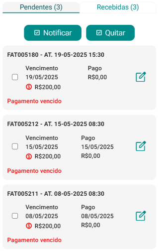
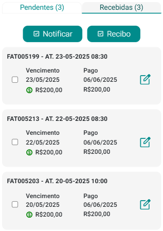
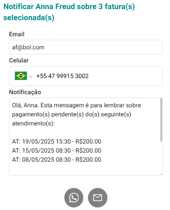
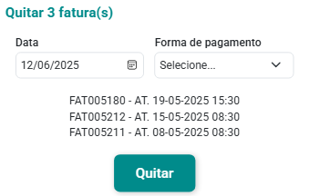

# Sobre Inadimplências

O Painel Inadimplências do eConsult é uma solução estratégica projetada para o acompanhamento e a gestão eficiente de situações de inadimplência. Ele proporciona uma visão centralizada e detalhada sobre os clientes e grupos terapêuticos que possuem atendimentos com pagamentos em atraso, auxiliando na identificação de riscos, no planejamento de ações de cobrança e na melhoria do desempenho financeiro.

No painel, os clientes e grupos terapêuticos são apresentados de maneira visualmente intuitiva por meio de *cards* interativos, projetados para facilitar a identificação rápida mostrando o nome do cliente e a quantidade de atendimentos com recebimentos pendentes.

Para consultar os atendimentos em atraso, basta clicar no botão  localizado no *card* do cliente ou grupo terapêutico. 

Uma vez indicado o cliente ou grupo terapêutico, o sistema mostra:

Cada fatura é composto basicamente pelos seguintes elementos:

- **Valor de Vencimento:** O montante a ser cobrado pelo atendimento prestado. Este valor é registrado na fatura e serve como base para o controle financeiro.
- **Data de Vencimento:** A data limite para o pagamento da fatura. Ajuda a determinar o prazo em que o pagamento deve ser efetuado.
- **Valor de Pagamento:** O valor pago até o momento, podendo ser parcial ou total.
- **Data de Pagamento:** A data em que o pagamento foi efetivamente realizado em sua totalidade. Esta informação é registrada na fatura assim que o pagamento em sua totalidade é confirmado.

Com esses dados, o sistema permite verificar o status das faturas, indicando se estão:

- **Pendentes:** Faturas que ainda não foram pagas em sua totalidade e estão aguardando o pagamento total da fatura.
- **Recebidas:** Faturas cujo pagamento em sua totalidade foi efetuado e registrado, indicando que a transação financeira foi concluída.

Essa organização facilita o acompanhamento das transações financeiras, ajudando a manter o controle sobre pagamentos pendentes e recebidos, e garantindo uma gestão eficiente das finanças associadas aos atendimentos.

Sendo assim, no painel Faturas do Cliente, você encontrará duas sub-abas distintas para um gerenciamento mais detalhado:

- **Sub-aba "Pendentes":** Nesta seção, são listadas todas as faturas do cliente especificado que ainda não foram pagas em suas totalidades. A sub-aba fornece uma visão clara das faturas com valores e datas de vencimento, permitindo o acompanhamento das pendências e a gestão eficaz dos pagamentos que estão por vencer ou que estão inadimplentes.

    

- **Sub-aba "Recebidas":** Aqui estão registradas todas as faturas que já foram pagas. Esta seção exibe as faturas cujo pagamento foi registrado, incluindo a data de pagamento e o valor pago, facilitando a verificação das transações concluídas e o controle financeiro.

    

Na sub-aba Pendentes, você tem duas funções importantes para gerenciar faturas pendentes:

- **Função "Notificar":** Permite notificar o cliente diretamente pelo WhatsApp sobre os pagamentos pendentes que estão marcados (selecionados). Ao acionar essa função, uma mensagem personalizada pode ser enviada, alertando o cliente sobre a necessidade de quitação das faturas em aberto que estão marcadas (selecionadas). Essa comunicação direta ajuda a lembrar o cliente de forma rápida e eficaz.

    

- **Função "Quitar":** Para efetuar pagamentos em sua totalidade, você pode utilizar a função "Quitar". Ao acionar a opção Quitar, o sistema abre tela mostrando informações e exigindo seleção de forma de pagamento. Uma vez definida a forma de pagamento as faturas serão movidas da lista de pendentes para a sub-aba Recebidas, atualizando o status do pagamento e mantendo o controle financeiro em dia.

    

    :::note
    Se o sistema não listar nenhuma forma de pagamento, significa que você não tem formas de pagamento cadastradas. Utilize a tela [Cadastro de Formas de Pagamento](/docs/funcionalidades/configuracoes/financas/formas-pagmento) para isso.
    :::

Na sub-aba Recebidas, você também dispõe de duas funções importantes para gerenciar as faturas já quitadas:

- **Notificar:** Permite informar ao cliente, através do WhatsApp ou E-mail, que o pagamento das faturas marcadas (selecionadas) foram recebidas e registradas. Isso mantém o cliente atualizado e garante uma comunicação eficiente.
- **Recibo:** Com essa função, você pode gerar e fornecer um recibo seu oficial para o cliente, contendo as faturas marcadas (selecionadas), documentando o pagamento efetuado de maneira clara e profissional.

Essas funções ajudam a manter o registro financeiro organizado e a garantir uma comunicação transparente com o cliente.

:::tip
Utilize a opção  localizada nos *cards* de faturas, tanto "Pendentes" quanto "Recebidas", para realizar alterações. Com essa opção, você pode:

- Efetuar pagamentos totais ou parciais.

- Incluir a fatura na lista de perdas (baixas contábeis), se constatado que esta fatura presumidamente não será recebida.
- Excluir pagamentos já feitos, caso necessário.

Essa funcionalidade permite um gerenciamento flexível e detalhado das faturas, facilitando ajustes e correções no processo de pagamento.
:::
